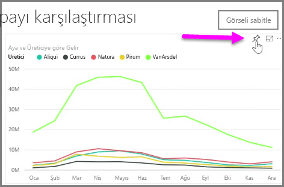
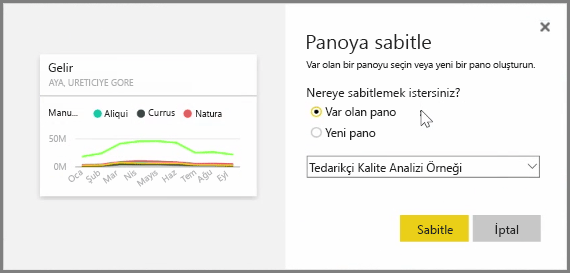
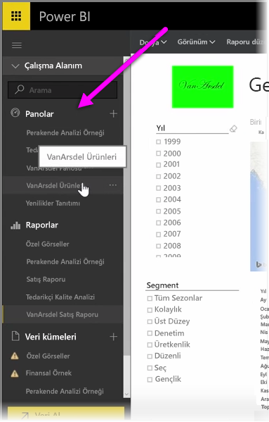
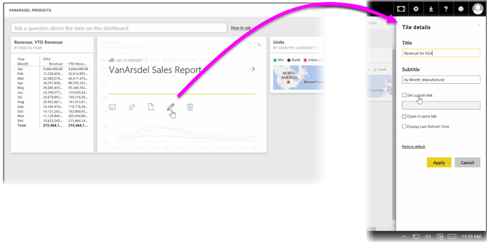

Power BI'daki **Panolar**, Power BI hizmetinin içinde oluşturulmuş görselleştirmelerden meydana gelen tek sayfalık koleksiyonlarıdır. Power BI Desktop'u kullanarak oluşturduğunuz ve yayımladığınız raporlardaki görselleştirmeleri veya Power BI hizmetinin kendisi içinde oluşturduğunuz görselleştirmeleri **sabitleyerek** panolar oluşturursunuz. Bir panoya görsel **sabitlemek** mantar panoya resim sabitlemek gibidir; görsel, panoda diğerlerinin görebileceği belirli bir noktaya yapıştırılır. Bir görseli sabitlemek için Power BI hizmetinde görselin bulunduğu raporu açın. Sabitlemek istediğiniz görselin üzerine gelin ve **raptiye** simgesini seçin.

Açılan menüden görsel için hedef pano seçtiğiniz bir iletişim kutusu görünür. Alternatif olarak, yeni bir pano da oluşturabilirsiniz. Sabitlenen görselin panoda nasıl görüneceğine ilişkin bir önizleme de edinebilirsiniz. Birden fazla rapordaki ve sayfadaki görselleştirmeleri tek bir panoya sabitleyebilirsiniz; bu, farklı veri kümelerini ve kaynaklarını öngörülerden oluşan tek bir sayfada birleştirmenize olanak tanır.

**Panolar**'da graflar, haritalar, resimler ve şekiller de dahil olmak üzere her türlü görselleştirmeyi "sabitleyerek" ekleyebilirsiniz. Panoya sabitlenen görseller **kutucuk** olarak adlandırılır.

Yeni olanlar da dahil olmak üzere panolarınız Power BI hizmetinin sol tarafındaki Panolar bölümünde görünür. Bir panoyu, listeden seçerek görüntüleyebilirsiniz.

Panolardaki görsellerin düzenini dilediğiniz şekilde değiştirebilirsiniz. Bir kutucuğu yeniden boyutlandırmak için kutucuğun tutamaçlarını içe veya dışa doğru sürükleyin. Bir kutucuğu, söz konusu kutucuğa tıklayıp panoda farklı bir konuma sürükleyerek taşıyabilirsiniz. Bir kutucuğun üzerine gelin ve **kalem** simgesine tıklayarak **Kutucuk Ayrıntıları**'nı açın, burada **Başlık**'ı veya **Alt Başlık**'ı değiştirebilirsiniz.

Bir pano kutucuğuna tıklayarak kutucuğun kaynağı olan raporu görüntüleyebilirsiniz. Bu, bir görselde temel alınan verileri hızlıca görüntülemenize olanak tanır. Ayrıca **Kutucuk Ayrıntıları**'nda **Özel bağlantı ayarlayın** alanını kullanarak söz konusu bağlantıyı da değiştirebilirsiniz.

Gereksinimlerinize göre (örneğin, bir pano koleksiyonuna sahip olmanız ve bir özet panosu oluşturmak istemeniz durumunda) bir panodaki kutucukları diğer bir panoya sabitleyebilirsiniz. İşlem aynıdır: Kutucuğun üzerine gelin ve **raptiye** simgesini seçin. Panolar kolayca oluşturulabilir ve değiştirilebilir. Ayrıca tek sayfalık panonuzun tam olarak olması gerektiği şekilde görünmesini sağlamak için bunları özelleştirebilirsiniz.

