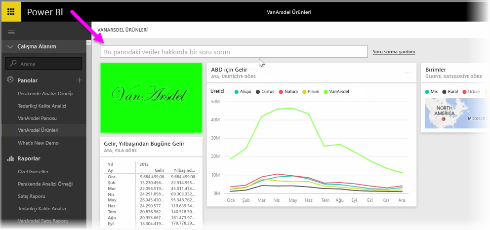
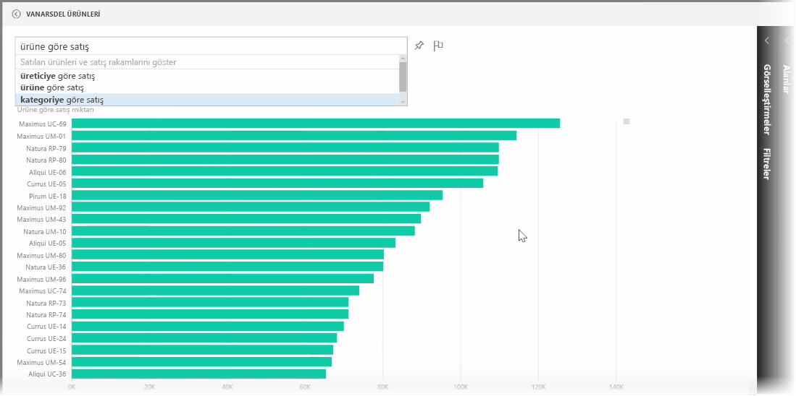
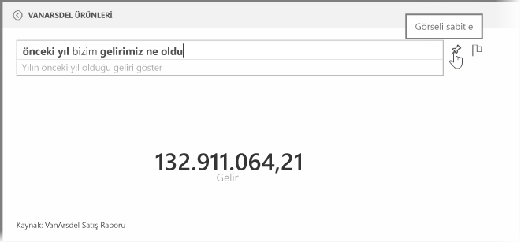
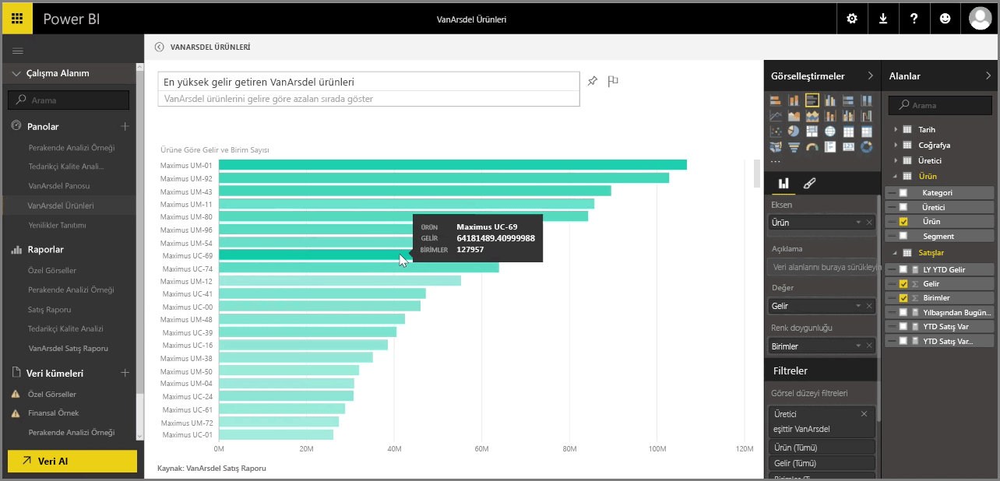

Power BI, konuşma dilinde ifadeler ve sorular kullanarak verilerinize ilişkin sorular sormanıza olanak sağlayan güçlü bir dil tanıma motoru ile birlikte gelir. Böylece, yalnızca basit sorular sorarak rapor ve görselleştirmelerin yanı sıra grafikler ve graflar oluşturabilirsiniz.

Verilerinize ilişkin bir soru sormak için, Power BI'da bir pano açın. Ekranın üst kısmında gördüğünüz giriş kutusunda, görüntülenen verilerle ilgili sorular sorabilirsiniz. Bu özellik *Soru-Cevap* olarak adlandırılır.

Kutuya tıkladığınızda Power BI, "YTD revenue" (Yıl Başından Bu Yana gelir) gibi, verilerinize dayalı olarak önerilen bazı terimler içeren istemler görüntüler. Genellikle basit bir tablo veya kart olarak gösterilen sonucu görmek için, önerilen terime tıklayabilirsiniz. Power BI, önerilen ifadelerden birini seçtiğinizde gerçek zamanlı olarak, seçiminizi temel alan bir görsel oluştur.

Ayrıca, doğal dilinizi kullanarak "What was our revenue last year?" (Geçtiğimiz yılki gelirimiz ne kadardı?) veya "What product had the highest sales in March 2014?" (Mart 2014'te en yüksek satış rakamları hangi ürüne aitti?) gibi sorular da sorabilirsiniz. Power BI sorunuzun bir yorumlamasını görüntüler ve cevabı en iyi şekilde temsil edecek türdeki görseli seçer. **Raptiye** simgesini seçerek, tıpkı Power BI'daki diğer tüm görseller gibi bu görseli de dilediğiniz panoya **sabitleyebilirsiniz**.

Doğal dil sorunuzu veya ifadenizi kullanarak oluşturduğunuz görseli istediğiniz an düzenleyebilirsiniz. Bu işlem için, ekranın sağ tarafında bulunan **Görsel Öğeler** ve **Alanlar** bölmelerini kullanmanız yeterlidir. Power BI'daki herhangi bir görselde olduğu gibi yerleşimi değiştirebilir, filtreleri ayarlayabilir ve alan girişlerini değiştirebilirsiniz.

Mükemmel görseli oluşturduktan sonra görselleştirmeyi bir panoya kaydetmek için soru giriş kutusunun yanındaki **raptiye** simgesine tıklayın yeter.

