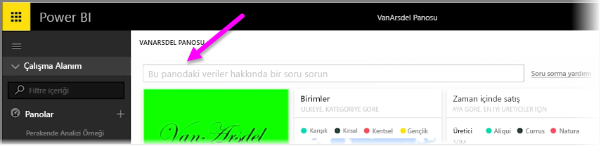
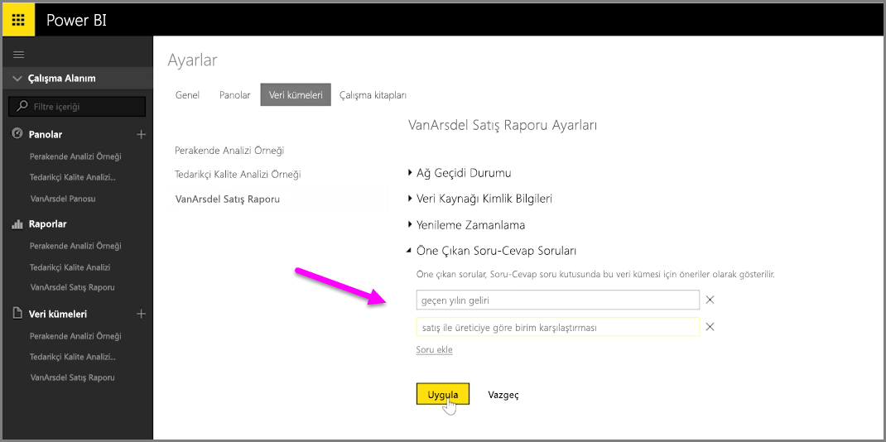

Power BI'ı kullanarak, bir panoya ilişkin doğal dil sorgu kutusunu (sık sık **Soru-Cevap** kutusu olarak da anılır) kullanan diğer kullanıcılar için kendi soru önerilerinizi ekleyebilirsiniz. Kullanıcılar bir panonun üst tarafındaki giriş kutusuna tıkladıklarında, önerilen bu soruları görür.

Kendi sorularınızı eklemek için, kullanmak istediğiniz panonun adının yanındaki üç noktayı ve karşınıza çıkan menüden **Ayarlar**'ı seçin.

 Bu, panoya ve temel alınan veri kümelerine veya çalışma kitaplarına ilişkin **Ayarlar** sayfasını açar. **Ayarlar** sayfasının **Panolar** bölümünde Soru-Cevap arama giriş kutusunu tamamen devre dışı bırakabilirsiniz ancak şu anda soru eklemek istediğimiz için **Veri Kümeleri** bölümünü seçiyoruz.

**Veri Kümeleri** bölümünde Pano ile ilişkilendirilmiş tüm veri kümeleri görüntülenir. Listeden panonuzla ilişkili veri kümesini, **Öne Çıkan Soru-Cevap Soruları**'nı ve ardından **Soru ekle** bağlantısını seçin. Sorunuzu veya istemi giriş kutusuna girin ve **Uygula** seçeneğini belirleyin.

Artık birisi seçilen panodaki arama giriş kutusuna tıkladığında istem listesinin üst tarafında önerdiğiniz girişleri görür ve bir soru seçtiğinde doğrudan Soru-Cevap yanıtına yönlendirilir. Bu, kullanıcıların mevcut veri türleri üzerinde düşünüp bunlar için en iyi kullanım şekline karar vermelerini sağlamak açısından faydalı bir yöntemdir.

