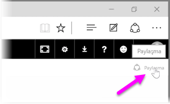
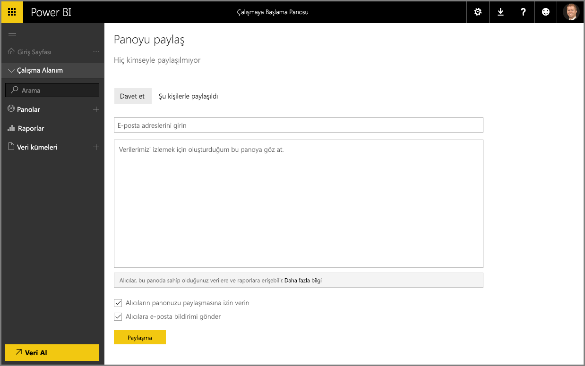

Power BI uygulamasının veri bulmanıza, bunları bir veri modelinde bir araya getirmenize ve söz konusu verileri kullanarak raporlar ve görselleştirmeler oluşturmanıza nasıl yardımcı olduğunu gösterdik. Ayrıca, bu raporları Power BI hizmetinde nasıl yayımlayabileceğinizi ve bilgilerinizi zaman içinde izlemenize yardımcı olan panoları nasıl oluşturabileceğinizi de gördünüz. Tüm bu özellikler, öngörülerinizi kuruluşunuzdaki diğer kişilerle paylaştıkça çok daha güçlü bir hale geliyor. Neyse ki panolarınızı kolayca paylaşabilirsiniz.

Bir panoyu paylaşmak için, söz konusu panoyu Power BI hizmetinde açın ve sağ üst köşedeki **Paylaş** bağlantısını seçin.

**Panoyu Paylaş** sayfası görüntülenir. Bu sayfada **Davet et** bölümünü seçebilir ve ardından, panonuza erişim izni vermek istediğiniz kişilerin **e-posta adreslerini** giriş kutusuna ekleyebilirsiniz. Siz e-posta adreslerini yazarken Power BI bu adresleri denetleyip hem sizin etki alanınızdaki hem de Office 365 etki alanındaki hesaplarla eşlemeye çalışarak mümkün olduğunda girişleri otomatik olarak tamamlar. Tek seferde birçok kişiye ulaşmak için e-posta adreslerini kopyalayıp bu kutuya yapıştırabilir veya bir dağıtım listesi, güvenlik grubu ya da Office 365 grubu kullanabilirsiniz.

*Alıcılara e-posta bildirimi gönder* onay kutusunu (alt kısma yakın) seçtiyseniz alıcılarınıza, kendileriyle bir pano paylaştığınızı bildiren, pano bağlantısının da bulunduğu bir e-posta gönderilir. Alıcılarınıza gönderilecek e-postaya notunuzu ekleyebilir veya Power BI uygulamasının sizin için oluşturduğu notu (kutuda, alıcıların e-posta adreslerini girdiğiniz alanın hemen altında) gönderebilirsiniz.

>[!NOTE]
>Power BI hesabı olmayan alıcılardan, panonuzu görüntüleyebilmek için hizmete kaydolmaları istenir.
> 
> 

Panonuzu paylaştığınız herkes, panoyu tıpkı sizin gördüğünüz gibi görüp onunla etkileşim kurabilir. Bununla birlikte, bağlantılı raporlar için *yalnızca okuma* erişimine sahip olurlar; bağlantılı veri kümelerine ise *herhangi bir şekilde erişemezler*.

Ayrıca, panoyu daha önce kimlerle paylaştığınızı görmek için Panoyu Paylaş sayfasında **Şu Kişilerle Paylaşıldı:** sekmesini seçebilirsiniz.

