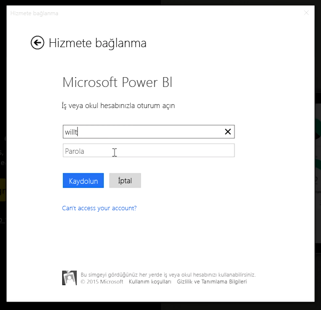
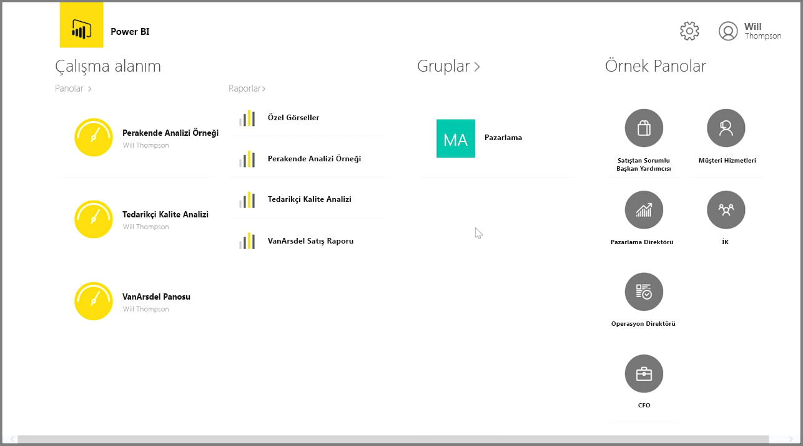
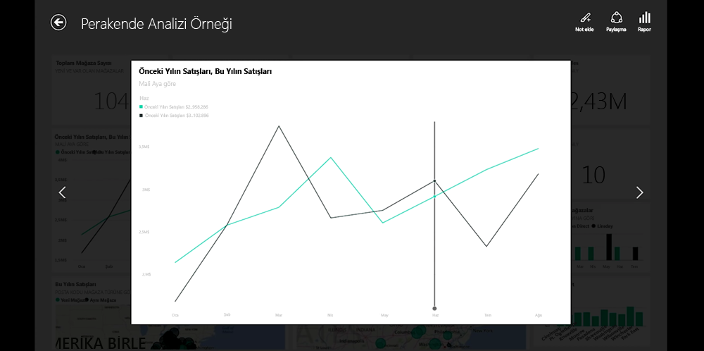
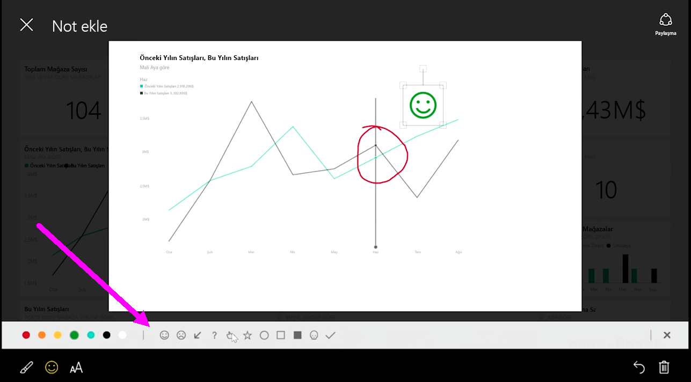

Verilerinizi hareket halindeyken izlemek istiyorsanız Power BI'ın iOS, Android veya Windows cihazlarına yönelik mobil uygulamalarından birini kullanabilirsiniz.

Power BI uygulamasını kullanırken ilk olarak Power BI hizmeti hesap bilgilerinizle hesabınızda oturum açın. Mobil bir Windows cihazında oturum açma ekranı aşağıda yer alan görüntüdeki gibidir.

Karşınıza çıkan ilk ekranda raporlar, panolar ve gruplar da dahil olmak üzere erişiminizin bulunduğu tüm içerikler görüntülenir. Fikir edinmek veya yalnızca Power BI'ın özelliklerini keşfetmek için kullanabileceğiniz örnek panolar da bulunur. Uygulama dokunmatik kullanıma uygun şekilde tasarlanmıştır: Tam ekran olarak görüntülemek için bir panoya veya rapora dokunabilir ve parmağınızı kullanarak bunlarda gezinebilirsiniz.

Dilediğiniz panoyu açmak için dokunmanız yeterlidir. Bir panodaki pano kutucuğuna dokunarak söz konusu panoya odaklanmak üzere daha geniş bir görünüm elde edebilirsiniz.

Ayrıca, keşfettiğiniz öngörülere not eklemek için sağ üst köşedeki **Not Ekleme** düğmesini de kullanabilirsiniz. Bu, ilgilendiğiniz belirli alanları vurgulamak için, odaklanılmış bir kutucukta çizim yapmanıza olanak sağlar. Not ekleme araçları ekranın alt kısmında yer alır.

Sağ üst köşedeki **Paylaş** bağlantısına dokunarak, not eklediğiniz kutucuğu paylaşabilirsiniz.

Sağ üst köşedeki **Rapor** bağlantısına dokunarak bir kutucuğa ilişkin bağlantılı raporu görüntüleyebilirsiniz. Bu bağlantıya tıkladığınızda, bir web tarayıcıda veya Power BI Desktop'ta gördüklerinizle tam olarak aynı görselleştirmeler görüntülenir ve çubuklara dokunarak, detaya giderek veya dilimleyicileri kullanarak raporla etkileşime girme olanağı sunulur.

