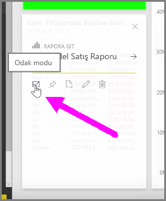
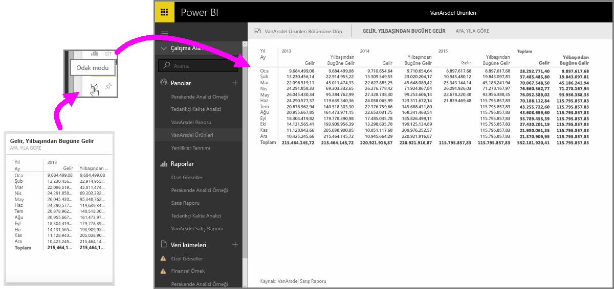

Hizmette Power BI panolarına veya raporlara bakarken tek bir grafiğe veya görselleştirmeye odaklanmak bazen faydalı olabilir. Bunu iki farklı şekilde yapabilirsiniz.

Panodayken sağ üst köşedeki birkaç farklı simge seçeneğini görmek için bir kutucuğun üzerine gelin. Üç noktayı seçtiğinizde, kutucuk üzerinde gerçekleştirebileceğiniz işlemleri ifade eden bir simge koleksiyonu görürsünüz.

En soldaki simge **Odak modu** olarak etiketlidir. Pano alanının tamamını kaplamak üzere kutucuğu genişletmek için simgeyi seçin.

**Odak modu**, görsellerinizde ve açıklamalarınızda çok daha fazla ayrıntı görmenize olanak tanır. Örneğin, Power BI'da bir kutucuğu yeniden boyutlandırdığınızda, kutucuktaki kullanılabilir alan nedeniyle bazı sütunlar gösterilmeyebilir.

**Odak modunda** tüm verileri görebilirsiniz. Ayrıca **Raptiye** simgesini seçerek doğrudan Odak modundan görseli farklı bir panoya da sabitleyebilirsiniz. **Odak modundan** çıkmak için **Odak modu**'nun sol üst köşesindeki **...geri dön** simgesini seçin.

İşlem, rapor görüntüleme ile benzer şekildedir. Sağ üst köşedeki üç simgeyi görmek için bir görselin üzerine gelin ve **Odak modu** simgesini seçin. Bu simge seçildiğinde görselleştirmeniz tüm rapor tuvalini kaplayacak şekilde genişler. Görselleştirmeler arasında herhangi bir çapraz filtre efektini geçici olarak kaybetmiş olsanız bile görsel, bu modda hâlâ etkileşimlidir.

Bir önceki görünüme geri dönmek için, genişletilmiş bir kutucuğun üzerine gelerek sol üst köşedeki **...geri dön** sol giriş simgesini seçin.

