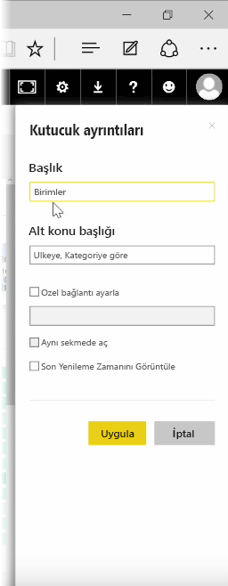

Pano oluşturduktan sonra birkaç biçimlendirme değişikliği yapmak için Power BI hizmetinde panonun **Kutucuklarını* düzenleyebilirsiniz.

Bir kutucukta değişiklik yapmak için kutucuğun üzerine gelin ve kutucukta değişiklik yapmanıza olanak tanıyacak bir simge koleksiyonunu görüntülemek üzere üç noktayı seçin.

**Kalem** simgesini seçerek **Kutucuk Ayrıntıları** bölmesini açın. Buradan kutucuğun **Başlığını** ve **Alt Konu Başlığını** değiştirebilir, son yenileme saatinin ve tarihinin yanı sıra özel bağlantı gibi başka ayrıntılar ekleyebilirsiniz.

Bir pano kutucuğuna tıkladığınızda varsayılan olarak, kutucuğun kaynağı olan rapora yönlendirilirsiniz. Bu davranışı değiştirmek için **Kutucuk Ayrıntıları** bölmesindeki **Özel bağlantı ayarlayın** alanını kullanın. Kullanıcılar bir logo resmine tıkladığında onları kuruluşun giriş sayfasına yönlendirme, bu özelliğin yaygın olarak görülen kullanımlarından biridir.

## Panonuza pencere öğesi ekleme
Panonuza pencere öğeleri de ekleyebilirsiniz. **Pencere öğesi**, görselleştirme yerine resim, çevrimiçi video, metin kutusu veya zengin web içeriği gibi diğer öğeleri içeren özel bir pano kutucuğudur.

Bir Panonun sağ üst köşesindeki Pencere Öğesi Ekle bağlantısını seçtiğinizde **Pencere öğesi ekleyin** iletişim kutusu görünür.

Örneğin, metin kutusu eklediğinizde sağ tarafta bir **Kutucuk ayrıntıları** bölmesi görünür; burada, herhangi bir kutucuk için sunulanlara benzer ayrıntıları düzenleyebilirsiniz. Ancak pencere öğelerinde, metin kutusu için zengin metin düzenleyicisi gibi, pencere öğesi içeriğinin tanımlanmasına veya değiştirilmesine yönelik bir bölüm de mevcuttur.

Pencere öğeleriyle ve kutucuk ayrıntılarını düzenleme özelliğiyle panonuzu özelleştirebilir ve istediğiniz şekilde görünmesini sağlayabilirsiniz.

