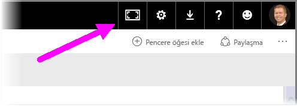
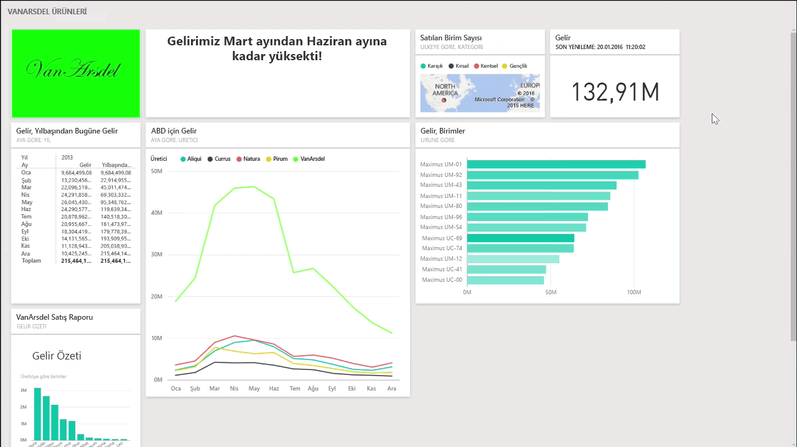
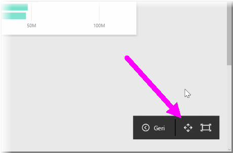
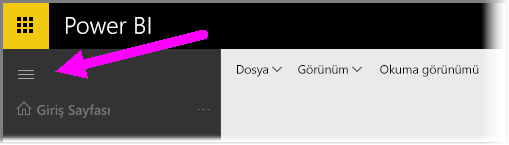

Zaman zaman panolarınızı oluştururken tuvalinize sığabileceğinden daha fazla içeriğe sahip olduğunuzu fark edebilirsiniz. Pano içeriğinizin eksiksiz bir görünümünü elde edebilmeniz için pano alanınızın nasıl görüntüleneceğini yönetme konusunda size yardımcı olacak birkaç çözüm mevcuttur.

Tüm panonuzu tek bir ekranda görüntülemenin en kolay yolu panonun sağ üst köşesindeki **Tam Ekran Modu** düğmesini seçmektir.

**Tam Ekran Modu** düğmesi seçildiğinde tarayıcınız tam ekran moduna alınarak panonun etrafındaki tüm grafik öğeleri kaldırılır, böylece görüntülenebilir alan miktarı artmış olur.

**Tam Ekran Modu**'ndayken kaydırma çubuklarına gerek kalmadan tüm kutucuklarınızı tek bir ekrana sığacak şekilde küçültmek için **Ekrana Sığdır** seçeneğini belirleyebilirsiniz. Bu, genellikle *TV modu* olarak adlandırılır ve panolarla sunum yapmak veya koridor monitörlerinde bir panoyu göstermek açısından kullanışlı bir seçenektir.

Pano alanını yönetmenin diğer bir yolu da hamburger simgesini seçerek sayfanın sol tarafındaki Gezinti bölmesini daraltmaktır. Gezinti bölmesini genişletmek için simgeye tekrar tıklayın.

URL'nin sonuna aşağıdaki eklemeyi yaparak panonuzdaki gezinti bölmesinin her zaman daraltılmış şekilde görünmesini sağlayabilirsiniz:

> ?collapseNavigation=true
> 
> 

Bu bağlantıyı izleyen kullanıcılar için pano, daraltılmış bir gezinti çubuğuyla açılır.

