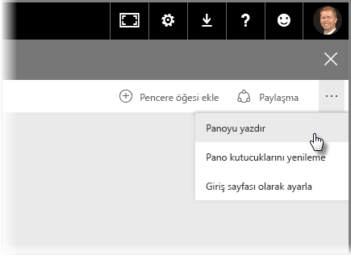
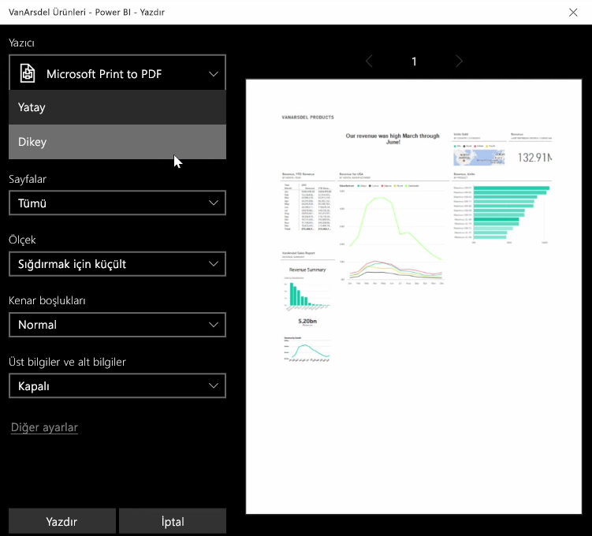
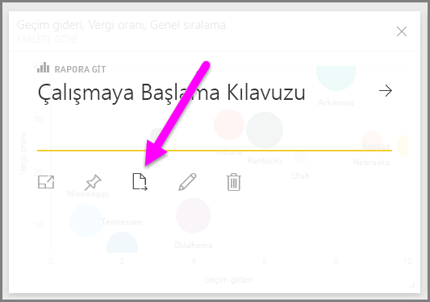
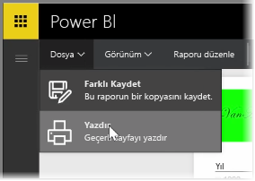

Bazen bir toplantıya yazdırılmış bir rapor veya pano getirerek bunları başkalarıyla paylaşmak isteyebilirsiniz. Power BI'da görsellerinizin çıktısını almak için kullanabileceğiniz birkaç yöntem mevcuttur.

Power BI hizmetinde, ekranın sağ üst tarafındaki üç noktayı seçin ve **Panoyu yazdır** seçeneğini belirleyin.

Panoyu göndermek istediğiniz yazıcının yanı sıra *dikey* veya *yatay* yön gibi standart yazdırma seçeneklerini belirleyebileceğiniz bir **Yazdır** iletişim kutusu görünür.

## Bir görseldeki verileri dışarı aktarma
Ayrıca Power BI hizmetindeki herhangi bir görselde bulunan verileri de dışarı aktarabilirsiniz. Herhangi bir görseldeki üç noktayı seçip **Verileri dışarı aktar** düğmesini (ortadaki düğme) seçmeniz yeterlidir. Bunu yaptığınızda bir .CSV dosyası oluşturulup yerel bilgisayarınıza indirilir ve tarayıcınızda (tarayıcıyla başlatılan herhangi bir indirme işleminde olduğu gibi) indirme işleminizin tamamlandığını bildiren bir ileti görüntülenir.

Ayrıca doğrudan bir rapordan da yazdırma veya dışarı aktarma işlemi gerçekleştirebilirsiniz. Power BI hizmetinde bir raporu görüntülerken yazdır iletişim kutusunu açmak için **Dosya > Yazdır** seçeneğini belirleyin.

Panolarda olduğu gibi, bir rapora ilişkin görselde yer alan verileri de görseldeki dışarı aktar düğmesini seçerek dışarı aktarabilirsiniz.

