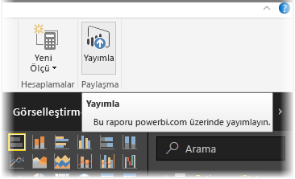
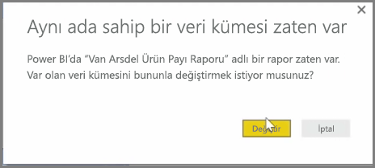
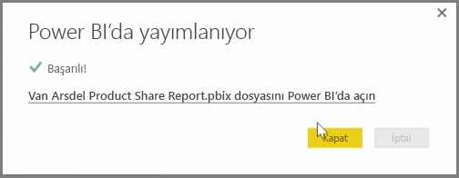

Power BI Desktop'tan Power BI hizmetinde yayımlamış olduğunuz raporları ve veri kümelerini güncelleştirebilirsiniz. Bunu yapmak için şeritteki **Giriş** sekmesinde bulunan **Yayımla** seçeneğini belirleyin.

Power BI hizmetinde mevcut olan bir raporu yayımlarken, önceki veri kümesini ve raporları, güncelleştirmeyi seçtiğiniz düzenlenmiş sürümle değiştirmek isteyip istemediğinizi onaylamanızı isteyen bir istemle karşılaşırsınız.

**Değiştir** seçeneğini belirlediğinizde, dosyanın Power BI Desktop'taki en son sürümünde bulunan veri kümeleri ve raporlar, Power BI hizmetindeki veri kümeleri ve raporların üzerine yazılır.

Ayrıca, Power BI Desktop'taki diğer tüm **Yayımla** olaylarında olduğu gibi, yayımlama olayının başarılı olduğunu bildiren bir iletişim kutusuyla karşılaşır ve Power BI hizmetindeki rapora yönelik bir bağlantı edinirsiniz.

Bu şekilde verilerinizi elle yedekleyebilirsiniz. Ayrıca veri kümelerini ve raporları otomatik olarak da güncelleştirebilirsiniz. (Bu işlem başka bir öğrenme konu başlığı altında ele alınmıştır.)

