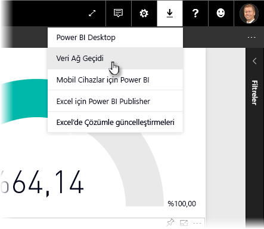
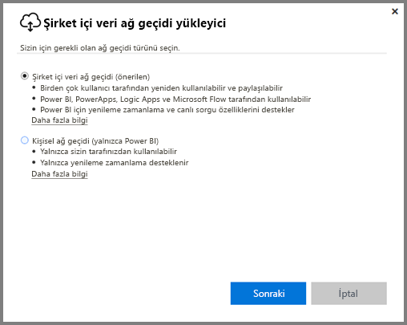
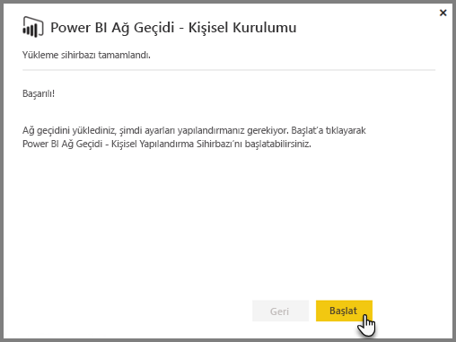
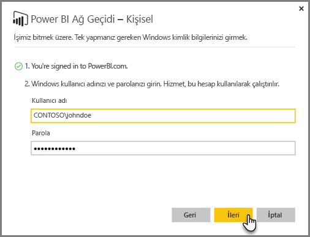
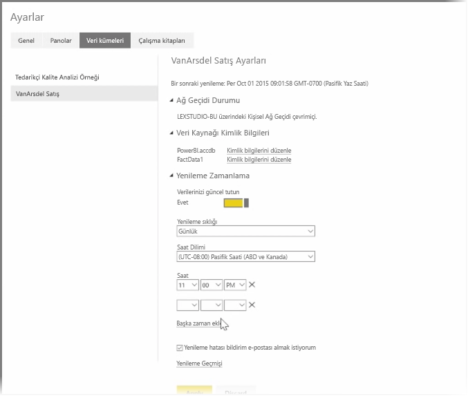

Önceki konu başlıklarında, veri kaynaklarına bağlanmak için Power BI'ı nasıl kullanacağınızdan ve Power BI hizmetindeki veri kümelerinizi elle nasıl yenileyeceğinizden bahsetmiştik. Ancak, verileriniz her değiştiğinde öğelerinizi elle yenilemek istemeyeceksiniz. Bu tür durumlar için Power BI'ı kullanarak, veri kaynaklarınıza bağlanacak ve onları otomatik olarak Power BI hizmetinde yayımlayacak bir zamanlanmış yenileme oluşturabilirsiniz. Ayrıca bu sayede hizmet ile herhangi bir şirket içi veri kaynağı (Excel dosyaları, Access veritabanları, SQL veritabanları ve daha fazlası) arasında bağlantı kurabilirsiniz.

Şirket içi veri kaynaklarınız ile Power BI hizmeti arasında bağlantı kurmanıza olanak sağlayan sistem **veri ağ geçidi** olarak adlandırılır. Bu, bilgisayarınızda çalışan küçük bir uygulamadır ve verilerinize bağlanmak, tüm güncelleştirmeleri toplamak ve bunları Power BI hizmetine iletmek için önceden ayarlanmış bir zamanlamayı kullanır. **Kişisel ağ geçidi**, herhangi bir yönetici yapılandırması olmadan kullanılabilecek bir **veri ağ geçidi** türüdür.

>[!NOTE]
>**Kişisel ağ geçidinin** düzgün şekilde çalışması için Power BI Personal Gateway'in açık ve İnternet'e bağlı olması *gerekir*.
> 

**Kişisel ağ geçidinizi** ayarlamak için öncelikle Power BI hizmetinde oturum açın. Ekranın sağ üst köşesinde **İndir** simgesini seçin ve ardından, menüde **Data Gateway** seçeneğini belirleyin.

Bu işlemin ardından bir web sayfasına yönlendirilirsiniz. Bu sayfada, aşağıda gösterildiği gibi, **Power BI Gateway - Personal** seçeneğini belirleyebilirsiniz.

İndirme işlemi tamamlandıktan sonra uygulamayı çalıştırın ve yükleme sihirbazını tamamlayın.

Ardından, ağ geçidinizi ayarlamak için yapılandırma sihirbazını başlatmanız istenir.

Ağ geçidi hizmeti hesabınızla bağlantılı olarak çalıştığından öncelikle Power BI hizmet hesabınızda, daha sonra da makinenin Windows hesabında oturum açmanız istenir.

Power BI hizmetine geri dönün. Yenilemek istediğiniz veri kümesinin yanındaki üç nokta menüsünü seçin ve ardından **Yenilemeyi Zamanla** seçeneğini belirleyin. Bu işlemin ardından, **Ayarları Yenile** sayfası açılır. Power BI bir **kişisel ağ geçidi** yüklediğinizi algılar ve bu ağ geçidinin durumunu size bildirir.

Her bir veri kaynağının yanındaki **Kimlik bilgilerini düzenle** seçeneğini belirleyin ve kimlik doğrulamasını ayarlayın.

Son olarak, **Yenilemeyi Zamanla** bölümünde, otomatik güncelleştirmeleri etkinleştirmek ve bunların ne zaman ve ne sıklıkta yapılacağını ayarlamak için ilgili seçenekleri belirleyin.

İşte bu kadar. Belirlenen zamanlarda Power BI, sağladığınız kimlik bilgilerini ve **kişisel ağ geçidinizin** yüklü olduğu bilgisayar ile olan bağlantısını kullanarak raporları ve veri kümelerini, belirlemiş olduğunuz zamanlamaya göre güncelleştirir. Power BI'a bir sonraki gidişinizde bu pano, rapor ve veri kümelerinin en son zamanlanmış yenilemeye ait verileri yansıttığını görürsünüz.

## Sonraki adımlar
**Tebrikler!** Power BI **Destekli Öğrenme** kursunun **Veri araştırma** bölümünü tamamladınız. Power BI hizmeti; verileri araştırmak, öngörüleri paylaşmak ve görsellerle etkileşim kurmak için uygulayabileceğiniz ilgi çekici yöntemlerle doludur. Üstelik nerede olursanız olun bağlanabileceğiniz bir hizmet ve tarayıcı aracılığıyla kullanımınıza sunulmuştur.

**Excel** ise Power BI'ın bir o kadar güçlü ve bilinen bir iş ortağıdır. Power BI ve Excel birlikte düzgün çalışacak şekilde tasarlanmıştır; çalışma kitaplarınız Power BI'a mükemmel bir şekilde uyum sağlar ve onları Power BI'a kolayca aktarabilirsiniz.

Ne kadar kolay olduğunu görmek ister misiniz? **Power BI ve Excel** adlı bir sonraki bölümümüzde bunu tam olarak nasıl yapacağınızı öğreneceksiniz.

Bir sonraki bölümde görüşmek üzere!

