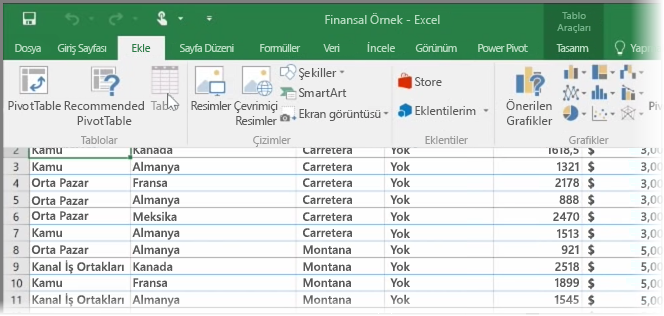
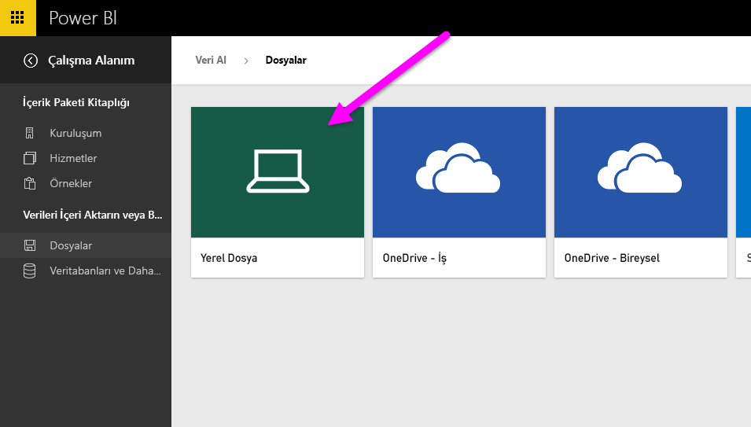
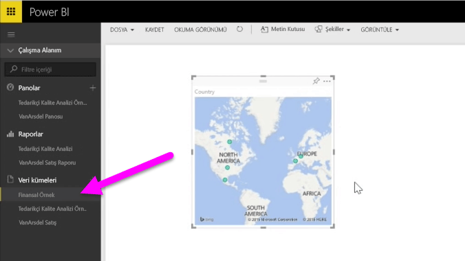

Bu konu başlığı altında, ilk olarak, basit bir **tablo** içeren bir Excel çalışma kitabı dosyasını yerel sürücüden Power BI'a nasıl aktarabileceğinize göz atacağız. Ardından, rapor oluşturarak söz konusu tablonun verilerini Power BI'da araştırmaya nasıl başlayabileceğinizi öğreneceksiniz.

## Verilerinizin bir tablo olarak biçimlendirilmesini sağlama
Power BI'ın, çalışma kitabınızdaki verileri içeri aktarması için söz konusu verilerin **tablo olarak biçimlendirilmesi** gerekir. Bu kolay bir işlemdir. Excel'de bir dizi hücreyi vurgulayabilir ve ardından Excel şeridinin **Ekle** sekmesindeki **Tablo** seçeneğine tıklayabilirsiniz.

Her bir sütunun kolay bir ada sahip olduğundan emin olmanız gerekir. Böylece, Power BI'da raporlarınızı oluştururken istediğiniz verileri daha kolay bir şekilde bulabilirsiniz.

## Yerel bir sürücüden içeri aktarma
Nerede bulundukları fark etmeksizin verilerinizi Power BI ile kolayca içeri aktarabilirsiniz. Power BI'da, **Veri Al** > **Dosyalar** > **Yerel Dosya** seçeneğini kullanarak, istediğimiz Excel dosyasını bulabilir ve seçebiliriz.

Dosya Power BI'a aktarıldıktan sonra rapor oluşturmaya başlayabilirsiniz.

Elbette dosyalarınız yerel sürücüde olmak zorunda değildir. Dosyalarınızı OneDrive'a veya SharePoint Ekip Sitesi'ne kaydetmek daha iyi bir seçimdir. Sonraki bir konu başlığı altında bu konuyla ilgili daha fazla ayrıntıya yer verilecektir.

## Rapor oluşturmaya başlama
Çalışma kitabınızdaki veriler içeri aktarıldıktan sonra Power BI'da bir veri kümesi oluşturulur. Bu, **Veri Kümeleri** bölümünde görünür. Artık raporlar ve panolar oluşturarak verilerinizi araştırmaya başlayabilirsiniz. Veri kümesinin yanındaki **Menüyü aç** simgesine ve ardından **Araştır** seçeneğine tıklamanız yeterlidir. Yeni bir boş rapor tuvali görünür. Sağ taraftaki **Alanlar** bölmesinde tablolarınızı ve sütunlarınızı görürsünüz. Tuvalde yeni bir görselleştirme oluşturmak için kullanmak istediğiniz alanları seçmeniz yeterlidir.

**Görsel Öğeler** bölmesinde görselleştirmenin türünü değiştirebilir ve **filtrelerin** yanı sıra başka özellikler uygulayabilirsiniz.

