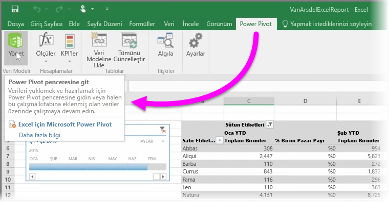

Excel'in veri sorgulamaya ve yüklemeye yönelik **Power Query** (Excel 2016'da **Al ve Dönüştür** adı verilir), güçlü veri modelleri oluşturmaya yönelik **Power Pivot** ve dinamik rapor oluşturmaya yönelik **Power View** gibi gelişmiş BI özelliklerini kullanıyorsanız bunları da Power BI'a aktarabilirsiniz.

Birden fazla ilişkili tablo, ölçü, hesaplanmış sütun ve hiyerarşi içeren veriler gibi gelişmiş veri modelleri oluşturmak için **Power Pivot**'u kullanıyorsanız Power BI bunların da tümünü içeri aktarır.

Çalışma kitabınızda **Power View sayfaları** mı var? Sorun değil. Power BI bunları Power BI'da yeni **Raporlar** olarak yeniden oluşturur. Görselleştirmeleri panolara sabitlemeye hemen başlayabilirsiniz.

Ve Power BI'ın en iyi özelliklerinden biri: Sorgulamak ve, çalışma kitabınızı Power BI'a aktardıktan sonra bir dış veri kaynağından veri yüklemek için bağlanmak için Power Query veya Power Pivot kullanırsanız ayarlayabilirsiniz **zamanlanmış yenileme**. Power BI, zamanlanmış yenilemeyi kullanarak, doğrudan veri kaynağına bağlanmak ve değişen verileri sorgulayıp yüklemek için çalışma kitabınızdaki bağlantı bilgilerinden yararlanır. Raporlardaki tüm görsel öğeler de otomatik olarak güncelleştirilir.

