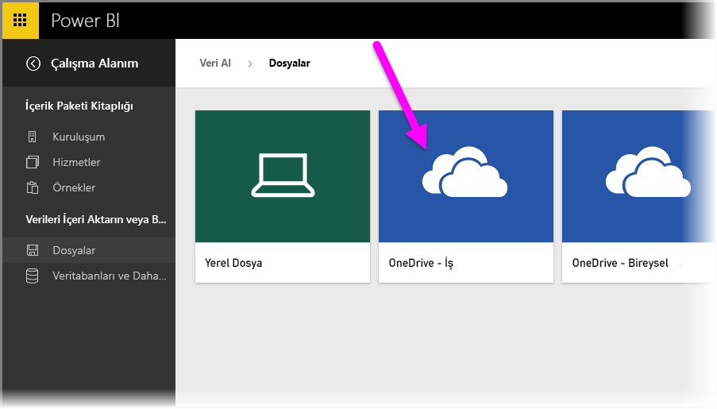
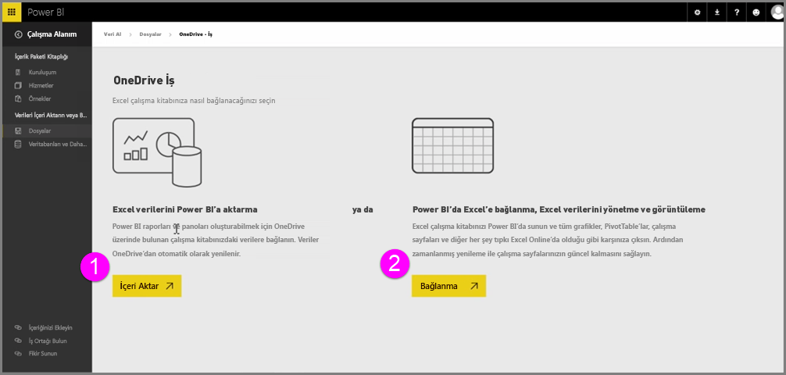
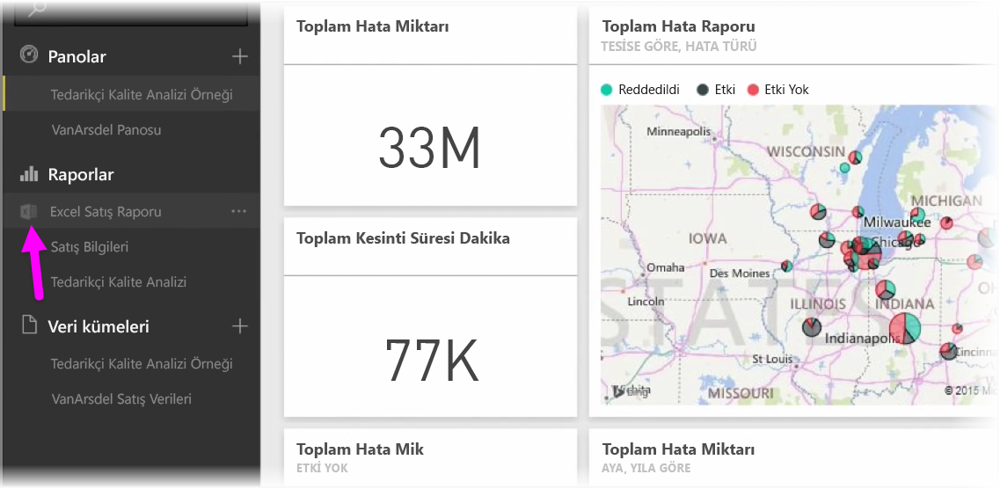
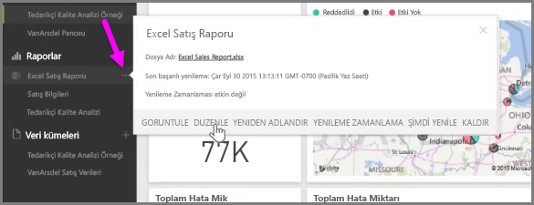

Excel çalışma kitaplarınızı OneDrive uygulamasına kaydederek Power BI ile Excel arasında kusursuz bir tümleştirme elde edin.

Tıpkı Power BI gibi OneDrive da bulutta olduğundan Power BI ile OneDrive arasında canlı bir bağlantı kurulur. OneDrive'daki çalışma kitabınızda değişiklik yaptığınızda söz konusu değişiklikler Power BI ile *otomatik olarak eşitlenir*. Raporlardaki ve panolardaki görselleştirmeleriniz güncel tutulur. Çalışma kitabınız bir veritabanı veya OData akışı gibi harici veri kaynaklarına bağlıysa güncelleştirmeleri denetlemek için Power BI uygulamasının **Yenileme zamanlama** özelliklerini kullanabilirsiniz. Çalışma kitabınızdaki verilerle ilgili sorularınız mı var? Hiç sorun değil. Power BI uygulamasının **Soru-Cevap** özellikleri tam olarak bunu yapabilmeniz için tasarlandı.

OneDrive İş'te Excel dosyalarınıza bağlanabilmenin iki yolu vardır:

1. Excel verilerini Power BI'a aktarma
2. Power BI'da Excel'e bağlanma, Excel verilerini yönetme ve görüntüleme

### Excel verilerini Power BI'a aktarma
Excel verilerini Power BI uygulamasına aktarmayı seçtiğinizde çalışma kitabınızdaki tablo verileri Power BI'daki yeni bir veri kümesine yüklenir. Çalışma kitabınızda **Power View** sayfaları varsa bunlar da içeri aktarılır ve Power BI'da otomatik olarak yeni raporlar oluşturulur.

OneDrive İş uygulamanızdaki çalışma kitabı dosyası ile Power BI arasındaki bağlantı Power BI tarafından sağlanır. Çalışma kitabınızda herhangi bir değişiklik yaparsanız dosyayı kaydettiğinizde bu değişiklikler Power BI ile *otomatik olarak eşitlenir** ve bu işlem genellikle bir saat içinde tamamlanır. Çalışma kitabınız harici veri kaynaklarına bağlıysa, zamanlanmış yenileme ayarlayarak Power BI'daki veri kümesinin güncel tutulmasını sağlayabilirsiniz. Power BI'daki raporlarda ve panolarda bulunan görselleştirmeler, veri kümesindeki verileri kullandığı için araştırma sırasında sorgularınız çok hızlı geçekleşir.

### Power BI'da Excel'e bağlanma, Excel verilerini yönetme ve görüntüleme
Excel çalışma kitabına bağlanmayı seçerseniz Excel ve Power BI ile çalışma kitabınız üzerinde kusursuz bir çalışma deneyimi elde edersiniz. Bu bağlantı yöntemini tercih ettiğinizde çalışma kitabına ilişkin raporun yanında küçük bir Excel simgesi bulunur.

Power BI'daki raporda Excel çalışma kitabınızı görüntüleme deneyiminiz **Excel Online**'daki gibidir. Üç nokta menüsünde Düzenle'yi seçerek çalışma sayfalarınızı Excel Online'da araştırabilir ve düzenleyebilirsiniz. Değişiklik yaptığınızda, panolara sabitlemiş olduğunuz tüm görselleştirmeler otomatik olarak güncelleştirilir.

Power BI'da herhangi bir veri kümesi oluşturulmaz. Tüm veriler OneDrive'daki çalışma kitabında kalır. Çalışma kitabınızın, harici veri kaynaklarına bağlı olması halinde **zamanlanmış yenileme** ayarlayabilmeniz bu yaklaşımın sunduğu pek çok avantajdan biridir. Power BI'da öğeleri (PivotTable ve grafikler gibi) seçerek doğrudan panolara **sabitleyebilirsiniz**. Yaptığınız değişiklikler Power BI'da otomatik olarak uygulanır. Ayrıca Power BI uygulamasının harika **Soru-Cevap** özelliklerinden yararlanarak çalışma kitabınızdaki veriler hakkında sorular sorabilirsiniz.  

