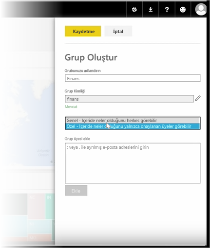
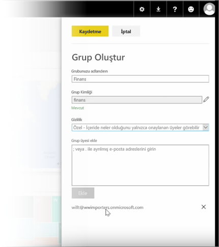

Bu derse *grup* oluşturarak başlıyoruz. **Gruplar**; belirli panolara, raporlara ve verilere erişimi olan bir kullanıcı kümesini tanımlar.

Power BI'daki gruplar Office 365'teki gruplara dayanır; bu nedenle, grubunuzun e-postalarını, takvimini ve belgelerini yönetmek için daha önce Office 365 gruplarını kullandıysanız Power BI'ın da aynı özellikleri ve daha fazlasını sunduğunu göreceksiniz. Power BI'da oluşturduğunuz gruplar aslında Office 365 gruplarıdır.

Bu modülde, yeni bir finans grubu ayarlama senaryosu kullanılmaktadır. Grup oluşturmayı, grupta pano, rapor ve veri kümesi paylaşmayı ve gruptaki öğelere erişim sahibi olacak üyeleri eklemeyi göstereceğiz.

Çalışma Alanım'da işleme başlıyorum. Bunlar benim oluşturduğum veya birisinin benimle paylaştığı panolar, raporlar ve veri kümeleri.

Çalışma Alanım'ı genişletirsem **Grup oluştur** seçeneğini belirleyebilirim.

Burada grubu adlandırabilirim. Senaryoyu veya bir finans grubunu kullandığımız için gruba Finance adını vereceğim. Power BI, adın etki alanında mevcut olmadığından emin olur.

Grubun içeriklerini kuruluşumdaki herkesin mi yoksa yalnızca grup üyelerinin mi görebileceğine karar vererek gizlilik düzeyini ayarlayabilirim.

Buraya e-posta adresleri, güvenlik grupları ve dağıtım listeleri yazıyorum. Bu kişileri grubun üyeleri haline getirmek için **Ekle** seçeneğini belirleyip grubu kaydediyorum.

Sonraki ders ile devam ediyoruz!

