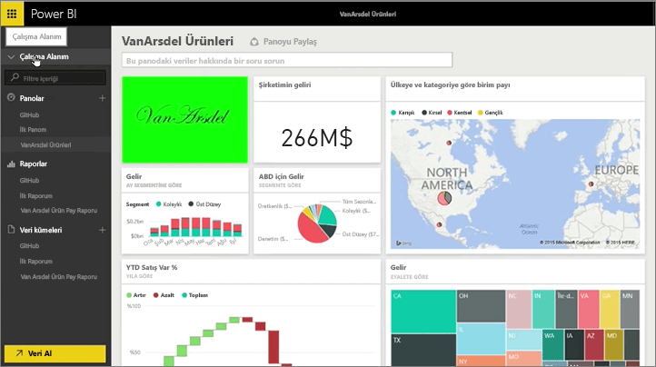

Bu derste, Power BI'da zaten sahip olduğumuz mevcut yapıtlarla bir *içerik paketi* oluşturacak ve bu yapıtları iş arkadaşlarımızla paylaşacağız.

**Çalışma Alanım**'da panom ve bunun altında ise rapor ve veri kümesi var. Bunları kuruluşumdaki kişilerin yeniden kullanabilmesi için paket olarak paylaşmak istiyorum.

**Ayarlar** (hizmetin sağ üst tarafındaki dişli) simgesini seçtiğimde ne kadar depolama alanı kullandığımı ve buradan edindiğim bilgiye göre bir içerik paketi oluşturabileceğimi görüyorum.

Görünen iletişim kutusunda, paketi dağıtacağım kullanıcıları veya grupları seçebiliyor ve pakete bir başlık verebiliyorum. Bir içerik paketine göz atan kullanıcıların paketin neler içerdiğini veya neler sağladığını anlayabilmesi için **Açıklama** kutusuna ayrıntılı bir açıklama eklemenin iyi bir fikir olduğunu düşünüyorum.

İletişim kutusunun alt tarafında içerik paketi için karşıya resim yükleme seçeneğine sahibim ve en önemli adım olarak içerik paketine eklemek istediğim panoyu seçiyorum. Bunu yaptığımda Power BI panoda kullanılan raporu ve veri kümesini otomatik olarak seçiyor. İçerik paketine eklemek istediğim pano için gerekli olduğundan raporun veya veri kümesinin seçimini kaldıramıyorum.

Başka panolar, raporlar ve veri kümeleri de seçebilirim ancak bunu şimdi yapmayacağım.

Yayımlama işlemiyle içerik paketi kuruluşun içerik galerisine ekleniyor.

Sonraki ders ile devam ediyoruz!

