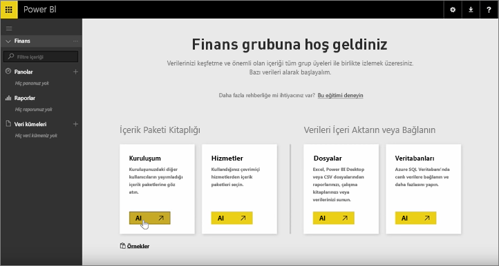

Önceki derslerde içerik paketi ve grup oluşturduk. Bu derste ise gruptaki herkes için içerik paketinin bir örneğini oluşturacağız.

Çalışma Alanım'da işleme başlıyorum...

...ve daha önceki bir derste oluşturduğum Finance grubuna geri dönüyorum.

Grubun henüz panosu, raporu veya veri kümesi yok. Kendi oluşturduğum içerik paketini kullanacağım. Üçüncü taraf hizmetlerin içerik paketleri yerine kuruluşuma ait içerik paketlerine göz atıyorum.

Bir dakika önce oluşturduğum içerik paketini buluyorum. Kullanıcıların bulabilmesi açısından içerik paketine uygun bir başlık, açıklama ve resim eklemenin öneminin farkındayım. İçerik paketine bağlanıyorum.

Power BI, içerik paketindeki panoları, raporları ve veri kümelerini içeri aktarır.

Veri kümesi seçtiğimde Power BI, içerik paketini kişiselleştirmek isteyip istemediğimi sorar.

Değişiklik yapabileceğim içerik paketinin bir kopyasını oluşturuyor ve içerik paketinin yayımlanan sürümüyle bağlantısını kesiyorum. İçerik paketi oluşturucusunun yayımlanan sürümde değişiklik yapması durumunda bu güncelleştirmeleri otomatik olarak almayacağım.

Ancak istersem panoyu, raporu ve hatta veri kümesini düzenleyebilirim.

Sonuç olarak içerik paketleri, kuruluşunuzdaki diğer kullanıcılar tarafından oluşturulan içeriğin yeniden kullanılmasına yönelik basit bir yöntemdir.

Sonraki ders ile devam ediyoruz: [Power BI'da içerik paketi oluşturma](6-4-update-content-pack.md).

