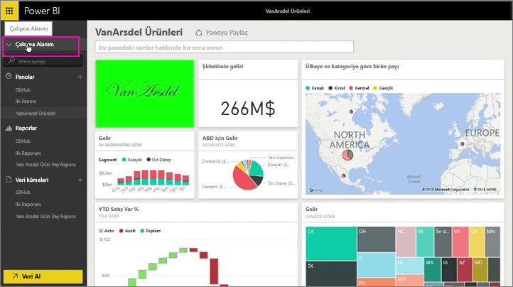
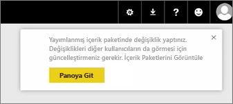
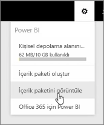
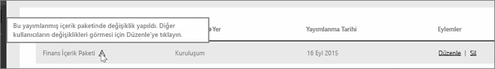
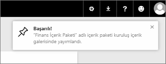

Bu derste, daha önce oluşturduğumuz özgün içerik paketini düzenleyecek ve bunun söz konusu içerik paketine bağlanmış olan diğer kullanıcılara nasıl yansıdığını göreceğiz.

Tekrar Çalışma Alanım'dayım ve özgün panomu düzenliyorum.

Panoda yaptığım her değişiklikte, diğerleriyle paylaştığım bir şeyi değiştirdiğime ve paylaşılan sürümü güncelleştirmem gerektiğine ilişkin bu hatırlatmayı alıyorum.

Ayarlar simgesine geri dönüp, yayımlamış olduğum içerik paketlerini görmek için **İçerik paketini görüntüle** seçeneğini belirliyorum.

Oluşturduğum içerik paketini görüyorum. Bu küçük simge bana içerik paketinde bir şeyi değiştirdiğimi ve diğer kullanıcıların değişikliklerimi görebilmesi için içerik paketini düzenlemem gerektiğini söylüyor.

**Düzenle** seçeneğini belirlediğimde başlığı ve açıklamayı düzenleyebileceğim ekrana geliyorum ancak bu kez ekranda bir **Güncelleştir** düğmesi var, bunu seçiyorum.

Power BI bu değişiklikleri alır ve güncelleştirilmiş içerik paketini içerik paketi galerisinde yayımlar.

İçerik paketime bağlanan herkes içerik paketinin değiştiğini belirten ve değişiklikleri kabul etme ile daha eski sürümü tutma arasında seçim yapılmasını isteyen bir ileti alır.

Böylece içerik paketinin sahibi olarak, iş arkadaşlarınızın kullandığı sürümleri yönetebilirsiniz.

