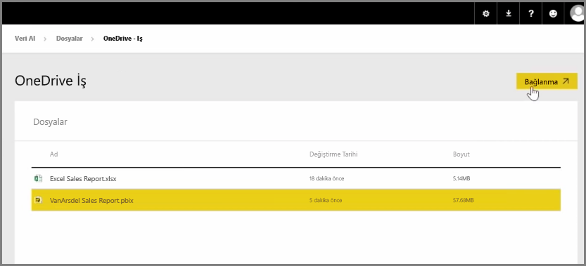

Daha önceki bir makalede, kuruluşunuzun Power BI'daki içerikleri yönetmesine ve bunlar üzerinde işbirliği yapmasına yardımcı olmak üzere grup oluşturma konusunu incelemiştik. Power BI/Office365 gruplarınızı **OneDrive İş** ile içerikler üzerinde işbirliği yapmak ve bunları paylaşmak için de kullanabilirsiniz.

Power BI içeriğiniz için kaynak olarak OneDrive İş'i kullandığınızda sürüm geçmişi gibi birçok faydalı araca erişim elde edersiniz. Ayrıca, OneDrive İş'te bir Office 365 grubuyla dosyalarınızı paylaşarak birçok kişinin aynı Power BI veya Excel dosyaları üzerinde çalışmasına olanak sağlayabilirsiniz.

OneDrive İş’teki bir PBIX (Power BI Desktop) dosyasına bağlanmak için Power BI hizmetinde oturum açın ve **Veri Al**’ı seçin. Verileri İçeri Aktarın veya Bağlayın bölümündeki **Dosyalar**'ı seçin ve ardından **OneDrive - İş** seçeneğini belirleyin. İstediğiniz dosyayı seçin ve **Bağlan** seçeneğini belirleyin.

İçeriğiniz sol taraftaki gezinti çubuğunda görünür.

Artık **OneDrive İş**'teki dosyada yapılan tüm değişiklikler otomatik olarak Power BI ortamına yansıtılır ve sürüm geçmişine kaydedilir.

