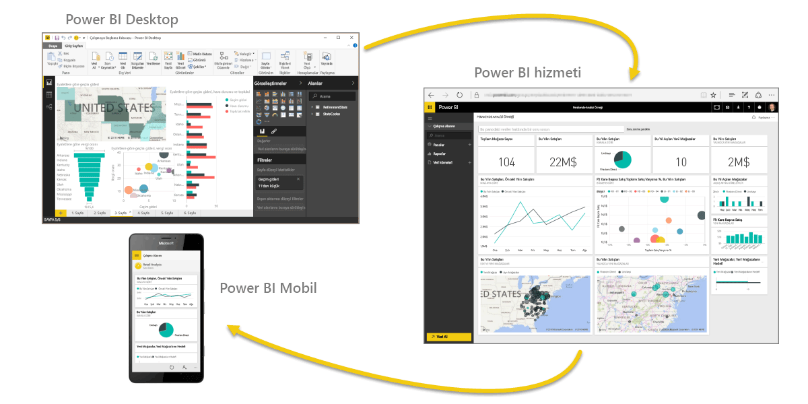
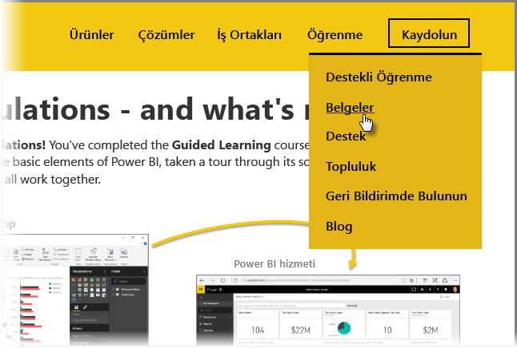

Başardınız! **Tebrikler!** Power BI **Destekli Öğrenme** kursunu tamamladınız. Power BI'ın temel bileşenleri hakkında bilgi edinmenin yanı sıra yazılım özellikleri ve öğeleri ile tüm bunların birlikte nasıl çalıştığını öğrendiniz.

Bu, kursun son bölümüdür. (DAX hakkında bilgi edinmek istemiyorsanız aynı zamanda son konudur.) Sırasıyla tüm bu bölümleri incelediyseniz kendinizi tebrik edebilirsiniz. İyi iş çıkardınız! Artık tüm bu **önemli kavramlara** hakimsiniz:

* [Power BI nedir](../gettingstarted.yml?tutorial-step=1)?
* Power BI'ın [yapı taşları](../gettingstarted.yml?tutorial-step=3)
* Verileri [alma](../gettingdata.yml?tutorial-step=3) ve [modelleme](../modeling.yml?tutorial-step=1)
* [Görselleştirmeler](../visualizations.yml?tutorial-step=1)
* Power BI hizmetinde [verileri araştırma](../exploringdata.yml?tutorial-step=1)
* [Excel ve Power BI](../powerbiandexcel.yml?tutorial-step=1) yazılımlarını birlikte kullanma
* Çalışmanızı [yayımlama ve paylaşma](../publishingandsharing.yml?tutorial-step=1)

Artık bu önemli bilgi birikimine sahip olduğunuza göre uygulamaya geçmeye hazırsınız! **İndirmelere ulaşmaya** veya tarayıcınızın **Power BI hizmetine bağlanmasını** sağlamaya yönelik bazı bağlantılar aşağıda verilmiştir:

* Dilediğiniz zaman [Power BI Desktop'ın en son sürümünü edinebilirsiniz](https://powerbi.microsoft.com/desktop)
* [Power BI hizmetine](https://powerbi.microsoft.com/) ulaşmak kolaydır
* [Power BI mobil uygulamalarını](https://powerbi.microsoft.com/mobile/) edinmeniz bir dokunma hareketinize bakar

Ayrıca daha fazla **yardım ve başvuru** içeriğine de erişebilirsiniz. Kapsamlı Power BI başvuru içeriklerimizi görmek için tek yapmanız gereken bu sayfanın üst kısmına giderek **Öğrenin > Belgeler** seçeneğini belirlemektir.

Bu **Power BI Destekli Öğrenme** deneyiminizden memnun kaldığınızı umuyoruz. İyi şanslar diler, Power BI görsellerinizin her zaman kapsamlı ve etkileyici olmasını umarız.

## DAX kullanıcıları için ek bölüm
Daha fazlasını mı istiyorsunuz? Power BI'da özel sütunlar ve tablolar oluşturmak, bunları filtrelemek veya kullanmak için **DAX (Veri Çözümleme İfadeleri)** dilinden yararlanmak mı istiyorsunuz? Power BI'da kod yazmaya eğilimli kişilere yönelik olarak oluşturulmuş, **DAX'a giriş** adında bir bölüm daha sunulmuştur. İlginizi çekiyorsa göz atmanızda fayda var. Burada da destekli öğrenme kursunun diğer bölümlerindeki ile aynı düzeyde kolaylık sunan bir yaklaşım gözetilmiştir.

