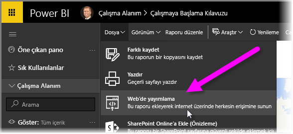
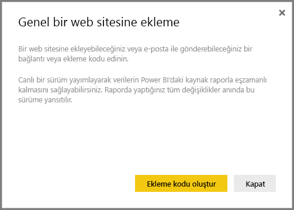
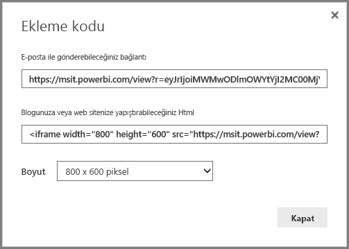
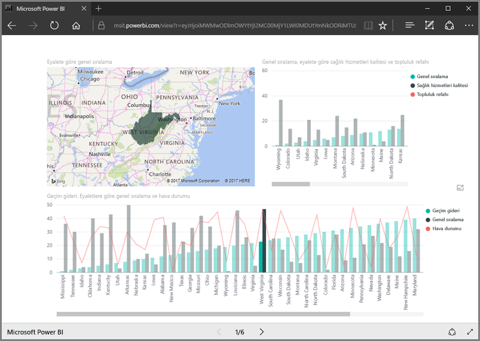
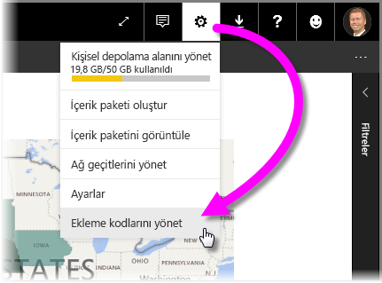
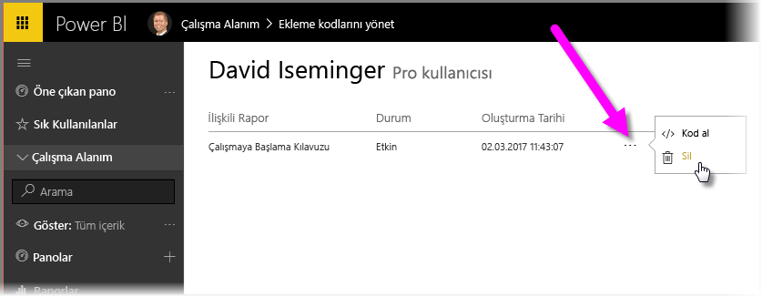

Bu derste, yalnızca birkaç adım uygulayarak bir Power BI raporunu web sayfasında paylaşmayı veya e-posta yoluyla göndermeyi öğreneceğiz. Power BI'ın bu özelliği genellikle **Web'de yayımla** olarak adlandırılır ve kolayca kullanılıp yönetilebilir.

Power BI'da, tuval üzerinde görüntülenmesini sağlamak üzere, paylaşmak istediğiniz raporu seçin. Ardından menüden **Dosya > Web'de yayımla** seçeneğini belirleyin.

Burada, raporu web sitesine veya postaya eklemenize olanak tanıyan bir *ekleme kodu* alacağınızı belirten bir iletişim kutusuyla karşılaşırsınız.

**Ekleme kodu oluştur** seçeneğini belirlediğinizde Power BI, verilerinizi İnternet'teki herkesle paylaşmak üzere olduğunuzu belirten başka bir iletişim kutusu görüntüler. Bunun sizin için uygun olduğundan emin olun.

Power BI iki bağlantı içeren bir iletişim kutusu sunar:

* raporu web sayfası olarak gösteren, e-postada paylaşabileceğiniz bir bağlantı
* raporu doğrudan bir web sayfasına ekleyebilmeniz için HTML kodu (iframe içinde bağlantı)

HTML bağlantısı için, eklenen rapora yönelik olarak önceden tanımlanmış boyutlardan seçim yapabilir veya iframe kodunu kendiniz değiştirip boyutunu özelleştirebilirsiniz.

Raporunuzu web sayfası olarak görmek için e-posta bağlantısını bir tarayıcıya yapıştırmanız yeterlidir. Raporu Power BI'da görüntülerken yapacağınız gibi bu web sayfasıyla da etkileşime geçebilirsiniz. Aşağıdaki resimde, bağlantısı doğrudan söz konusu iletişim kutusundan tarayıcıya kopyalandığı haliyle bir **Web'de yayımla** sayfası gösterilmektedir:

Ayrıca bu iframe bağlantısını bir blog gönderisine veya web sitesine ya da Sway'e de ekleyebilirsiniz.

Oluşturduğunuz bir ekleme kodunu silmek mi istiyorsunuz? Hiç sorun değil. Power BI'da sağ üst köşedeki **dişli** simgesini seçin ve ardından **Ekleme kodlarını yönet** seçeneğini belirleyin.

Power BI çalışma alanı, oluşturduğunuz ekleme kodlarını gösterir. (Aşağıdaki resimde yalnızca bir adet mevcuttur.) Üç noktaya tıkladığınızda ekleme kodu için kod almayı veya ekleme kodunu tamamen silmeyi seçebilirsiniz.

Artık Power BI raporunuzu web'de yayımlayarak tüm dünyayla paylaşabilirsiniz. İşte bu kadar!

