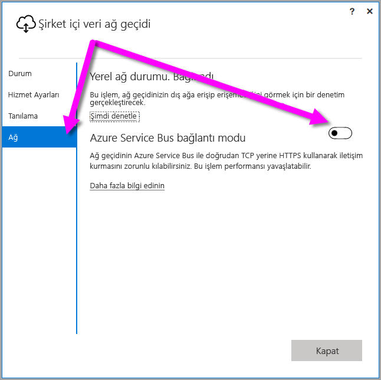
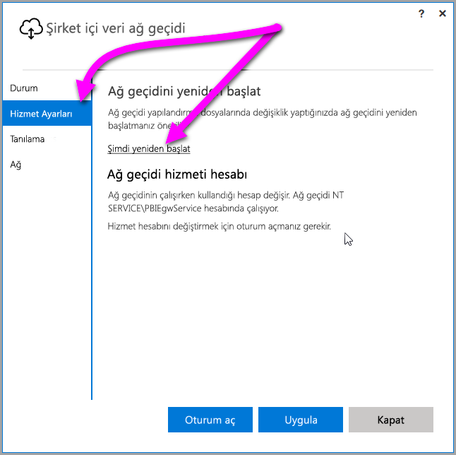

## <a name="sign-in-account"></a>Oturum açma hesabı

Kullanıcılar, iş veya okul hesabıyla oturum açar. Bu hesap, **kuruluş hesabınızdır**. Bir Office 365 teklifine kaydolduysanız ve gerçek iş e-postanızı sağlamadıysanız e-postanız şu şekilde görünebilir: nancy@contoso.onmicrosoft.com. Hesabınız, Azure Active Directory’deki (AAD) bir kiracıda depolanır. Çoğu durumda AAD hesabınızın UPN'si e-posta adresiyle eşleşir.

## <a name="windows-service-account"></a>Windows Hizmet hesabı

Şirket içi veri ağ geçidi, Windows hizmeti oturum açma kimlik bilgileri için *NT SERVICE\PBIEgwService* kullanılacak şekilde yapılandırılır. Varsayılan olarak, ağ geçidini yüklediğiniz makine bağlamında Hizmet olarak oturum açma hakkına sahiptir. Bu hesap, şirket içi veri kaynaklarına bağlanmak için kullandığınız hesap değildir. Ayrıca bu hesap, bulut hizmetlerinde oturum açmak için kullandığınız iş veya okul hesabı da değildir.

> [!NOTE]
> Kişisel modu seçtiyseniz Windows hizmet hesabını ayrı olarak yapılandırırsınız.

Ara sunucunuzda kimlik doğrulaması ile ilgili sorunlarla karşılaşırsanız Windows hizmet hesabını bir etki alanı kullanıcısı veya yönetilen hizmet hesabı olarak değiştirmeyi deneyin. Daha fazla bilgi için bkz. [ara sunucu yapılandırması](../service-gateway-proxy.md#changing-the-gateway-service-account-to-a-domain-user).

## <a name="ports"></a>Bağlantı noktaları

Ağ geçidi, Azure Service Bus'a yönelik bir giden bağlantı oluşturur. Şu giden bağlantı noktaları üzerinden iletişim kurar: TCP 443 (varsayılan), 5671, 5672, 9350 - 9354.  Ağ geçidi için gelen bağlantı noktaları gerekli değildir.

Güvenlik duvarınızda veri bölgenize ilişkin IP adreslerini beyaz listeye eklemeniz önerilir. Haftalık olarak güncelleştirilen [Microsoft Azure Veri Merkezi IP listesini](https://www.microsoft.com/download/details.aspx?id=41653) indirebilirsiniz. Ağ geçidi, tam etki alanı adı (FQDN) ile IP adresini kullanarak Azure Service Bus ile iletişim kurar. Ağ geçidini HTTPS kullanarak iletişim kurmaya zorluyorsanız yalnızca FQDN kullanılır ve IP adresleri kullanılarak herhangi bir iletişim kurulmaz.

> [!NOTE]
> Azure Veri Merkezi IP listesindeki adresler, CIDR gösteriminde listelenir. Örneğin, 10.0.0.0/24 değeri, 10.0.0.0’dan 10.0.0.24’e kadar anlamına gelmez. [CIDR gösterimi](http://whatismyipaddress.com/cidr) hakkında daha fazla bilgi edinin.

Aşağıda, ağ geçidi tarafından kullanılan tam etki alanı adlarının bir listesi verilmiştir.

| Etki alanı adları | Giden bağlantı noktaları | Açıklama |
| --- | --- | --- |
| *.download.microsoft.com |80 |Yükleyiciyi indirmek için kullanılan HTTP. |
| *.powerbi.com |443 |HTTPS |
| *.analysis.windows.net |443 |HTTPS |
| *.login.windows.net |443 |HTTPS |
| *.servicebus.windows.net |5671-5672 |Gelişmiş İleti Sıraya Alma Protokolü (AMQP) |
| *.servicebus.windows.net |443, 9350-9354 |TCP üzerinden Service Bus Geçişi'ndeki dinleyiciler (Erişim Denetimi belirtecinin alınması için 443 gerekir) |
| *.frontend.clouddatahub.net |443 |HTTPS |
| *.core.windows.net |443 |HTTPS |
| login.microsoftonline.com |443 |HTTPS |
| *.msftncsi.com |443 |Power BI hizmeti tarafından ağ geçidine ulaşılamaması halinde İnternet bağlantısını test etmek için kullanılır. |
| *.microsoftonline-p.com |443 |Yapılandırmaya bağlı olarak kimlik doğrulaması için kullanılır. |

> [!NOTE]
> visualstudio.com veya visualstudioonline.com'a giden trafik uygulama öngörüleri için kullanılır ve ağ geçidinin çalışması için gerekli değildir.

## <a name="forcing-https-communication-with-azure-service-bus"></a>Azure Service Bus ile HTTPS iletişimini zorlama

Ağ geçidinin Azure Service Bus ile doğrudan TCP yerine HTTPS kullanarak iletişim kurmasını zorunlu kılabilirsiniz. HTTPS kullanımı performansı etkileyebilir. Bu işlemi gerçekleştirmek için, bu paragrafın hemen altındaki kod parçacığında gösterilen şekilde, *Microsoft.PowerBI.DataMovement.Pipeline.GatewayCore.dll.config* dosyasını düzenleyerek `AutoDetect` değerini `Https` olarak değiştirin. Bu dosya varsayılan olarak *C:\Program Files\On-premises data gateway* konumunda bulunur.

```
<setting name="ServiceBusSystemConnectivityModeString" serializeAs="String">
    <value>Https</value>
</setting>
```

*ServiceBusSystemConnectivityModeString* parametresinin değeri büyük/küçük harfe duyarlıdır. Geçerli değerler şunlardır: *AutoDetect* ve *Https*.

Alternatif olarak ağ geçidi kullanıcı arabirimini kullanarak, ağ geçidini bu davranışı benimsemeye zorlayabilirsiniz. Ağ geçidi kullanıcı arabiriminde **Ağ** seçeneğini belirleyin ve ardından **Azure Service Bus bağlantı modu** değerini **Açık** olarak değiştirin.



Değişikliğin ardından **Uygula**'yı seçtiğinizde (yalnızca değişiklik yaptığınızda görünen bir düğme) *ağ geçidi Windows hizmeti* otomatik olarak yeniden başlatılır ve söz konusu değişiklik geçerli olur.

Daha sonra gerçekleştireceğiniz işlemler için, *ağ geçidi Windows hizmetini*, kullanıcı arabiriminde **Hizmet Ayarları**'nı ve ardından *Şimdi Yeniden Başlat*'ı seçerek ilgili iletişim kutusundan yeniden başlatabilirsiniz.



## <a name="support-for-tls-12"></a>TLS 1.2 Desteği

Varsayılan olarak Şirket içi veri ağ geçidinde, Power BI hizmeti ile iletişim kurmak için Aktarım Katmanı Güvenliği (TLS) 1.2 sürümü kullanılmaktadır. Tüm ağ geçidi trafiğinin TLS 1.2 kullanmasını sağlamak için, ağ geçidi hizmetinin çalıştırıldığı makinede şu kayıt defteri anahtarlarını eklemeniz veya değiştirmeniz gerekebilir:

```
[HKEY_LOCAL_MACHINE\SOFTWARE\Microsoft\.NETFramework\v4.0.30319]"SchUseStrongCrypto"=dword:00000001
[HKEY_LOCAL_MACHINE\SOFTWARE\Wow6432Node\Microsoft\.NETFramework\v4.0.30319]"SchUseStrongCrypto"=dword:00000001
```

> [!NOTE]
> Bu kayıt defteri anahtarları eklendiğinde veya değiştirildiğinde değişiklikler tüm .NET uygulamalarında geçerli olur. Diğer uygulamalar için TLS'yi etkileyen kayıt defteri değişiklikleri hakkında bilgi edinmek için bkz. [Transport Layer Security (TLS) registry settings (Aktarım Güvenliği Katmanı (TLS) kayıt defteri ayarları)](https://docs.microsoft.com/windows-server/security/tls/tls-registry-settings).

## <a name="how-to-restart-the-gateway"></a>Ağ geçidini yeniden başlatma

Ağ geçidi, bir Windows hizmeti olarak çalışır. Ağ geçidini de diğer Windows hizmetleri gibi başlatıp durdurabilirsiniz. Aşağıda, bu işlemleri komut isteminden nasıl gerçekleştireceğiniz açıklanmıştır.

1. Ağ geçidinin çalıştırıldığı makinede bir yönetici komut istemi başlatın.
2. Hizmeti durdurmak için aşağıdaki komutu kullanın.
   
   net stop PBIEgwService
3. Hizmeti başlatmak için aşağıdaki komutu kullanın.
   
   net start PBIEgwService

