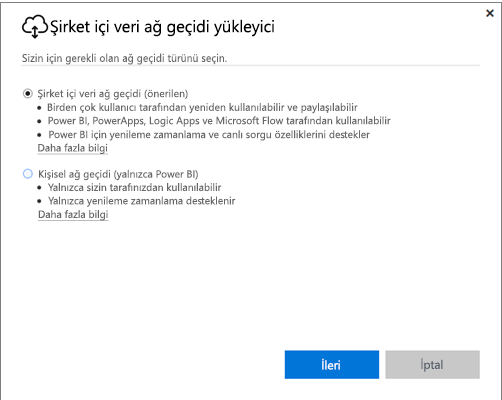
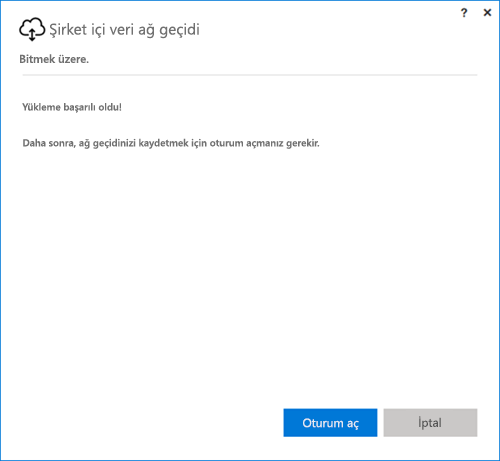
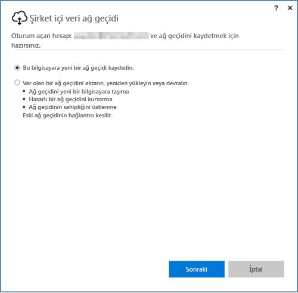
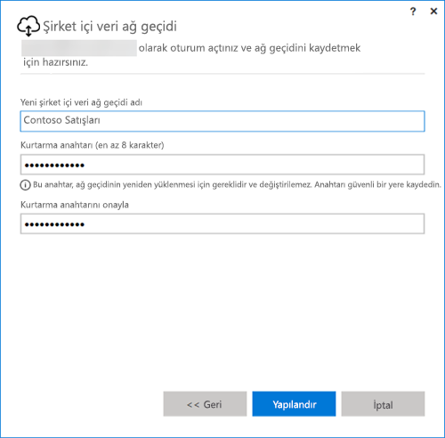

## Şirket içi veri ağ geçidini yükleme
Veri ağ geçidi bilgisayarınıza yüklenir ve orada çalışır. Ağ geçidinin sürekli açık bırakılabilecek bir bilgisayara yüklenmesi önerilir.

> [!NOTE]
> Ağ geçidi, yalnızca 64 bit Windows işletim sistemlerinde desteklenir.
> 
> 

Power BI için yapmanız gereken ilk seçim ağ geçidi modudur.

* **Şirket içi veri ağ geçidi:** Bu modda ağ geçidini birden fazla kullanıcı paylaşabilir ve kullanabilir. Bu ağ geçidi Power BI, PowerApps, Flow veya Logic Apps ile kullanılabilir. Power BI'da hem yenileme zamanlama hem de DirectQuery desteği sunulur
* **Kişisel:** Bu mod yalnızca Power BI içindir ve kullanıcı tarafından, yönetici yapılandırmasına gerek duymadan kullanılabilir. Bu mod yalnızca istek üzerine yenileme ve yenileme zamanlama için kullanılabilir. Bu seçim kişisel ağ geçidi yüklemesini başlatır.

Ağ geçidinin iki modunu yüklerken de dikkat edilmesi gereken birkaç nokta vardır:

* iki ağ geçidi için de 64 bit Windows işletim sistemi gerekir
* ağ geçitleri etki alanı denetleyicisi üzerine yüklenemez
* aynı bilgisayara her biri farklı bir modda çalışan (kişisel ve standart) iki şirket içi veri ağ geçidi yükleyebilirsiniz. 
* aynı bilgisayara aynı modda çalışan birden fazla ağ geçidi yükleyemezsiniz.
* farklı bilgisayarlara birden fazla şirket içi veri ağ geçidi yükleyip tümünü aynı Power BI ağ geçidi yönetim arabiriminden yönetebilirsiniz (kişisel hariç, aşağıdaki noktaya bakın)
* Her Power BI kullanıcısı için Kişisel modda çalışan yalnızca bir ağ geçidine sahip olabilirsiniz. Başka bir bilgisayarda bile olsa aynı kullanıcı için ikinci bir Kişisel mod ağ geçidi yüklediğinizde en son yapılan yükleme önceki yüklemelerin yerini alır.

Ağ geçidini yüklemeden önce dikkat etmeniz gereken birkaç nokta vardır.

* Yüklemeyi dizüstü bilgisayara yapıyorsanız, dizüstü bilgisayarınız kapalı olduğunda, internet bağlantısı olmadığında veya uyku moduna geçtiğinde ağ geçidi çalışmaz ve bulut hizmetindeki veriler şirket içi verilerinizle eşitlenmez.
* Bilgisayarınız kablosuz ağa bağlıysa ağ geçidi daha yavaş çalışabilir ve bulut hizmetindeki verilerle şirket içi verilerinizin eşitlenmesi daha uzun sürebilir.

Ağ geçidi yüklendikten sonra iş veya okul hesabınızla oturum açmanız gerekir.

Oturum açtıktan sonra yeni bir ağ geçidi yapılandırabilir veya var olan ağ geçidini taşıyabilir, geri yükleyebilir veya devralabilirsiniz.

## Yeni bir ağ geçidini yapılandırma
1. Ağ geçidi için bir **ad** girin
2. **Kurtarma anahtarı** girin. Bu bilginin en az 8 karakter uzunluğunda olması gerekir.
3. **Yapılandır**'ı seçin.

> [!NOTE]
> Ağ geçidini taşımanız, geri yüklemeniz veya devralmanız gerekirse kurtarma anahtarına ihtiyaç duyarsınız. Bu anahtarı güvenli bir yerde saklamayı unutmayın.
> 
> 

### Var olan bir ağ geçidini taşıma, geri yükleme veya devralma
Kurtarmak istediğiniz ağ geçidini seçmeniz ve ağ geçidini oluşturduğunuzda belirlediğiniz kurtarma anahtarını girmeniz gerekir.

### Şirket içi veri ağ geçidi bağlandı
Ağ geçidi yapılandırıldıktan sonra şirket içi veri kaynaklarına bağlanabilirsiniz.

Ağ geçidini Power BI için oluşturduysanız veri kaynaklarınızı Power BI hizmetindeki ağ geçidine eklemeniz gerekir. Bu işlemi **Ağ geçitlerini yönet** bölümünden yapabilirsiniz. Daha fazla bilgi için veri kaynaklarını yönetme makalelerini inceleyebilirsiniz.

PowerApps'ta desteklenen veri kaynakları için tanımlanmış bağlantıyla ilişkili bir ağ geçidi seçmeniz gerekir. Flow ve Logic Apps için bu ağ geçidi şirket içi bağlantılarınızla birlikte kullanılmaya hazırdır.

