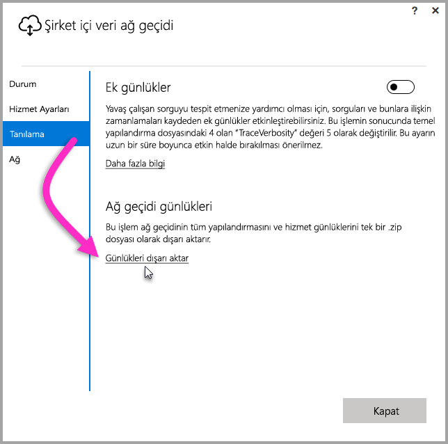
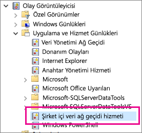

## Sorun giderme araçları
<a name="logs" />

### Ağ geçidi yapılandırıcısından günlükleri toplama
Ağ geçidi için toplayabileceğiniz birden fazla günlük vardır ve her zaman günlüklerle başlamanız gerekir. Ağ geçidini yükledikten sonra günlükleri toplamanın en kolay yolu, kullanıcı arabirimini kullanmaktır. **Şirket içi veri ağ geçidi** kullanıcı arabiriminde görüntüde belirtilen şekilde **Tanılama**'yı ve ardından sayfanın alt kısmındaki **Günlükleri dışarı aktar** bağlantısını seçin.

**Yükleyici günlükleri**

    %localappdata%\Temp\On-premises_data_gateway_*.log

**Yapılandırma günlükleri**

    %localappdata%\Microsoft\On-premises Data Gateway\GatewayConfigurator*.log

**Şirket içi veri ağ geçidi hizmet günlükleri**

    C:\Users\PBIEgwService\AppData\Local\Microsoft\On-premises Data Gateway\Gateway*.log

### Olay Günlükleri
**Şirket içi veri ağ geçidi hizmeti** olay günlükleri, **Uygulama ve Hizmet Günlükleri** altında mevcuttur.

<a name="fiddler" />

### Fiddler ile İzleme
[Fiddler](http://www.telerik.com/fiddler), Telerik tarafından kullanıma sunulup HTTP trafiğini izleyen ücretsiz bir araçtır.  İstemci makinesinden Power BI hizmetindeki gelen ve giden trafiği görebilirsiniz. Bu sayede hataları ve diğer ilgili bilgileri görüntüleyebilirsiniz.

