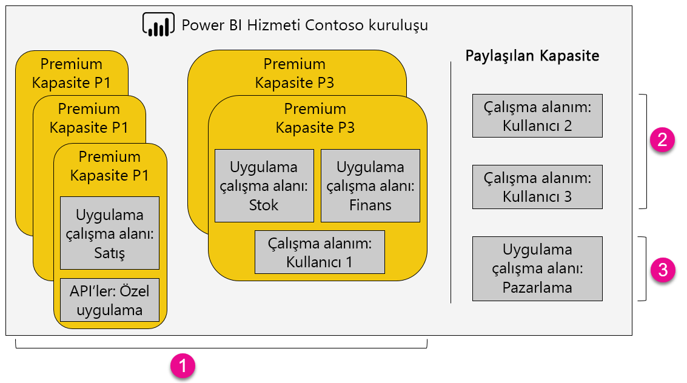

1. Premium kapasitedeki öğeler
   
   * Uygulama çalışma alanlarına erişmek (üye veya yönetici olarak) ve uygulama yayımlamak için Power BI Pro lisansı gerekir.
   * Uygulama okuyucular, Power BI Pro veya ücretsiz sürüm kullanıcıları olabilir.
   * Paylaşım için Power BI Pro lisansı gereklidir ancak alıcılar Power BI Pro veya ücretsiz sürüm kullanıcıları olabilir.
   * Power BI Pro veya ücretsiz lisansa sahip olan pano alıcıları veri uyarısı ekleyebilir.
   * Eklemeye yönelik REST API'leri, kullanıcı yerine Power BI Pro lisansıyla bir hizmet hesabından yararlanır.
2. Paylaşılan kapasitede Çalışma Alanım
   
   * Paylaşımı için Pro lisansı gereklidir. Alıcıların da Pro lisanslarına sahip olması gerekir.
3. Paylaşılan kapasitede Uygulama Çalışma Alanları
   
   * Tüm uygulama kullanımları için Pro lisansları gereklidir.

