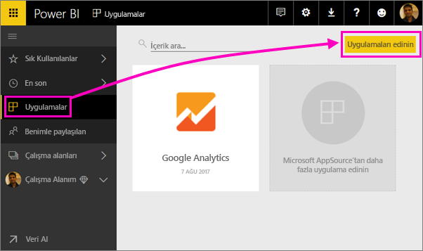
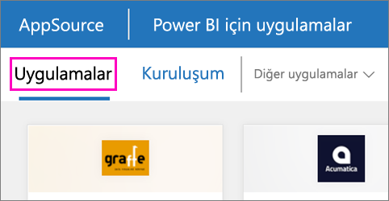

1. Gezinti bölmesinde **Uygulamalar**'ı seçin ve ardından sağ üst köşedeki **Uygulama edinin** seçeneğini belirleyin.
   
     
2. AppSource'ta **Uygulamalar** sekmesini seçin ve istediğiniz hizmeti arayın.
   
    

