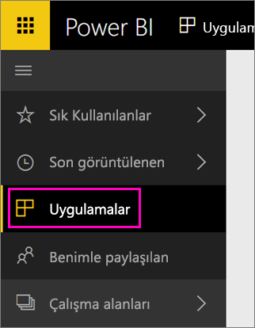

İçeri aktarma tamamlandığında, yeni uygulama Uygulamalar sayfasında görünür.

1. Sol gezinti bölmesinde **Uygulamalar** seçeneğini belirleyin ve ardından uygulamayı seçin.
   
     
2. Soru-Cevap kutusuna yazarak soru sorabilir veya bağlantılı raporu açmak için bir kutucuğa tıklayabilirsiniz. 

