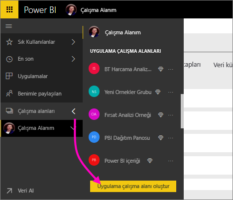
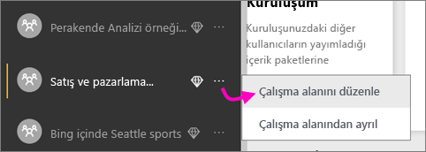

1. İşe çalışma alanını oluşturarak başlayın. **Çalışma alanları** > **Uygulama çalışma alanı oluşturma**'yı seçin.
   
     
   
    Çalışma alanı, iş arkadaşlarınızla birlikte üzerinde işbirliği yapacağınız içeriği barındıracak olan alandır.

2. Çalışma alanına bir ad verin. Karşılık gelen **Çalışma Alanı Kimliği** kullanılamıyorsa düzenleyerek benzersiz bir kimlik belirleyin.
   
     Bu kimlik uygulamanın da adı olacaktır.
   
     

3. Değiştirebileceğiniz birkaç ayar vardır. **Ortak** seçeneğini belirlerseniz çalışma alanınızdakileri kuruluşunuzdaki herkes görebilir. **Özel**'i seçerseniz çalışma alanının içeriğini yalnızca üyeler görebilir.
   
     
   
    Grubu oluşturduktan sonra Ortak/Özel ayarını değiştiremezsiniz.

4. Üyelere **düzenleme** veya **yalnızca görüntüleme** erişimi verebilirsiniz.
   
     
   
     Uygulama çalışma alanına yalnızca içeriği düzenlemesini istediğiniz kişileri ekleyin. Kişiler içeriği yalnızca görüntüleyecekse onları çalışma alanına eklemeyin. Bu kişileri uygulamayı yayımlarken ekleyebilirsiniz.

5. Çalışma alanı erişimi vermek istediğiniz kişilerin e-posta adreslerini girip **Ekle**'yi seçin. Grup takma adlarını ekleyemezsiniz, yalnızca kişilere izin verilir.

6. Eklediğiniz kişilerin üye mi yoksa yönetici mi olacağına karar verin.
   
     
   
    Yöneticiler çalışma alanını düzenleyebilir, başka üyeler ekleyebilir. Yalnızca görüntüleme erişimine sahip olanlar hariç üyeler çalışma alanındaki içeriği düzenleyebilir. Hem yöneticiler hem de üyeler uygulamayı yayımlayabilir.

7. **Kaydet**'i seçin.

Power BI çalışma alanını oluşturur ve açar. Üyesi olduğunuz çalışma alanlarının listesinde görünür. Yönetici olduğunuz için üç nokta (…) simgesini seçerek geri gidebilir, değişiklik yapabilir, yeni üye ekleyebilir veya üye izinlerini değiştirebilirsiniz.

