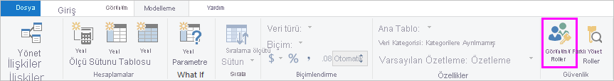
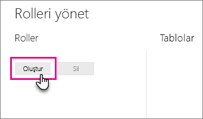
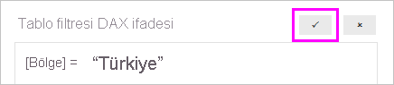

## Power BI Desktop'ta rol ve kural tanımlama
Power BI Desktop'ta rol ve kural tanımlayabilirsiniz. İçeriğinizi Power BI'da yayımladığınızda rol tanımları da yayımlanır.

Güvenlik rollerini tanımlamak için aşağıdaki adımları izleyebilirsiniz.

1. Verilerinizi Power BI Desktop raporunuza aktarın veya bir DirectQuery bağlantısı yapılandırın.
   
   > [!NOTE]
   > Analysis Services için Power BI Desktop canlı bağlantılarında rol tanımlayamazsınız. Bu işlemi Analysis Services modelinde yapmanız gerekir.
   > 
   > 
2. **Modelleme** sekmesini seçin.
3. **Rolleri Yönet**'i seçin.
   
   
4. **Oluştur**'u seçin.
   
   
5. Rol için bir ad girin. 
6. DAX kuralı uygulamak istediğiniz tabloyu seçin.
7. DAX ifadelerini girin. İfadenin true veya false değeri döndürmesi gerekir. Örneğin: [Entity ID] = "Değer".
   
   > [!NOTE]
   > Bu ifadede *username()* parametresini kullanabilirsiniz. *username()* parametresinin Power BI Desktop'ta *ETKİALANI\kullanıcıadı* biçiminde olacağını unutmayın. Power BI hizmetinde kullanıcının UPN bilgisini kullanmanız gerekir. Alternatif olarak kullanıcıyı her zaman kullanıcı asıl adı biçiminde döndüren *userprincipalname()* parametresini kullanabilirsiniz.
   > 
   > 
   
   
8. DAX ifadesini oluşturduktan sonra ifadeyi doğrulamak için ifade kutusunun üstündeki onay işaretini seçebilirsiniz.
   
   
9. **Kaydet**'i seçin.

Power BI Desktop'ta kullanıcıları bir role atayamazsınız. Bu işlemi Power BI hizmetinden yapmanız gerekir. *username()* veya *userprincipalname()* DAX işlevlerini kullanarak ve ilişkileri doğru şekilde yapılandırarak Power BI Desktop'ta dinamik güvenliği etkinleştirebilirsiniz.

