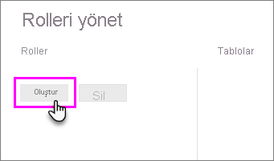

## Power BI Desktop'ta rol ve kural tanımlama
Power BI Desktop'ta rol ve kural tanımlayabilirsiniz. İçeriğinizi Power BI'da yayımladığınızda rol tanımları da yayımlanır.

Güvenlik rollerini tanımlamak için şu adımları izleyin.

1. Verilerinizi Power BI Desktop raporunuza aktarın veya bir DirectQuery bağlantısı yapılandırın.
   
   > [!NOTE]
   > Analysis Services için Power BI Desktop canlı bağlantılarında rol tanımlayamazsınız. Bu işlemi Analysis Services modelinin içinde yapmanız gerekir.
   > 
   > 
1. **Modelleme** sekmesini seçin.
2. **Rolleri Yönet**'i seçin.
   
   
4. **Oluştur**'u seçin.
   
   
5. Rol için bir ad girin. 
6. DAX kuralı uygulamak istediğiniz tabloyu seçin.
7. DAX ifadelerini girin. İfadenin true veya false değeri döndürmesi gerekir. Örneğin: [Entity ID] = "Değer".
   
   > [!NOTE]
   > Bu ifadede *username()* parametresini kullanabilirsiniz. *username()* parametresinin Power BI Desktop'ta *ETKİALANI\kullanıcıadı* biçiminde olduğunu unutmayın. Power BI hizmetinde ve Power BI Rapor Sunucusu'nda, kullanıcının Kullanıcı Asıl Adı (UPN) biçimindedir. Alternatif olarak kullanıcıyı her zaman kullanıcı asıl adı biçiminde (*kullanıcıadı\@contoso.com*) döndüren *userprincipalname()* işlevini kullanabilirsiniz.
   > 
   > 
   
   
8. DAX ifadesini oluşturduktan sonra ifadeyi doğrulamak için ifade kutusunun üstündeki onay işaretini seçebilirsiniz.
      
   
   
   > [!NOTE]
   > Bu ifade kutusunda, normalde noktalı virgül ayırıcıları kullanan bir yerel ayar (ör. Fransızca veya Almanca) kullanıyor olsanız bile DAX işlevi bağımsız değişkenlerini ayırmak için virgül kullanırsınız. 
   >
   >
   
9. **Kaydet**'i seçin.

Power BI Desktop'ta kullanıcıları bir role atayamazsınız. Onları Power BI hizmetinde atarsınız. *username()* veya *userprincipalname()* DAX işlevlerini kullanarak ve ilişkileri doğru şekilde yapılandırarak Power BI Desktop'ta dinamik güvenliği etkinleştirebilirsiniz. 

