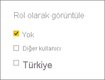

## Power BI Desktop'ta rolleri doğrulama
Rollerinizi oluşturduktan sonra rol sonuçlarını Power BI Desktop'ta test edin.

1. **Rol Olarak Görüntüle**’yi seçin. 

    

    **Rol olarak görüntüle**'nin altında, oluşturduğunuz rolleri görürsünüz.

    

3. Oluşturduğunuz rollerden birini seçin > **Tamam**'ı seçerek bu rolü uygulayın. Rapor seçilen rolle ilgili verileri işler. 

4. **Diğer kullanıcı**’yı seçebilir ve bir kullanıcı belirtebilirsiniz. En iyisi Kullanıcı Asıl Adını (UPN) sağlamaktır çünkü Power BI hizmeti ve Power BI Rapor Sunucusu bunu kullanır.

    

1. **Tamam**'ı seçtiğinizde raporlar kullanıcının görebileceği içerikle oluşturulur. 

Power BI Desktop'ta, **Diğer kullanıcı** ancak DAX ifadelerinize göre dinamik güvenlik kullandığınızda farklı sonuçlar gösterir. 

