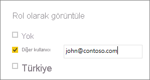

## Power BI Desktop'ta rolü doğrulama
Rolünüzü oluşturduktan sonra rol sonuçlarını Power BI Desktop'ta test edebilirsiniz. Bunu yapmak için **Rol Olarak Görüntüle**'yi seçin.

**Rol olarak görüntüle** iletişim kutusundan belirli bir kullanıcı veya rol için görünümü değiştirebilirsiniz. Oluşturduğunuz rolleri görebilirsiniz.

Oluşturduğunuz rolü seçtikten sonra bu rolü görüntülediğiniz içeriğe uygulamak için **Tamam**'ı seçin. Raporlar yalnızca seçilen rolle ilgili verileri oluşturur.

**Diğer kullanıcı**’yı seçebilir ve bir kullanıcı belirtebilirsiniz. Power BI hizmetinin kullandığı Kullanıcı Asıl Adını (UPN) girmeniz önerilir. **Tamam**'ı seçtiğinizde raporlar kullanıcının görebileceği içerikle oluşturulur. 

> [!NOTE]
> Power BI Desktop'ta yalnızca DAX deyimlerinize göre dinamik güvenlik kullandığınızda farklı sonuçlar gösterilir.
> 
> 

