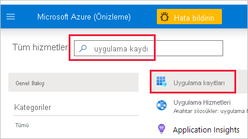
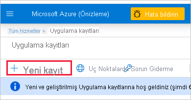

1. [Microsoft Azure](https://ms.portal.azure.com/#allservices)’da oturum açın.

2. **Uygulama kayıtlarını** arayın ve **Uygulama kayıtları** bağlantısına tıklayın.

    

3. **Yeni kayıt**’a tıklayın.

    

4. Gereken bilgileri doldurun:
    * **Ad**: Uygulamanız için bir ad girin
    * **Desteklenen hesap türleri**: Desteklenen hesap türlerini seçin
    * (İsteğe bağlı) **Yeniden Yönlendirme URI’si**: Gerekirse bir URI girin

5. **Kaydet**’e tıklayın.

6. Kaydolduktan sonra, *Uygulama Kimliğini* **Genel Bakış** sekmesinde bulabilirsiniz. Daha sonra kullanmak için *Uygulama Kimliğini* kopyalayıp kaydedin.

    