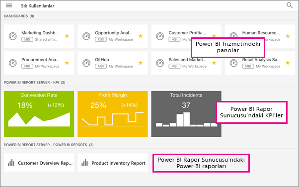

# Power BI mobil uygulamalarında şirket içi rapor sunucusu raporlarını ve KPI'lerini görüntüleme
Aşağıdakiler için geçerlidir:

|  |  |  |  |
|:--- |:--- |:--- |:--- |
| iPhone'lar |iPad'ler |Android telefonlar |Android tabletler |

Power BI mobil uygulamaları, Power BI Rapor Sunucusu ve SQL Server 2016 Reporting Services'de (SSRS) bulunan şirket içi iş bilgilerinize yönelik gerçek zamanlı ve dokunmatik kullanıma uygun mobil erişim sağlar. 

 

## İlk yapılacaklar
**Mobil uygulamalar, Power BI içeriklerinizi oluşturduğunuz değil, görüntülediğiniz yerdir.**

* Siz ve kuruluşunuzda rapor oluşturan diğer kişiler, [Power BI Desktop'ı kullanarak Power BI raporları oluşturur ve bu raporları Power BI Rapor Sunucusu](report-server/quickstart-create-powerbi-report.md) web portalında yayımlarsınız. 
* [KPI'leri doğrudan web portalında](https://docs.microsoft.com/sql/reporting-services/working-with-kpis-in-reporting-services) oluşturur, klasörler halinde düzenler, sık kullandıklarınızı işaretler ve istediğinizde kolayca bulabilirsiniz. 
* SQL Server 2016 Enterprise Edition Mobil Rapor Yayımcısı ile [Reporting Services mobil raporları oluşturur](https://docs.microsoft.com/sql/reporting-services/mobile-reports/create-mobile-reports-with-sql-server-mobile-report-publisher) ve bu raporları [Reporting Services web portalında](https://docs.microsoft.com/sql/reporting-services/web-portal-ssrs-native-mode) yayımlarsınız.  

Ardından, Power BI mobil uygulamalarında beş adede kadar rapor sunucusuna bağlanarak Power BI raporlarını ve KPI'lerini klasörler halinde düzenlenmiş veya sık kullanılanlar olarak bir araya getirilmiş şekilde görüntüleyebilirsiniz. 

## Sunucu bağlantısı olmadan mobil uygulamalardaki örnekleri inceleme
Reporting Services web portalına erişiminiz olmasa bile Reporting Services mobil raporlarının ve KPI'lerinin özelliklerini inceleyebilirsiniz. 

1. Sol üst köşede bulunan genel gezinti düğmesine  ve ardından sağ üst köşedeki dişli simgesine dokunun.
2. **Reporting Services Örnekleri**'ne dokunup sayfaya göz atarak örnek KPI'ler ve mobil raporlarla etkileşime geçin.
   
   

## Şirket içindeki bir sunucuya bağlanma
Power BI mobil uygulamalarında şirket içi Power BI raporlarını, Reporting Services mobil raporlarını ve KPI'leri görüntüleyebilirsiniz. 

1. Mobil cihazınızda Power BI uygulamasını açın.
2. Henüz Power BI'da oturum açmadıysanız **Rapor Sunucusu**'na dokunun.
   
   
   
   Power BI uygulamasında oturum açtıysanız genel gezinti düğmesine ve ardından, sağ üst köşedeki dişli simgesine  dokunun.
3. **Sunucuya bağlan**'a dokunun.
   
    
4. Sunucu adresinin yanı sıra kullanıcı adınızı ve parolanızı girin. Sunucu adresi için şu biçimi kullanın:
   
     `http://<servername>/reports`
   
     VEYA
   
     `https://<servername>/reports`
   
   > [!NOTE]
   > Bağlantı dizesinin önüne **http** veya **https** ifadesini ekleyin.
   > 
   > 
   
    
5. (İsteğe bağlı) Dilerseniz **Advanced options** (Gelişmiş seçenekler) bölümünde sunucunuza kolay bir ad verebilirsiniz.
6. Artık sol gezinti çubuğunda sunucunuzu görebilirsiniz. Bu örnekte sunucuyu "power bi report server" olarak adlandırdık.
   
   

## Power BI uygulamasında Power BI raporlarını ve KPI'lerini görüntüleme
Power BI raporları, Reporting Services mobil raporları ve KPI'ler, Reporting Services web portalındaki klasör düzeninde görüntülenir. 

* Bir Power BI raporuna dokunun. Rapor yatay modda açılır ve Power BI uygulamasında raporla etkileşime geçebilirsiniz.
  
    
* Rapor sahipleri Power BI Desktop'ta, [bir raporu Power BI mobil uygulamaları için en iyi duruma getirebilir](desktop-create-phone-report.md). En iyi duruma getirilmiş raporlar cep telefonunuzda özel bir simge,  ve düzenle gösterilir.
  
    
* Odak modunda görmek için bir KPI'ye dokunun.
  
    

## Sık kullandığınız KPI'leri ve raporları görüntüleme
Web portalında KPI'leri ve raporları sık kullanılanlara ekleyip daha sonra bunları mobil cihazınızda tek bir klasörde, sık kullanılan Power BI panolarınızla birlikte görüntüleyebilirsiniz.

* **Sık Kullanılanlar**'a dokunun.
  
   
  
   Web portalında sık kullandığınız KPI ve raporlarınızın tümü, Power BI hizmetindeki Power BI panoları ile birlikte bu sayfada yer alır:
  
   

## Rapor sunucusu bağlantısını kesme
1. Sol gezinti çubuğunun alt kısmında bulunan **Ayarlar**'a dokunun.
2. Bağlantısını kesmek istediğiniz sunucunun adına dokunun.
3. **Sunucuyu Kaldır**'a dokunun.

## Sonraki adımlar
* [Power BI ile çalışmaya başlama](service-get-started.md)  
* Sorularınız mı var? [Power BI Topluluğu'na sorun](http://community.powerbi.com/)

