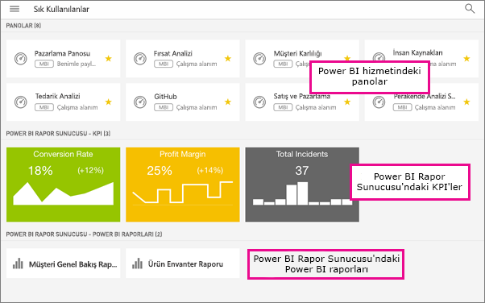

# Power BI mobil uygulamalarında sık kullanılanlara ekleme ve sık kullanılanları görüntüleme
Aşağıdakiler cihazlar için geçerlidir:

|  |  |  |  |  |
|:--- |:--- |:--- |:--- |:--- |
| iPhone'lar |iPad'ler |Android telefonlar |Android tabletler |Windows 10 cihazları |

Mobil uygulamalarda sık kullanılanlara eklediğiniz şirket içi Power BI Rapor Sunucusu ve Reporting Services KPI'lerinin ve raporlarının yanı sıra, sık kullandığınız Power BI panolarının, raporlarının ve uygulamalarının tümünü oluşturma ve görüntüleme hakkında bilgi edinin.

Power BI mobil uygulamalarında bir sık kullanılan oluşturduğunuzda bunu Power BI hizmetinizdeki ([https://powerbi.com](https://powerbi.com)) ve tüm mobil cihazlarınızdaki Sık Kullanılanlar sayfalarında görürsünüz. 

İsterseniz [Power BI panolarını ve uygulamalarını Power BI hizmetinden de sık kullanılanlara ekleyebilirsiniz](service-dashboard-favorite.md). Bunu yaptığınızda ilgili öğeleri mobil uygulamadaki Sık Kullanılanlar sayfasında görebilirsiniz.

Power BI Rapor Sunucusu veya Reporting Services web portalında sık kullanılanlara eklediğiniz KPI'leri ve raporları, mobil cihazınızda tek bir klasörde, sık kullanılan Power BI panolarınızla birlikte görüntüleyebilirsiniz.

## Power BI sık kullanılanlarınızı görüntüleme
* Üst gezinti menüsüne , sonra da **Sık Kullanılanlar**'a dokunun.
  
  
  
  Sık kullanılanlarınızın tümünü şu sayfada görürsünüz:
  
  

## Bir uygulamayı sık kullanılanlara ekleme
1. Mobil uygulamadaki uygulama listesinde uygulamanın yanındaki üç nokta (...) simgesine ve ardından **Sık Kullanılanlara Ekle**'ye dokunun.
   
    
   
    Uygulama, sık kullandığınız panolar ve uygulamalarla birlikte listelenir.
   
    

## iOS ve Windows 10 mobil uygulamalarında bir panoyu veya raporu sık kullanılanlara ekleme
Bir Power BI panosunu veya raporunu, pano veya rapor listesinden ya da doğrudan pano veya raporun içinden sık kullanılanlara ekleyebilirsiniz.

* Mobil uygulamadaki pano veya uygulama listesinde, adın yanında bulunan içi boş yıldız simgesine dokunun geçin. Yıldız sarı olur geçin.
  
    
* Panoda veya raporda şeritteki içi boş yıldız simgesine dokunun geçin. Yıldız sarı olur geçin.
  
    

## Android mobil uygulamalarında bir panoyu veya raporu sık kullanılanlara ekleme
Bir panoyu veya raporu, pano veya rapor listesinden ya da doğrudan pano veya raporun içinden sık kullanılanlara ekleyebilirsiniz.

* Mobil uygulamadaki pano veya rapor listesinde adın yanında bulunan dikey üç nokta (...) simgesine ve ardından **Sık Kullanılanlara Ekle**'ye dokunun. Adın yanında sarı bir yıldız  görünür.
  
    
* Panoda veya raporda şeritteki içi boş yıldız simgesine dokunun geçin. Yıldız koyu gri renk olur geçin.
  
    

## Power BI Rapor Sunucusu ve Reporting Services raporları ile KPI'leri sık kullanılanlara ekleme
Sık kullanılan Power BI Rapor Sunucusu ve Reporting Services raporlarınızla KPI'leri Power BI mobil uygulamalarında görüntüleyebilirsiniz ancak bunları mobil uygulamalarda sık kullanılanlara ekleyemezsiniz. [Bunları web portalında sık kullanılan olarak etiketleyebilirsiniz](report-server/tutorial-explore-report-server-web-portal.md#tag-your-favorites). 

## Sonraki adımlar
* [Power BI hizmetindeki sık kullanılan panolar](service-dashboard-favorite.md) 
* Sorularınız mı var? [Power BI Topluluğu'na sorun](http://community.powerbi.com/)

