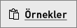

# Hızlı Başlangıç: Power BI mobil uygulamalarında pano ve raporları keşfetme
Bu hızlı başlangıçta, bir Android telefon üzerinde çalışan Power BI mobil uygulamalarındaki örnek bir pano ve raporu keşfedeceksiniz. Diğer mobil uygulamaları da takip edebilirsiniz. 

Aşağıdakiler cihazlar için geçerlidir:

|  |  |  |  |
|:--- |:--- |:--- |:--- |
| iPhone | iPad | Android | Windows 10 |

Panolar, şirketinizin yaşam döngüsünün ve işlemlerinin yer aldığı portallardır. Genel bakış sunan panolar, işletmenin geçerli durumunun takip edilebileceği merkezlerdir. Raporlar, verilerinizin etkileşimli bir görünümüdür ve verilerinize dayalı farklı bulguları ve öngörüleri temsil eden görseller içerir. 

## Önkoşullar

### Power BI'a kaydolma
Power BI’ya kaydolmadıysanız başlamadan önce [ücretsiz deneme için kaydolun](https://app.powerbi.com/signupredirect?pbi_source=web).

### Android için Power BI uygulamasını yükleme
Google Play'den [Android için Power BI uygulamasını indirin](http://go.microsoft.com/fwlink/?LinkID=544867).

Power BI, Android 5.0 veya sonraki işletim sistemlerini çalıştıran Android cihazlarda çalışır. Cihazınızı kontrol etmek için **Ayarlar** > **Cihaz hakkında** > **Android sürümü** menüsüne gidin.

### Perakende Analizi örneğini indirme
Bu hızlı başlangıcın ilk adımı, Power BI hizmetindeki Perakende Analizi örneğini indirmektir.

1. Tarayıcınızda Power BI hizmetini (app.powerbi.com) açın ve oturum açın.

1. Genel gezinti simgesini seçerek sol gezinti bölmesini açın.

    

2. Sol gezinti bölmesinde **Çalışma Alanları** > **Çalışma Alanım**’ı seçin.

    

3. Sol alt köşedeki **Veri Al** seçeneğini belirleyin.
   
    

3. Veri Al sayfasında **Örnekler** simgesini seçin.
   
   

4. **Perakende Analizi örneği**’ni seçin.
 
    
 
8. **Bağlan**'ı seçin.  
  
   
   
5. Power BI, örneği içeri aktarır ve Çalışma Alanınıza yeni bir pano, rapor ve veri kümesi ekler.
   
   

Örneğiniz Android cihazınızda görüntülenmeye hazırdır.

## Android cihazınızdan pano görüntüleme
1. Android cihazınızda Power BI uygulamasını açın ve tarayıcıdaki Power BI hizmetinde kullandığınız Power BI hesabı kimlik bilgilerinizle oturum açın.

1.  Sol üst köşede bulunan genel gezinti düğmesine geçin.

2.  **Çalışma Alanları** > **Çalışma Alanım**’a dokunun

    

3. Perakende Analizi Örneği panosuna dokunarak açın.
 
    
   
    Pano adının altındaki gösterim (bu örnekte “C” harfi) her bir panoda verilerin nasıl sınıflandırıldığını gösterir. [Power BI'daki veri sınıflandırması](service-data-classification.md) hakkında daha fazla bilgi edinin.

    Power BI panoları Android telefonunuzda varsayılan olarak biraz farklı görünür. Tüm kutucuklar aynı genişliktedir ve yukarıdan aşağıya doğru alt alta dizilmişlerdir.

4. Yıldız simgesine dokunun  başlık çubuğunda bunu sık kullanılan bir pano yapın.

    Mobil uygulamada bir sık kullanılan oluşturduğunuzda Power BI hizmetinde de sık kullanılan olur; aynı durum karşılıklı olarak geçerlidir.

4. Sayfayı aşağı kaydırın ve "Bu Yılın Satışları, Geçen Yılın Satışları" adlı doldurulmuş çizgi grafiğe dokunun.

    

    Odak modunda açılır.

7. Odak modunda, grafikteki Nis öğesine dokunun. Grafiğin üst kısmında Nisan değerlerinin gösterildiğini görürsünüz.

    

8. Sağ üst köşedeki Rapor simgesine  dokunun. Bu kutucukla ilgili rapor, yatay modda açılır.

    

9. Kabarcık grafiğindeki sarı "040 - Juniors" kabarcığına dokunun. Diğer grafiklerdeki ilgili değerleri nasıl vurguladığını görüyor musunuz? 

    

10. Alt kısımdaki araç çubuğunu görmek için yukarı çekin ve kalem simgesine dokunun.

    

11. Ek Açıklama araç çubuğundaki gülen yüz simgesine dokunun ve rapor sayfanıza birkaç gülen yüz ekleyin.
 
    

12. Sağ üst köşede bulunan **Paylaş**'a dokunun.

1. E-posta adreslerini doldurun ve istiyorsanız bir ileti ekleyin.  

    

    Bu anlık görüntüyü, kuruluşunuzun içinde veya dışında bulunan herkesle paylaşabilirsiniz. Paylaştığınız kişi kuruluşunuzdaysa ve kendi Power BI hesabı varsa, Perakende Analizi örnek raporunu da açabilir.

## Kaynakları temizleme

Bu hızlı başlangıcı tamamladıktan sonra dilerseniz Perakende Analizi örneği panosunu, raporu ve veri kümesini silebilirsiniz.

1. Power BI hizmeti (app.powerbi.com) sayfasına gidin ve oturum açın.

2. Sol gezinti bölmesinde **Çalışma Alanları** > **Çalışma Alanım**’ı seçin.

    Sık kullanılanların sarı yıldızla gösterildiğini fark ettiniz mi?

3. **Panolar** sekmesinde Perakende Analizi panosunun yanında bulunan çöp kutusu biçimindeki **Sil** simgesini seçin.

    

4. **Raporlar** sekmesini seçin ve aynı işlemi Perakende Analizi raporu için tekrarlayın.

5. **Veri Kümeleri** sekmesini seçin ve aynı işlemi Perakende Analizi veri kümesi için tekrarlayın.

## Sonraki adımlar

Bu hızlı başlangıçta, Android cihazınızda örnek bir pano ve raporu keşfettiniz. Power BI hizmetinde çalışma hakkında daha fazla bilgi edinin. 

> [!div class="nextstepaction"]
> [Hızlı Başlangıç: Power BI hizmetinde dolaşma](service-the-new-power-bi-experience.md)

