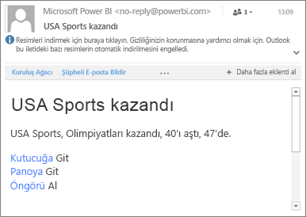

# Power BI mobil uygulamalarında veri uyarıları oluşturma
Aşağıdakiler için geçerlidir:

|  |  |  |  |  |
|:--- |:--- |:--- |:--- |:--- |
| iPhone'lar |iPad'ler |Android telefonlar |Android tabletler |Windows 10 cihazları |

Power BI mobil uygulamalarında ve Power BI hizmetinde panolarda uyarılar ayarlayabilirsiniz. Bir kutucuktaki veriler belirlediğiniz sınırları aşacak şekilde değiştiğinde uyarılar sizi bilgilendirir. Uyarılar, kartlar ve ölçekler gibi tek bir sayı içeren kutucuklarla birlikte çalışır, akış verileri için kullanılamaz. Mobil cihazınızdan ayarladığınız veri uyarılarını Power BI hizmetinde, burada ayarladıklarınızı da mobil uygulamada görebilirsiniz. Bir panoyu veya kutucuğun anlık görüntüsünü paylaşsanız dahi ayarladığınız veri uyarılarını yalnızca siz görebilirsiniz.

Power BI Pro lisansınız varsa veya paylaşılan pano Premium kapasitedeyse kutucuklarda uyarı ayarlayabilirsiniz. 

> [!WARNING]
> Veri tabanlı uyarı bildirimleri, verileriniz hakkında bilgi verir. Cihazınız çalınırsa, Power BI hizmetine giderek veri tabanlı uyarı kurallarının tümünü kapatmanızı öneririz. 
> 
> [Power BI hizmetindeki veri uyarılarını yönetme](service-set-data-alerts.md) hakkında daha fazla bilgi edinin.
> 
> 

## iPhone veya iPad'de veri uyarıları
### iPhone veya iPad'de uyarı ayarlama
1. Panodaki sayı veya ölçek kutucuklarından birine dokunarak odak modunda açın.  
   
   
2. Uyarı eklemek için zil simgesine  dokunun.  
3. **Uyarı kuralı ekle**'ye dokunun.
   
   
4. Belirli bir değerin üzerinde veya altında uyarı alma seçeneğini belirleyip değeri ayarlayın.
   
   
5. Saatlik veya günlük uyarı seçeneğinin yanı sıra uyarı durumunda e-posta almak isteyip istemediğinizi belirtin.
   
   > [!NOTE]
   > Veriler yenilenmediği sürece her saat başında veya her gün uyarı gönderilmez.
   > 
   > 
6. Uyarı başlığını da değiştirebilirsiniz.
7. **Kaydet**'e dokunun.
8. Tek bir kutucukta bir eşiğin hem üzeri hem de altı için uyarı belirlenebilir. **Uyarıları yönet** bölümünde **Uyarı kuralı ekle**'ye dokunun.
   
   

### iPhone veya iPad'de uyarıları yönetme
Mobil cihazınızda yalnızca belirli uyarıları yönetebilir veya [tüm uyarılarınızı Power BI hizmetinde yönetebilirsiniz](service-set-data-alerts.md).

1. Panoda uyarı içeren bir sayı veya ölçek kutucuğuna dokunun.  
   
   
2. Zil simgesine  dokunun.  
3. Düzenlemek istediğini uyarının adına dokunun, kaydırıcıya dokunarak e-posta uyarılarını kapatın veya çöp kutusuna dokunarak uyarıyı silin.
   
    

## Android cihazlarda veri uyarıları
### Android cihazlarda uyarı ayarlama
1. Power BI panosunda bir sayı veya ölçek kutucuğuna dokunarak açın.  
2. Uyarı eklemek için zil simgesine  dokunun.  
   
   
3. Artı simgesine (+) dokunun.
   
   
4. Belirli bir değerin üzerinde veya altında uyarı alma seçeneğini belirleyip değeri yazın.
   
   
5. **Bitti**'ye dokunun.
6. Saatlik veya günlük uyarı seçeneğinin yanı sıra uyarı durumunda e-posta almak isteyip istemediğinizi belirtin.
   
   > [!NOTE]
   > Veriler yenilenmediği sürece her saat başında veya her gün uyarı gönderilmez.
   > 
   > 
7. Uyarı başlığını da değiştirebilirsiniz.
8. **Kaydet**'e dokunun.

### Android cihazlarda uyarıları yönetme
Power BI mobil uygulamasında yalnızca belirli uyarıları yönetebilir veya [tüm uyarılarınızı Power BI hizmetinde yönetebilirsiniz](service-set-data-alerts.md).

1. Panoda uyarı içeren bir kart veya ölçer kutucuğuna dokunun.  
2. Koyu renkli zil simgesine  dokunun.  
3. Uyarıya dokunarak değerini değiştirin veya kapatın.
   
    
4. Aynı kutucuğa başka bir uyarı eklemek için artı simgesine (+) dokunun.
5. Uyarıyı silmek için çöp kutusu simgesine  dokunun.

## Windows cihazlarda veri uyarıları
### Windows cihazlarda veri uyarısı ayarlama
1. Panodaki sayı veya ölçek kutucuklarından birine dokunarak açın.  
2. Uyarı eklemek için zil simgesine  dokunun.  
   
   
3. Artı simgesine (+) dokunun.
   
   
4. Belirli bir değerin üzerinde veya altında uyarı alma seçeneğini belirleyip değeri yazın.
   
   
5. Saatlik veya günlük uyarı seçeneğinin yanı sıra uyarı durumunda e-posta almak isteyip istemediğinizi belirtin.
   
   > [!NOTE]
   > Veriler yenilenmediği sürece her saat başında veya her gün uyarı gönderilmez.
   > 
   > 
6. Uyarı başlığını da değiştirebilirsiniz.
7. Onay işaretine dokunun.
8. Tek bir kutucukta bir eşiğin hem üzeri hem de altı için uyarı belirlenebilir. **Uyarıları yönet** bölümünde artı işaretine (+) dokunun.
   
   

### Windows cihazlarda uyarıları yönetme
Power BI mobil uygulamasında yalnızca belirli uyarıları yönetebilir veya [tüm uyarılarınızı Power BI hizmetinde yönetebilirsiniz](service-set-data-alerts.md).

1. Panoda uyarı içeren bir kart veya ölçer kutucuğuna dokunun.  
2. Zil simgesine  dokunun.  
   
   
3. Uyarıya dokunarak değerini değiştirin veya kapatın.
   
    
4. Uyarıyı silmek için sağ tıklayın veya basılı tutun ve **Sil**'i seçin.

## Uyarı alma
Uyarılar mobil cihazınızdaki Power BI [Bildirim Merkezi](mobile-apps-notification-center.md)'nde veya Power BI hizmetinde görüntülenir ve sizinle paylaşılan yeni panolarla ilgili bildirimler de burada yer alır.

Veri kaynakları genelde her gün yenilenecek şekilde ayarlanmıştır ancak bazıları daha sık yenilenebilir. Panodaki veriler yenilendiğinde takip edilen veri belirlediğiniz eşiklerden birine ulaşırsa birden fazla işlem gerçekleşir.

1. Power BI son uyarının gönderilmesinin üzerinden bir saat veya 24 saat (belirlediğiniz seçeneğe bağlı olarak) geçip geçmediğini kontrol eder.
   
   Veriler eşiği geçtiği sürece saatte veya 24 saatte bir uyarı gönderilir.
2. Uyarının e-posta gönderme ayarını açtıysanız gelen kutunuzda aşağıdakine benzer bir ileti görürsünüz.
   
   
3. Power BI **Bildirim merkezinize** bir ileti ekler ve ilgili kutucukta yeni uyarı simgesi  görüntüler.
4. Genel gezinti düğmesine  dokunarak [**Bildirim merkezinizi** açın](mobile-apps-notification-center.md) ve uyarı ayrıntılarına bakın.
   
      

> [!NOTE]
> Uyarılar yalnızca yenilenen verilerde çalışır. Veriler yenilendiğinde Power BI bu veriler için bir uyarı ayarlanıp ayarlanmadığını kontrol eder. Veriler bir uyarı eşiğine ulaştığında bir uyarı tetiklenir.
> 
> 

## İpuçları ve sorun giderme
* Şu an için Bing kutucukları veya tarih/saat ölçülerine sahip kart kutucuklarında uyarılar desteklenmemektedir.
* Uyarılar yalnızca sayısal verilerle çalışır.
* Uyarılar yalnızca yenilenen verilerde çalışır. Sabit veriler üzerinde çalışmaz.
* Uyarılar akış verisi içeren kutucuklarda çalışmaz.

## Sonraki adımlar
* [Power BI hizmetindeki uyarılarınızı yönetme](service-set-data-alerts.md)
* [Power BI Mobil Bildirim Merkezi](mobile-apps-notification-center.md)
* Sorularınız mı var? [Power BI Topluluğu'na sorun](http://community.powerbi.com/)

