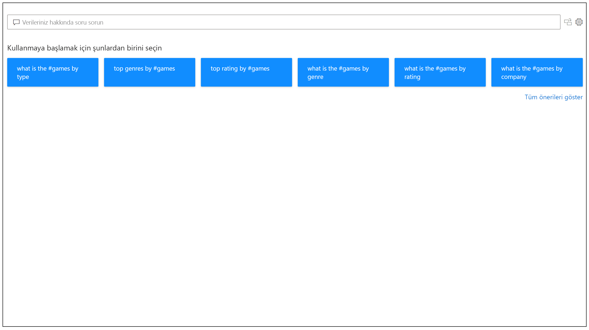
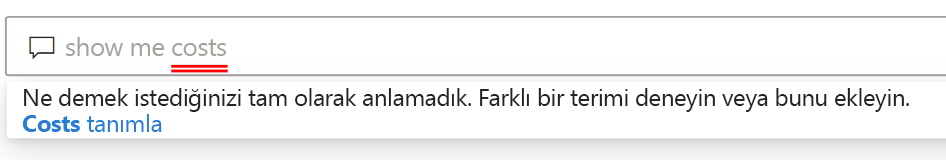
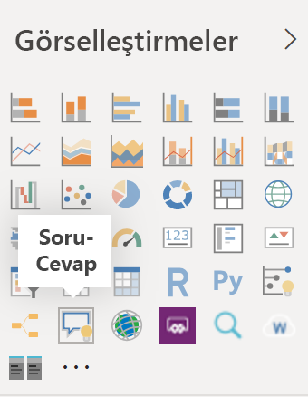
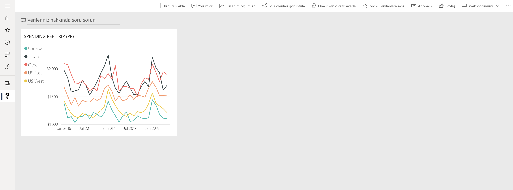

# Power BI Soru-Cevap’a giriş

Bazen verilerinizden yanıt almanın en hızlı yolu, doğal dil kullanarak verileriniz üzerinde arama yapmaktır. Power BI'ın Soru-Cevap özelliği, verilerinizi doğal dil kullanarak kendi sözcüklerinizle keşfetmenizi sağlar. Soru-Cevap etkileşimli ve hatta eğlenceli bir özelliktir. Genellikle görselleştirmelerin sürdürülebilecek ilginç yollar açması nedeniyle her soru yeni bir soruyu getirir. Soruyu sormak yalnızca bir başlangıçtır. Sorunuzu daraltarak veya genişleterek, yeni bilgiler keşfederek, ayrıntılara yoğunlaşarak veya daha geniş bir görünüm elde etmek için uzaklaştırarak verilerinizde yolculuğa çıkın. Bu deneyim, bellek içi depolama tarafından desteklenen etkileşimli ve hızlı bir deneyimdir. 

Power BI Soru-Cevap ücretsizdir ve tüm kullanıcılara açıktır. Power BI Desktop’ta rapor tasarımcıları, verileri araştırmak ve görselleştirmeler oluşturmak için Soru-Cevap kullanabilir. Power BI hizmetinde herkes, verilerini Soru-Cevap kullanarak araştırabilir. iOS için Soru-Cevap sanal yardımcısı, Android cihazlarda ise Soru-Cevap görseli ile Soru-Cevap özelliği mobil uygulamalarımızda da desteklenir. Bir panoyu veya raporu düzenleme izniniz varsa, Soru-Cevap sonuçlarınızı sabitleyebilirsiniz.

## Soru-Cevap nasıl kullanılır?

Soru-Cevap özelliği, yazmaya başlamadan önce sorunuzu oluşturmanıza yardımcı olacak önerilerin bulunduğu yeni bir ekran görüntüler. Önerilen soruların birinden başlayın veya kendi sorularınızı yazın. Soru-Cevap aşağıdakiler dahil olmak üzere çok çeşitli soruları destekler:

- **Doğal sorular sorun** En yüksek geliri hangi satışlar elde etti?
- **Göreli tarih filtrelemesi kullanın** Geçen yılın satışlarını göster
- **Yalnızca ilk N satışı döndürün** Satışa göre ilk 10 ürün
- **Filtre sağlayın** ABD’deki satışları göster
- **Karmaşık koşullar sağlayın** Ürün kategorisinin Kategori 1 veya Kategori 2 olduğu satışları göster
- **Belirli bir görseli döndürün** Ürüne göre satışları pasta grafiği olarak göster
- **Karmaşık toplamalar kullanın** Ürüne göre ortanca satışları göster
- **Sonuçları sırala** Ülke koduna göre en çok sipariş verilen 10 ülkeyi göster
- **Verileri karşılaştırın** Toplam satış ile toplam maliyeti karşılaştırarak tarihi göster
- **Eğilimleri görüntüle** Zaman içinde satışları göster

### Otomatik Tamamlama

Sorunuzu yazarken Power BI Soru-Cevap, doğal dil ile hızlıca üretken olmanıza yardımcı olacak ilgili ve bağlamsal önerileri gösterir. Siz yazarken anında geri bildirim ve sonuçlar alırsınız. Deneyim bir arama altyapısına yazmaya benzer.

### Kırmızı/Mavi/Turuncu alt çizgiler

Soru-Cevap, sistemin anladığı veya tanımadığı sözcükleri görmenize yardımcı olmak için sözcükleri alt çizgilerle gösterir. Kesintisiz mavi alt çizgi, sistemin sözcüğü veri modelindeki bir alanla veya değerle başarılı bir şekilde eşleştirdiğini gösterir. Aşağıdaki örnekte, Soru-Cevap’ın *AB Satışları* sözcüğünü tanıdığı gösterilmektedir.

 Turuncu alt çizgi, sözcüğün veya sözcüklerin*düşük güven düzeyinde* olduğunu belirtir. Şüpheli veya belirsiz bir sözcük yazarsanız alanın altına turuncu çizgi eklenir. 'Satış' sözcüğü örnek olabilir. Birden fazla alan “Satış” sözcüğünü içerebilir. Bu nedenle sistem, hedeflediğiniz alanı seçmenizi istemek için turuncu bir alt çizgi kullanır. 'Alan' sözcüğünü yazmanıza rağmen eşleştiği sütunun 'bölge' olması başka bir düşük güven örneğidir. Bing ve Office ile olan tümleştirme sayesinde Power BI Soru-Cevap, aynı anlama gelen sözcükleri tanıyarak rapordaki yeniden adlandırmaları olası öneriler olarak yorumlar. Soru-Cevap, sözcüğe turuncu alt çizgi ekler, böylece doğrudan eşleşme olmadığını bilirsiniz.

Kırmızı alt çizgi, Soru-Cevap’ın kelimeyi hiçbir şekilde tanımadığı anlamına gelir. Verilerin hiçbir yerinde bahsedilmeyen, etki alanına özgü bir terim kullanarak bu sorunla karşılaşmış olabilirsiniz veya veri alanları yanlış adlandırılmıştır. Verilerin hiçbir yerinde mevcut olmamasına rağmen “Maliyetler” sözcüğünün kullanılması bu durumun örneği olabilir. Bu sözcük İngilizce sözlükte yer alır, ancak Soru-Cevap bu terimi veriler arasında bulamadığını belirtmek için sözcüğün altını kırmızıyla çizer.

> [!NOTE]
> Soru-Cevap **Görsel biçimlendirme** bölmesinde mavi/kırmızı/turuncu alt çizgi renklerini özelleştirebilirsiniz. Ayrıca, [Soru-Cevap araçları](q-and-a-tooling-teach-q-and-a.md) makalesinde, Soru-Cevap’ın tanımadığı terimleri tanımlamak için kullandığınız *Soru-Cevap Öğretimi* açıklanmaktadır.

### Görselleştirme sonuçları

Sorunuzu yazarken Soru-Cevap, soruyu anlık olarak yorumlamaya ve yanıtı görselleştirmeye çalışır. En son güncelleştirmelerin parçası olarak, Soru-Cevap artık soruyu yorumlamaya ve alanları doğru eksene otomatik olarak çizmeye çalışmaktadır. Örneğin, 'Yıla göre satış' yazarsanız Soru-Cevap yılın bir tarih alanı olduğunu algılar ve bu alanı her zaman öncelikli olarak X eksenine yerleştirmeyi hedefler. Görselleştirme türünü değiştirmek istiyorsanız, sorudan sonra '*grafik türü* gibi' yazın. Soru-Cevap şu anda aşağıdaki görselleştirme türlerini desteklemektedir:

- Çizgi grafik
- Çubuk Grafik
- Matris
- Tablo
- Kart
- Alan
- Pasta grafiği
- Dağılım/kabarcık grafiği
 

## Rapora Soru-Cevap ekleme

Power BI Desktop veya Power BI hizmetindeki bir rapora iki şekilde Soru-Cevap ekleyebilirsiniz:

- Bir Soru-Cevap görseli ekleme.
- Bir Soru-Cevap düğmesi ekleme.

Soru-Cevap görselini bir rapora eklemek için yeni **Soru-Cevap** simgesini seçerek Görselleştirme bölmesindeki yeni Soru-Cevap görselini seçin. Alternatif olarak, Soru-Cevap görselini eklemek için rapor tuvalinde herhangi bir yere çift tıklayın.

Düğme eklemek için, **Giriş** şeridinde **Düğmeler** > **Soru-Cevap**’ı seçin. Soru-Cevap düğmesinin görüntüsünü tamamen özelleştirebilirsiniz.

> [!NOTE]
> Soru-Cevap’ı düğmeyle başlatsanız bile eski Soru-Cevap kullanılır. Power BI’ın sonraki sürümlerinde bu durum değişecektir.

## Panolar için Soru-Cevap kullanma

Varsayılan olarak Soru-Cevap, panoların üst kısmında bulunur. Soru-Cevap’ı kullanmak için **Verileriniz hakkında soru sorun** kutusuna yazın.

## Sonraki adımlar

Doğal dili raporlarınıza tümleştirmek için kullanabileceğiniz çeşitli yollar vardır. Daha fazla bilgi için şu makalelere bakın:

* [Soru-Cevap görseli](../visuals/power-bi-visualization-q-and-a.md)
* [Soru-Cevap en iyi yöntemler](q-and-a-best-practices.md)
