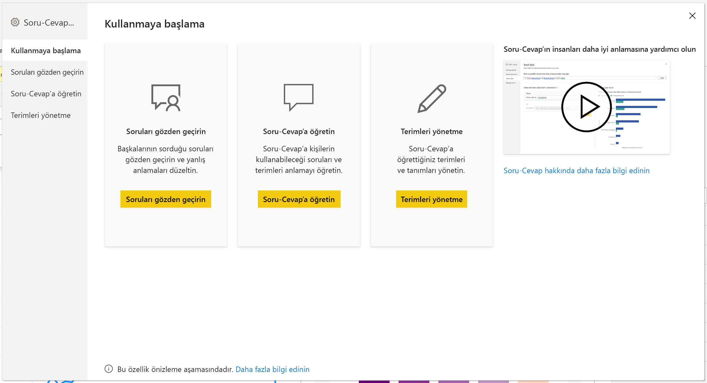
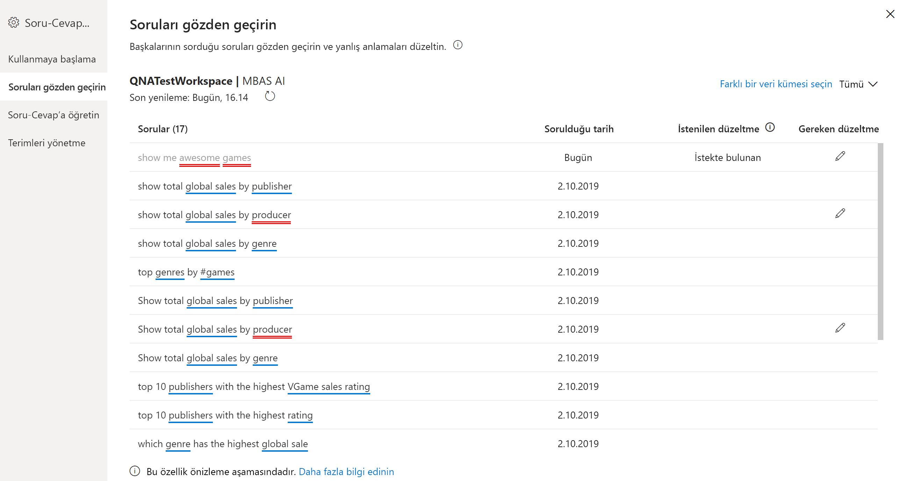
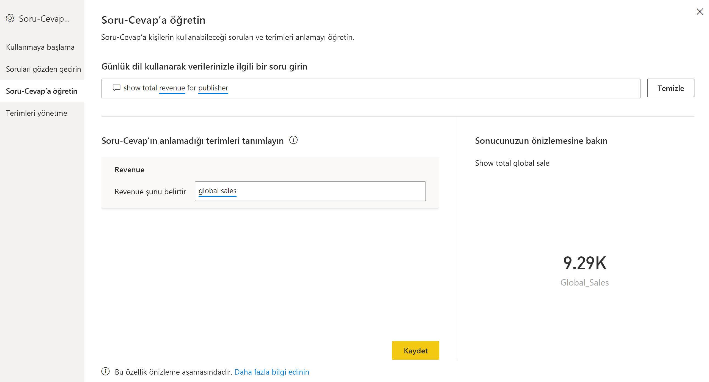
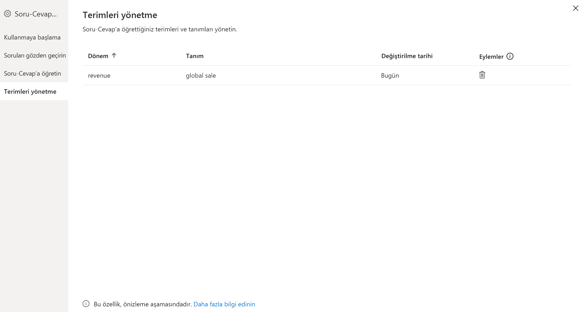
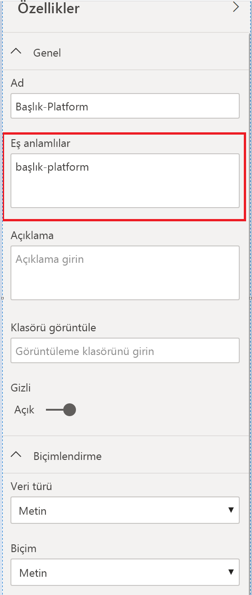

# Power BI Soru-Cevap eğitimi için Soru-Cevap araçlarına giriş (önizleme)

Power BI Soru-Cevap *araçları* ile kullanıcılarınızın doğal dil deneyimini iyileştirebilirsiniz. Tasarımcı veya yönetici olarak, doğal dil altyapısıyla etkileşime geçerek üç alanda geliştirmeler yaparsınız: 

- Kullanıcılarınızın sorduğu soruları gözden geçirmek.
- Soru-Cevap’a soruları anlamayı öğretmek.
- Soru-Cevap’a öğrettiğiniz terimleri yönetmek.

Bu ayrılmış araç özelliklerine ek olarak Power BI Desktop’taki **Modelleme** sekmesinde daha fazla seçenek sunulur:  

- Eş anlamlılar
- Satır etiketleri
- Soru-Cevap’tan gizle
- Dil şemasını yapılandırma (gelişmiş)

## Soru-Cevap araçlarını kullanmaya başlama

Soru-Cevap araçları yalnızca Power BI Desktop’ta kullanılabilir ve şu anda yalnızca içeri aktarma modunu desteklemektedir.

1. Power BI Desktop’ı açın ve Soru-Cevap’ı kullanarak bir görsel oluşturun. 
2. Görselin köşesinden dişli simgesini seçin. 

    

    Başlarken sayfası açılır.  

    

### Soruları gözden geçirme

Kiracınız için Power BI hizmetinde kullanılmakta olan veri kümelerinin bir listesini görmek için **Soruları inceleyin**’i seçin. **Soruları inceleyin** sayfası ayrıca veri kümesi sahibini, çalışma alanını ve son yenileme tarihini gösterir. Buradan bir veri kümesi seçerek kullanıcıların sorduğu soruları görebilirsiniz. Veriler tanınmayan sözcükleri de gösterir. Burada gösterilen tüm veriler son 28 güne aittir.

### Soru-Cevap’a öğretme

**Soru-Cevap Öğretimi** bölümünü kullanarak Soru-Cevap’ı sözcükleri tanıması için eğitebilirsiniz. Başlamak için, Soru-Cevap’ın tanımadığı bir veya daha fazla sözcüğü içeren bir soru yazın. Soru-Cevap ilgili terimin tanımını sorar. Sözcüğün temsil ettiği anlama karşılık gelen bir filtre veya alan adı girin. Bundan sonra Soru-Cevap özgün soruyu yeniden yorumlar. Sonuçlardan memnunsanız girişinizi kaydedebilirsiniz. Daha fazla bilgi edinmek için bkz. [Soru-Cevap Öğretimi](q-and-a-tooling-teach-q-and-a.md)

### Terimleri yönetme

Soru-Cevap Öğretimi bölümünde kaydettiğiniz her şey burada gösterilir, böylece tanımladığınız terimleri inceleyebilir veya silebilirsiniz. Şu anda mevcut bir tanımı düzenlemeniz mümkün değildir; bu yüzden bir terimi tanımlamak için silip yeniden oluşturmanız gerekir.

## Diğer Soru-Cevap ayarları

### Toplu eş anlamlılar

Power BI Desktop **Modelleme** sekmesinde Soru-Cevap deneyimini geliştirmeye yönelik daha fazla seçenek bulunur. 

1. Power BI Desktop'ta Modelleme görünümünü seçin.

2. Bir alan veya tablo seçerek **Özellikler** bölmesini görüntüleyin.  Bu bölme, tuvalin sağ tarafında gösterilir ve birkaç Soru-Cevap eylemini listeler. Seçeneklerden biri **Eş anlamlılar**’dır. **Eş anlamlılar** kutusunda, seçtiğiniz tablo veya alan için hızlıca alternatifler tanımlayabilirsiniz. Ayrıca, Araçlar iletişim kutusunun **Soru-Cevap Öğretimi** bölümünde eş anlamlıları tanımlayabilirsiniz ancak bir tablodaki çok sayıda alan için eş anlamlıları genellikle burada daha hızlı tanımlarsınız.

    

3. Tek bir alana ait birden çok eş anlamlı tanımlamak için, bir sonraki eş anlamlıyı göstermek üzere virgül kullanın.

### Soru-Cevap’tan gizle

Ayrıca alanları ve tabloları Soru-Cevap sonuçlarında görünmeyecek şekilde gizleyebilirsiniz. 

1. Power BI Desktop'ta Modelleme görünümünü seçin.

2. Bir alan veya tablo seçerek **Özellikler** bölmesini görüntüleyin ve **Gizli** seçeneğini **Açık** duruma getirin.

    Soru-Cevap bu ayara uyar ve alanın Soru-Cevap tarafından tanınmamasını sağlar. Örneğin, aynı ada sahip alanların gereksiz yinelenmesini önlemek için Kimlik alanlarını ve yabancı anahtarları gizlemek isteyebilirsiniz. Alanı gizleseniz bile Soru-Cevap dışındaki görsellerde Power BI Desktop ile kullanabilirsiniz.

### Satır etiketi ayarlama

Satır etiketi, bir tablodaki tek bir satırı en iyi tanımlayan sütunu (veya *alanı*) tanımlamanıza olanak tanır. Örneğin, 'Müşteri' adlı bir tablo için satır etiketi genellikle 'Görünen Ad' olur. Bu ekstra meta veriyi sağlamak, kullanıcılar 'Müşteriye göre satışları göster' yazdığında Soru-Cevap’ın daha faydalı bir görsel çizmesine olanak tanır. 'Müşteri'yi tablo olarak işleme almak yerine 'Görünen Ad'ı kullanabilir ve her bir müşterinin satışını gösteren bir çubuk grafik gösterebilir. Satır etiketini yalnızca Modelleme görünümünde ayarlayabilirsiniz. 

1. Power BI Desktop'ta Modelleme görünümünü seçin.

2. Bir tablo seçerek **Özellikler** bölmesini görüntüleyin.

3. **Satır etiketi** kutusunda bir alan seçin.

## Dil şemasını yapılandırma (gelişmiş)

Power BI’da, Soru-Cevap içindeki doğal dil altyapısını, temel alınan doğal dil sonuçlarının puanlamasını ve ağırlıklandırılmasını değiştirmek de dahil olmak üzere tamamen eğitip geliştirebilirsiniz. Nasıl yapılacağını öğrenmek için bkz. [Soru-Cevap dil şemasını düzenleme ve ifade ekleme](q-and-a-tooling-advanced.md).

## Sonraki adımlar

Doğal dil altyapısını iyileştirmeye yönelik birkaç en iyi yöntem vardır. Daha fazla bilgi için aşağıdaki makaleyi inceleyin:

* [Soru-Cevap ile En İyi Yöntemler](q-and-a-best-practices.md)
