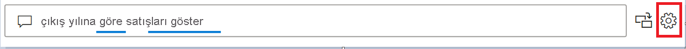
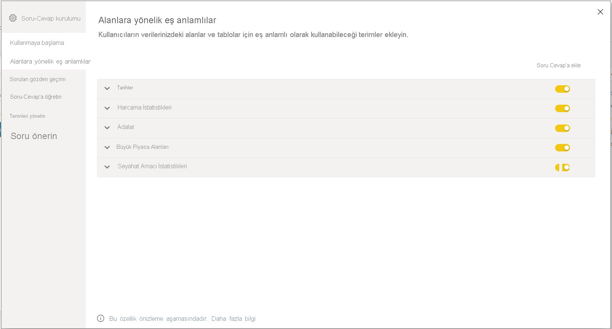
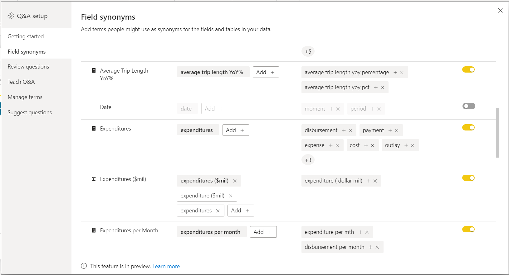
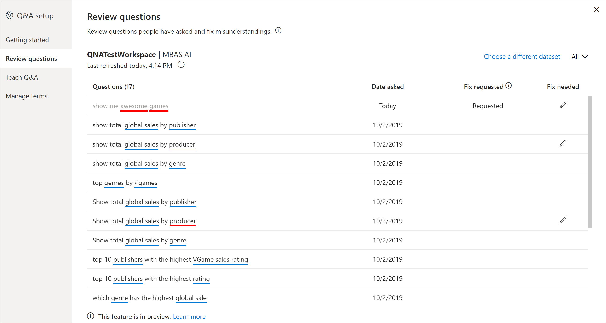

# Power BI Soru-Cevap eğitimi için Soru-Cevap araçlarına giriş (önizleme)

Power BI Soru-Cevap *araçları* ile kullanıcılarınızın doğal dil deneyimini iyileştirebilirsiniz. Tasarımcı veya yönetici olarak, doğal dil altyapısıyla etkileşime geçerek üç alanda geliştirmeler yaparsınız: 

- Kullanıcılarınızın sorduğu soruları gözden geçirmek.
- Soru-Cevap’a soruları anlamayı öğretmek.
- Soru-Cevap’a öğrettiğiniz terimleri yönetmek.

Bu ayrılmış araç özelliklerine ek olarak Power BI Desktop’taki **Modelleme** sekmesinde daha fazla seçenek sunulur:  

- Eş anlamlılar
- Satır etiketleri
- Soru-Cevap’tan gizle
- Dil şemasını yapılandırma (gelişmiş)

## Soru-Cevap araçlarını kullanmaya başlama

Soru-Cevap araçları yalnızca Power BI Desktop’ta kullanılabilir ve şu anda yalnızca içeri aktarma modunu desteklemektedir.

1. Power BI Desktop’ı açın ve Soru-Cevap’ı kullanarak bir görsel oluşturun. 
2. Görselin köşesinden dişli simgesini seçin. 

    

    Başlarken sayfası açılır.  

    

### Alan Eş Anlamlıları

Modele ait tüm tablo ve sütunları görmek için **Alan Eş Anlamlıları**’nı seçin. Bu görünüm, kullanıcılara yardım etmek amacıyla sütunlarla eşleşecek alternatif adlar eklemenize olanak verir. Bir sütunun veya tablonun Soru-Cevap’tan gizlenmesi gerekip gerekmediğini de seçebilirsiniz.

Genişletmek için tablolardan birine tıkladığınızda, aşağıdakine benzer bir iletişim kutusu görürsünüz.

İletişim kutusu, tüm sütun ve tablolara ek olarak, kullanıcıların veri kümesine soru sorarken kullanabileceği ilgili terimleri/eş anlamlıları gösterir. Tüm terimleri hızla tek bir yerde görebilir ve birden çok sütuna terim ekleyip kaldırabilirsiniz. 

- Terim ekleme: Satış adlı bir alanınız varsa Gelir diye bir terim eklemeye karar verebilirsiniz. Böylece kullanıcı, satış sözcüğü yerine bu sözcüğü kullanabilir. Hızla yeni terim eklemek için İmza ekle’ye tıklayın

- Soru-Cevap’a dahil etme: Bu seçenek, bir sütun veya tablonun Soru-Cevap’ta atlanmasını, yani görüntülenmemesini veya bu sütunu içeren bir sonucun gösterilmemesini sağlar. Tarihlerle ilgilenirken bir sütunu dahil etmemeye karar verebileceğiniz bir durum oluşabilir. Çok sayıda tarih alanı veya yabancı anahtar varsa kullanıcı tarihle ilgili bir soru sorduğunda doğru tarih sütununun seçilmesini sağlamak için bir tanesi hariç tüm tarih sütunlarını kaldırmaya karar verebilirsiniz.

- Önerilen Terimler: Soru-Cevap, terimleri/eş anlamlıları hızla eklemenize yardımcı olmak için öneriler altyapımızdan alınan önerilen terimleri de size tavsiye eder. Öneriler eklenmese de çalışır, ancak kullanıcıya Soru-Cevap’ın bir yanıtı olduğunu düşündüğünü, fakat emin olmadığını gösteren turuncu noktalı çizgi gösterir. Önerilen eş anlamlı sözcük doğruysa eş anlamlı olarak kullanılabilmesi için + simgesine tıklayın. Öneri hatalıysa x’e tıklayarak terimi kaldırın ve terim/eş anlamlı olarak kullanılmayacağından ve Soru-Cevap’ta işlenmeyeceğinden emin olun. Öneriler hem Office Sözlüğü tarafından desteklenir hem de bir rapordaki yeniden adlandırmaları temel alır

### Soruları gözden geçirme

Kiracınız için Power BI hizmetinde kullanılmakta olan veri kümelerinin bir listesini görmek için **Soruları inceleyin**’i seçin. **Soruları inceleyin** sayfası ayrıca veri kümesi sahibini, çalışma alanını ve son yenileme tarihini gösterir. Buradan bir veri kümesi seçerek kullanıcıların sorduğu soruları görebilirsiniz. Veriler tanınmayan sözcükleri de gösterir. Burada gösterilen tüm veriler son 28 güne aittir.

### Soru-Cevap’a öğretme

**Soru-Cevap Öğretimi** bölümünü kullanarak Soru-Cevap’ı sözcükleri tanıması için eğitebilirsiniz. Başlamak için, Soru-Cevap’ın tanımadığı bir veya daha fazla sözcüğü içeren bir soru yazın. Soru-Cevap ilgili terimin tanımını sorar. Sözcüğün temsil ettiği anlama karşılık gelen bir filtre veya alan adı girin. Bundan sonra Soru-Cevap özgün soruyu yeniden yorumlar. Sonuçlardan memnunsanız girişinizi kaydedebilirsiniz. Daha fazla bilgi edinmek için bkz. [Soru-Cevap Öğretimi](q-and-a-tooling-teach-q-and-a.md)

### Terimleri yönetme

Soru-Cevap Öğretimi bölümünde kaydettiğiniz her şey burada gösterilir, böylece tanımladığınız terimleri inceleyebilir veya silebilirsiniz. Şu anda mevcut bir tanımı düzenlemeniz mümkün değildir; bu yüzden bir terimi tanımlamak için silip yeniden oluşturmanız gerekir.

### Soru önerme

> [!NOTE]
> Önerilen sorular, Soru-Cevap görselinin tüm örnekleri için görünür. Her Soru-Cevap görseli için ayrı bir öneri kümesi oluşturmak mümkün olmaz.
> 
> 

Herhangi bir kurulum yapmadan Soru-Cevap başlangıç olarak çeşitli sorular önerecektir. Bu sorular, veri modeliniz temelinde otomatik olarak oluşturulur. **Soru öner** bölümünde otomatik olarak oluşturulan soruların üzerine kendi sorularınızı yazabilirsiniz.

Başlangıç olarak eklemek istediğiniz soruyu metin kutusuna yazın. Önizleme bölümünde, Soru-Cevap görselinde sonucun nasıl görüneceğini görürsünüz. 

:::image type="content" source="media/q-and-a-tooling-intro/power-bi-qna-suggest-questions.png" alt-text="Soru-Cevap soruları önerme":::
 
Bu soruyu **Önerilen sorularınız**’a eklemek için **Ekle**’yi seçin. Girilen her soru bu listenin sonuna eklenir. Sorular, Soru-Cevap görselinde listedekiyle aynı sırada gösterilir. 

:::image type="content" source="media/q-and-a-tooling-intro/power-bi-qna-save-suggest-questions.png" alt-text="Önerilen soruları kaydetme":::
 
Öneriler sorular listenizin Soru-Cevap görselinde gösterilmesi için **Kaydet**’i seçtiğinizden emin olun. 

## Diğer Soru-Cevap ayarları

### Satır etiketi ayarlama

Satır etiketi, bir tablodaki tek bir satırı en iyi tanımlayan sütunu (veya *alanı*) tanımlamanıza olanak tanır. Örneğin, 'Müşteri' adlı bir tablo için satır etiketi genellikle 'Görünen Ad' olur. Bu ekstra meta veriyi sağlamak, kullanıcılar 'Müşteriye göre satışları göster' yazdığında Soru-Cevap’ın daha faydalı bir görsel çizmesine olanak tanır. 'Müşteri'yi tablo olarak işleme almak yerine 'Görünen Ad'ı kullanabilir ve her bir müşterinin satışını gösteren bir çubuk grafik gösterebilir. Satır etiketini yalnızca Modelleme görünümünde ayarlayabilirsiniz. 

1. Power BI Desktop'ta Modelleme görünümünü seçin.

2. Bir tablo seçerek **Özellikler** bölmesini görüntüleyin.

3. **Satır etiketi** kutusunda bir alan seçin.

## Dil şemasını yapılandırma (gelişmiş)

Power BI’da, Soru-Cevap içindeki doğal dil altyapısını, temel alınan doğal dil sonuçlarının puanlamasını ve ağırlıklandırılmasını değiştirmek de dahil olmak üzere tamamen eğitip geliştirebilirsiniz. Nasıl yapılacağını öğrenmek için bkz. [Soru-Cevap dil şemasını düzenleme ve ifade ekleme](q-and-a-tooling-advanced.md).

## Sonraki adımlar

Doğal dil altyapısını iyileştirmeye yönelik birkaç en iyi yöntem vardır. Daha fazla bilgi için bkz. [Soru-Cevap ile ilgili en iyi yöntemler](q-and-a-best-practices.md).
