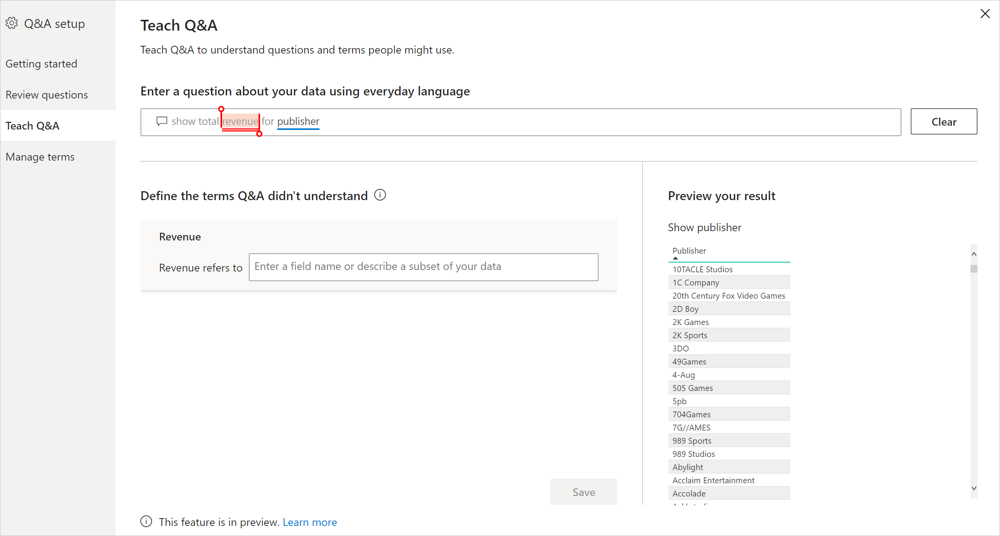
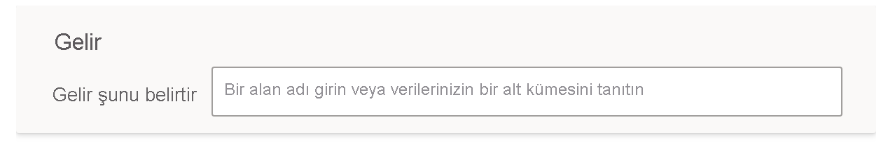
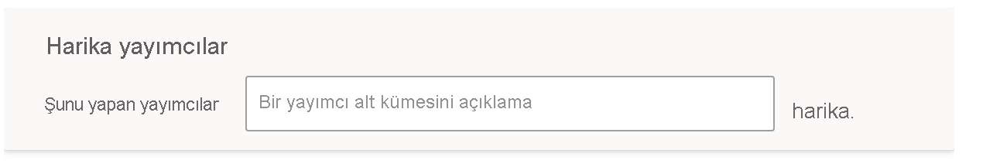

# Power BI Soru-Cevap'taki soru ve terimleri anlamak için Soru-Cevap Öğretimi

Soru-Cevap ayarının **Soru-Cevap Öğretimi** bölümünde, Soru-Cevap’ı tanımadığı doğal dil soru ve terimlerini anlaması için eğitebilirsiniz. Başlamak için, Soru-Cevap’ın tanımadığı bir veya daha fazla sözcüğü içeren bir soru gönderin. Soru-Cevap bu terimi tanımlamanızı ister. Sözcüğün temsil ettiği anlama karşılık gelen bir filtre veya alan adı girebilirsiniz. Bundan sonra Soru-Cevap özgün soruyu yeniden yorumlar. Sonuçlardan memnunsanız kaydedin.

> [!NOTE]
> Soru-Cevap Öğretimi işlevi yalnızca içeri aktarma modunu destekler. Ayrıca, henüz bir şirket içi veya Azure Analysis Services veri kaynağına bağlanmayı desteklememektedir. Bu sınırlama, Power BI’ın sonraki yayınlarında kaldırılacaktır.

## Soru-Cevap öğretimine başlama

1. Power BI Desktop’ta **Modelleme** şeridindeki **Soru-Cevap Ayarı** > **Soru-Cevap Öğretimi**’ni seçin.

    

2. Soru-Cevap’ın tanımadığı terimle başlayan bir cümle yazın ve **Gönder**'i seçin.

3. Kırmızıyla altı çizili sözcüğü seçin. 

    Soru-Cevap, öneriler sunar ve terimin doğru tanımını sağlamanızı ister. 
    
3. **Soru-Cevap’ın anlamadığı terimleri tanımlayın** altında bir tanım belirtin.

    

4. Güncelleştirilmiş görselin önizlemesini görmek için **Kaydet**'i seçin.

5. Sonraki soruyu girin veya kapatmak için **X** simgesini seçin.

Rapor tüketicileriniz, siz raporu hizmette geri yayımlayana kadar bu değişikliği görmez.

## İsimleri ve sıfatları tanımlama

Soru-Cevap’a iki tür terim öğretebilirsiniz:

- İsimler
- Sıfatlar

### İsim eşanlamlısı tanımlama

Verilerle çalışırken, genellikle alternatif adlarla başvurulabilen alan adlarıyla karşılaşabilirsiniz. 'Satış' buna örnek olabilir. 'Gelir' gibi satışı ifade eden birçok sözcük veya tümcecik olabilir. Bir sütunun adı 'Satış' ise ve rapor tüketicileri 'gelir' yazarsa Soru-Cevap, soruyu uygun şekilde yanıtlamak için doğru sütunu seçemeyebilir. Bu durumda, Soru-Cevap’a 'Satış' ve 'Gelir' sözcüklerinin aynı anlama geldiğini söylemeniz gerekir.

Soru-Cevap, tanınmayan bir sözcük isim olduğunda Microsoft Office’ten edindiği bilgiyi kullanarak otomatik olarak algılar. Soru-Cevap bir isim algılarsa sizi aşağıdaki şekilde uyarır:

- <your term> **sözcüğünün anlamı** 

Bu kutuyu, verilerinizdeki terimle doldurun.

Veri modelindeki bir alan dışında bir seçenek belirtirseniz istenmeyen sonuçlar alabilirsiniz.

### Sıfat filtre koşulu tanımlama

Bazen, temel alınan verilerde koşul görevi gören terimleri tanımlamak isteyebilirsiniz. 'Başarılı Yayımcılar' buna örnek olabilir. 'Başarılı', yalnızca X ürün yayımlamış yayımcıları seçen bir koşul olabilir. Soru-Cevap, farklı bir soru göstererek sıfatları algılamaya çalışır:

- <field name> **şunu yapmış**  

Kutuyu koşulla doldurursunuz.

Tanımlayabileceğiniz bazı örnek koşullar şunlardır:

- ABD olan Ülke
- ABD olmayan Ülke
- Ürünler > 100
- 100’den büyük olan Ürünler
- Ürünler = 100
- 100’e eşit Ürünler
- Ürünler < 100
- 100’den küçük olan Ürünler

Bu örneklerde 'Ürünler' bir sütun adı veya ölçü olabilir. 

Ayrıca Soru-Cevap ifadesinde de toplama belirtebilirsiniz. Örneğin ‘popüler ürünler’ en az 100 birimi satılan ürünlerse ‘satılan birim toplamı > 100’ olan ürünleri popüler olarak tanımlayabilirsiniz.  

:::image type="content" source="media/q-and-a-tooling-teach-q-and-a/power-bi-qna-popular-products.png" alt-text="'Popüler ürünler'i tanımlama":::

Araç içinde yalnızca tek bir koşul tanımlayabilirsiniz. Daha karmaşık koşullar tanımlamak için DAX kullanarak hesaplanmış bir sütun veya ölçü oluşturun ve ardından bu sütun veya ölçü için tek bir koşul oluşturmak üzere araç bölmesini kullanın.

## Terimleri yönetme

Tanımları sağladıktan sonra, yaptığınız tüm düzeltmeleri görmek ve düzenlemek veya silmek için geri gidebilirsiniz. 

1. **Soru-Cevap ayarı** adımında **Terimleri yönet** bölümüne gidin.

2. Artık istemediğiniz terimleri silin. Şu anda koşulları düzenleyemezsiniz. Bir terimi yeniden tanımlamak için terimi silin ve tanımlayın.

    

## Sonraki adımlar

Doğal dil altyapısını iyileştirmeye yönelik birkaç en iyi yöntem vardır. Daha fazla bilgi için bkz. [Soru-Cevap ile ilgili en iyi yöntemler](q-and-a-best-practices.md).
