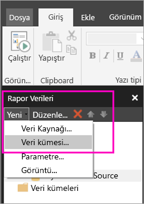
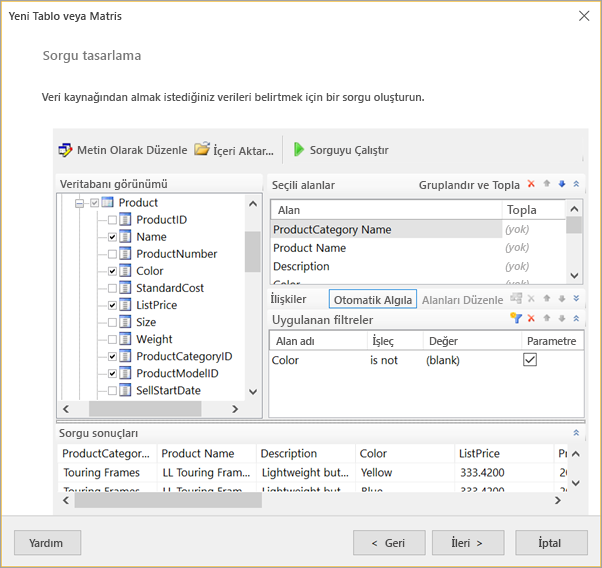
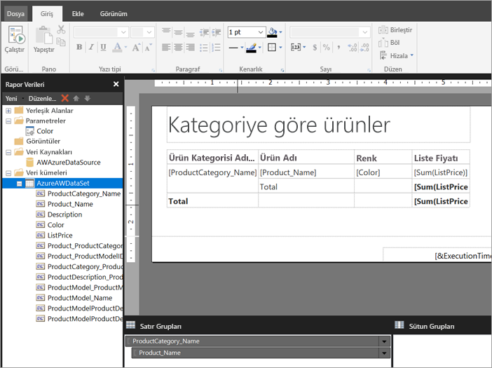

# Sayfalandırılmış rapor için Power BI hizmetinde tümleşik veri kümesi oluşturma (Önizleme)
Bu makalede, Power BI hizmetindeki sayfalandırılmış bir rapor için tümleşik bir veri kaynağını temel alan tümleşik bir veri kümesi oluşturma işlemini öğreneceksiniz. Tümleşik veri kümeleri tek bir sayfalandırılmış raporda kullanılmak üzere o raporda yer alır. Şu anda, Power BI hizmetinde yayımlanan sayfalandırılmış raporlar için tümleşik veri kümeleri ve tümleşik veri kaynakları gereklidir. Tümleşik veri kaynağını ve veri kümesini, raporunuzu oluştururken Rapor Oluşturucusu’nde oluşturursunuz. 

Veri kümesini oluşturabilmeniz için bir veri kaynağı oluşturmak gerekir. Nasıl yapıldığını öğrenmek için Power BI hizmetinde [Sayfalandırılmış raporlar için tümleşik veri kaynakları](paginated-reports-embedded-data-source.md) bölümüne bakın.
  
## Eklenmiş veri kümesi oluşturma
  
1. Rapor Oluşturucusu'ndaki Rapor Verileri bölmesinde **Yeni** > **Veri Kümesi**’ni seçin.

1. **Veri Kümesi Özellikleri** iletişim kutusunun **Sorgu** sekmesinde veri kümesine bir ad verin. Tümleşik veri kaynağı zaten **Veri kaynağı** kutusundadır veya **Yeni**’yi seçerek farklı bir tümleşik veri kaynağı seçebilirsiniz.
 
     

3. **Sorgu türü** altında veri kümesi için kullanılacak komut türünü veya sorguyu seçin. 
    - **Metin**, veritabanından veri almak için bir sorgu çalıştırır. Varsayılandır ve sorguların çoğu için kullanılır. Bir sorgu yazın veya **İçeri Aktar**’ı seçerek önceden mevcut olan bir sorguyu içeri aktarın. Sorguyu grafiksel olarak oluşturmak için **Sorgu Tasarımcısı**’nı seçin. Bir sorgu oluşturmak için sorgu tasarımcısını kullanırsanız bu kutuda sorgunun metni görünür. Sorguyu dinamik olarak oluşturmak üzere bir ifade kullanmak için **İfade** (**fx**) düğmesini seçin. 
    - **Tablo** bir tablonun içindeki tüm alanları seçer. Veri kümesi olarak kullanmak istediğiniz tablonun adını girin.
    - **Saklı Yordam**, ada göre bir saklı yordam çalıştırır.

4. Sorgu Tasarımcısı'nda, veri kümesindeki tablo ve alanları görüp bunlarla etkileşimde bulunabilir, bir sorguyu içeri aktarabilir veya metin olarak düzenleyebilirsiniz. Ayrıca, buraya filtre ve parametreler de ekleyebilirsiniz. 

    

5. Sorgu Tasarımcısı'nda sorguyu test etmek için **Sorgu Çalıştır**’ı ve **Tamam**’ı seçin.

1. Veri Kümesi Özellikleri iletişim kutusunda geri dönerek **Zaman aşımı (saniye cinsinden)** kutusuna sorgu zaman aşımına uğrayana kadar geçen saniye sayısını yazın. Varsayılan değer 30 saniyedir. **Zaman aşımı** değeri boş ya da sıfırdan büyük olmalıdır. Boş ise sorgu zaman aşımına uğramaz.

7.  Diğer sekmelerde veri kümesinin diğer özelliklerini ayarlayabilirsiniz:
    - **Alanlar** sekmesinde hesaplanan alanlar oluşturun.
    - **Seçenekler** sekmesinde gelişmiş seçenekleri ayarlayın.
    - İlgili sekmelerde **Filtreler** ve **Parametreler** ekleyin ya da güncelleştirin.

8. **Tamam**'ı seçin
 
   Rapor, Rapor Tasarım Görünümünde açılır. Veri kaynağı, veri kümesi ve veri kümesi alan koleksiyonu, Rapor Verileri bölmesinde görünür ve sayfalandırılmış raporunuzu tasarlamaya devam edebilirsiniz.  

     
 
## Sonraki adımlar 

- [Power BI Premium’da sayfalandırılmış raporlar nelerdir? (Önizleme)](paginated-reports-report-builder-power-bi.md)  
- [Öğretici: Sayfalandırılmış rapor oluşturma ve bu raporu Power BI hizmetine yükleme](paginated-reports-quickstart-aw.md)
- [Power BI hizmetinde sayfalandırılmış rapor yayımlama](paginated-reports-save-to-power-bi-service.md)

