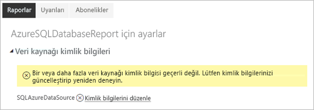
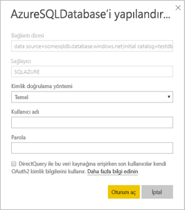

# Power BI sayfalandırılmış raporları için desteklenen veri kaynakları

Bu makalede Power BI hizmetindeki sayfalandırılmış raporlar için desteklenen veri kaynakları ve Azure SQL Veritabanı veri kaynaklarına nasıl bağlanılacağı açıklanır. Bazı veri kaynakları yerel olarak desteklenir. Diğerlerine veri ağ geçitleri yoluyla bağlanabilirsiniz.

## Yerel olarak desteklenen veri kaynakları

Sayfalandırılmış raporlar aşağıdaki veri kaynakları listesini yerel olarak destekler:

| Veri Kaynağı | Kimlik Doğrulama | Notlar |
| --- | --- | --- |
| Azure SQL Veritabanı  Azure SQL Veri Ambarı | Temel, çoklu oturum açma (SSO), OAuth2 |   |
| Azure Analysis Services | SSO, OAuth2 |   |
| Power BI veri kümesi | SSO | Premium ve Premium olmayan Power BI veri kümeleri |
| Premium Power BI veri kümesi (XMLA) | SSO |   |
| Veri Gir | YOK | Veriler rapora katıştırılmıştır. |

Siz raporu Power BI hizmetine yükledikten sonra Azure SQL Veritabanı dışındaki tüm veri kaynakları kullanıma hazırdır. Veri kaynakları uygulanabilir olduğunda varsayılan olarak çoklu oturum açmayı (SSO) kullanır. Azure Analysis Services için kimlik doğrulaması türünü OAuth2 olarak değiştirebilirsiniz.

Azure SQL Veritabanı veri kaynakları için, [Azure SQL Veritabanı Kimlik Doğrulaması](#azure-sql-database-authentication) bölümünde açıklandığı gibi daha fazla bilgi sağlamanız gerekir.

## Diğer veri kaynakları

Yukarıdaki yerel olarak desteklenen veri kaynaklarına ek olarak, aşağıdaki veri kaynaklarına da [Power BI veri ağ geçidi](service-gateway-onprem.md) yoluyla erişilebilir:

- SQL Server
- SQL Server Analysis Services
- Oracle
- Teradata

Sayfalandırılmış raporlar için şu anda Azure SQL Veritabanı'na ve Azure Analysis Services'e Power BI veri ağ geçidi üzerinden erişilemez.

## Azure SQL Veritabanı kimlik doğrulaması

Azure SQL Veritabanı veri kaynakları için, raporu çalıştırmadan önce kimlik doğrulaması türünü ayarlamalısınız. Bu yalnızca çalışma alanında bir veri kaynağını ilk kez kullanırken geçerlidir. Bu ilk kullanımınızda aşağıdaki iletiyi görürsünüz:

Kimlik bilgilerini sağlamazsanız raporu çalıştırdığınızda hata oluşur. Yeni karşıya yüklediğiniz raporun **Veri kaynağı kimlik bilgileri** sayfasına gitmek için **Devam**'ı seçin:

**Yapılandır** iletişim kutusunu görüntülemek için belirli bir veri kaynağının **Kimlik bilgilerini düzenle** bağlantısını seçin:

Azure SQL Veritabanı veri kaynakları için desteklenen kimlik doğrulaması türleri şunlardır:

- Temel (kullanıcı adı ve parola)
- SSO (çoklu oturum açma)
- OAuth2 (depolanmış AAD belirteci)

SSO ve OAuth2'nin doğru çalışması için veri kaynağının bağlantılı olduğu Azure SQL Veritabanı sunucusunda [AAD kimlik doğrulaması desteğinin etkinleştirilmiş](https://docs.microsoft.com/azure/sql-database/sql-database-aad-authentication-configure) olması gerekir. OAuth2 kimlik doğrulama yöntemi için AAD bir belirteç oluşturur ve bunu gelecekteki veri kaynağı erişimleri için depolar. Bunun yerine [SSO kimlik doğrulama yöntemini](https://docs.microsoft.com/power-bi/service-azure-sql-database-with-direct-connect#single-sign-on) kullanmak için, hemen altındaki SSO seçeneğini belirtin: **DirectQuery ile bu veri kaynağına erişirken, son kullanıcılar kendi OAuth2 kimlik bilgilerini kullanır**.
  
## Sonraki adımlar

[Power BI hizmetinde sayfalandırılmış rapor görüntüleme](paginated-reports-view-power-bi-service.md)

Başka bir sorunuz mu var? [Power BI Topluluğu'na başvurun](http://community.powerbi.com/)
