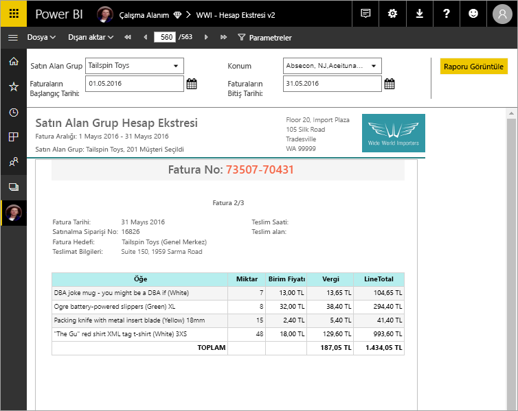

# Power BI Premium’da sayfalandırılmış raporlar nelerdir? (Önizleme)

SQL Server Reporting Services’de uzun süredir rapor biçimi olan sayfalandırılmış raporlar artık Power BI hizmetinde kullanılabilir. Bu raporlar yazdırılabilir veya paylaşılabilir. "Sayfalandırılmış" olarak adlandırılmalarının nedeni, bir sayfaya düzgün yerleştirilecek şekilde biçimlendirilmiş olmalarıdır. Tablo birden fazla sayfaya yayılsa bile tüm verileri bir tabloda gösterirler. Rapor sayfası düzenini tam olarak denetleyebileceğiniz için bazı durumlarda "piksel düzeyinde hassas" olarak anılırlar. Sayfalandırılmış raporlar, SQL Server Reporting Services’in RDL rapor teknolojisini temel alır. Rapor Oluşturucusu, sayfalandırılmış raporlar yazmaya yarayan bağımsız bir araçtır. 

Sayfalandırılmış raporlar birçok sayfadan oluşabilir. Örneğin bu raporun 563 sayfası vardır. Her biri tam olarak her fatura için bir sayfa olacak ve üst bilgiler ile alt bilgiler tekrarlanacak şekilde düzenlenmiştir.

Rapor Oluşturucusu'nda raporunuzun önizlemesini görebilir, ardından http://app.powerbi.com Power BI hizmetinde yayımlayabilirsiniz. Hizmette bir rapor yayımlamak için Power BI Pro lisansı gereklidir. Sayfalandırılmış raporları Çalışma Alanım bölümünüzde veya Power BI Premium kapasitesi içindeki uygulama çalışma alanlarında yayımlayıp paylaşabilirsiniz. Ayrıca, sayfalandırılmış raporların Power BI yönetici portalında bir Power BI yöneticisi tarafından etkinleştirilmesi gerekir. 

## Power BI Rapor Oluşturucusu'nda rapor oluşturma

Sayfalandırılmış raporlar, kendi tasarım aracı olan Power BI Rapor Oluşturucusu vardır. Power BI rapor sunucusu veya SQL Server Raporlama Hizmetleri (SSRS) için sayfalandırılmış raporlar oluşturmak için daha önce kullanılan araçları ile aynı temel paylaşan yeni bir aracıdır. Şirket içinde SSRS 2016 ve 2017 veya Power BI Rapor Sunucusu için oluşturduğunuz sayfalandırılmış raporlar, Power BI hizmeti ile uyumludur. Power BI hizmeti geriye dönük uyumluluğa sahip olduğu için raporlarınızı ileriye taşıyabilir ve önceki sürümlerdeki sayfalandırılmış raporları yükseltebilirsiniz. Rapor özelliklerinin tamamı başlatma sırasında kullanılamaz. Ayrıntılar için bu makaledeki [Sınırlamalar ve önemli noktalar](#limitations-and-considerations) bölümüne bakın.
     
## Çeşitli veri kaynaklarından rapor

Tek bir sayfalandırılmış raporun birkaç farklı veri kaynağı olabilir. Power BI raporlarının aksine, temel alınan bir veri modeli yoktur. Power BI hizmetindeki sayfalandırılmış raporların ilk sürümünde, raporun içinde yerleşik veri kaynakları ve veri kümeleri oluşturursunuz. Şimdilik paylaşılan veri kaynaklarını veya paylaşılan veri kümelerini kullanamazsınız. Yerel bilgisayarınızdaki Rapor Oluşturucusu'nda raporları oluşturursunuz. Bir rapor şirket içi verilere bağlanıyorsa raporu Power BI hizmetine yükledikten sonra bir ağ geçidi oluşturmanız ve veri bağlantısını yönlendirmeniz gerekir. Şu anda bağlanabileceğiniz veri kaynakları şunlardır:

- Azure SQL Veritabanı ve Veri Ambarı
- Azure Analysis Services (SSO) aracılığıyla
- Ağ geçidi üzerinden SQL Server
- Ağ geçidi üzerinden SQL Server Analysis Services
- Power BI Premium veri kümeleri
- Oracle
- Teradata
 
Önizleme dönemi boyunca daha fazla veri kaynağı kullanıma sunulacaktır.

## Raporunuzu tasarlama  

### Matris, grafik ve serbest biçimli düzenleri olan sayfalandırılmış raporlar oluşturma

Tablo raporları, sütun tabanlı veriler için idealdir. Çapraz veya PivotTable raporları gibi matris raporlar, özetlenmiş veriler için idealdir. Grafik raporları, verileri grafiksel biçimde sunar ve serbest biçimli *liste* raporları, fatura gibi neredeyse diğer her şeyi sunabilir. 
  
Rapor Oluşturucusu sihirbazlarından biri ile başlayabilirsiniz. Tablo, Matris ve Grafik sihirbazları, yerleşik veri kaynağı bağlantısı ve yerleşik veri kümesi oluşturma işlemlerinde size yol gösterir. Ardından, alanları sürükleyip bırakarak bir veri kümesi sorgusu oluşturun, bir düzen ve stil seçin ve raporunuzu özelleştirin.  
  
Harita sihirbazı ile coğrafi veya geometrik bir arka plana göre toplu verileri gösteren raporlar oluşturun. Harita verileri bir Transact-SQL sorgusundaki uzamsal veriler ya da bir Environmental Systems Research Institute, Inc. (ESRI) şekil dosyaları olabilir. Ayrıca bir Microsoft Bing harita parçası arka planı da ekleyebilirsiniz.  

### Raporunuza daha fazla bilgi ekleme

Verileri filtreleyerek, gruplandırarak ve sıralayarak ya da formül veya ifade ekleyerek verilerinizi değiştirin. Verileri görsel bir biçimde özetlemek için grafikler, ölçerler, mini grafikler ve göstergeler ekleyin.  Özelleştirilmiş görünümler için verileri filtrelemek üzere parametreler ve filtreler kullanın. Dış içerikler de dahil olmak üzere görüntüleri ve diğer kaynakları ekleyin ya da başvurun.  

Raporun kendisinden her metin kutusu, görüntü, tablo ve grafiğe kadar bir sayfalandırılmış raporun içindeki her şey, raporun tam olarak istediğiniz gibi görünmesi için ayarlayabileceğiniz bir dizi özelliğe sahiptir.

## Rapor tanımı oluşturma

Sayfalandırılmış rapor tasarlarken aslında bir *rapor tanımı* oluşturursunuz. Bu rapor tanımı, verileri içermez. Verilerin nereden alınacağını, hangi verilerin alınacağını ve verilerin nasıl görüntüleneceğini belirtir. Raporu çalıştırdığınızda, rapor işlemcisi belirttiğiniz rapor tanımını alır, verileri alır ve raporu oluşturmak için rapor düzeni ile birleştirir. Rapor tanımını http://app.powerbi.com Power BI hizmetine, Çalışma Alanım bölümünüze veya iş arkadaşlarınızla paylaşılan bir çalışma alanına yükleyin. Rapor veri kaynağı şirket içindeyse, raporu karşıya yükledikten sonra veri kaynağı bağlantısını bir ağ geçidinden geçecek şekilde yeniden yönlendirin. 

## Sayfalandırılmış raporunuzu görüntüleme
Power BI hizmetindeki sayfalandırılmış raporunuzu bir tarayıcıda ve aynı zamanda Power BI mobil uygulamalarında görüntülersiniz. Power BI hizmetinde raporu HTML, MHTML, PDF, XML, CSV, TIFF, Word ve Excel gibi biçimlerde dışarı aktarabilirsiniz. Ayrıca, diğer kişilerle paylaşabilirsiniz.  

## Raporunuz için bir abonelik oluşturun

Artık Power BI hizmetinde sayfalandırılmış raporlar için e-posta abonelikleri kendiniz ve başkaları için ayarlayabilirsiniz. Genel olarak, raporları ve Power BI hizmetindeki panolara abone aynı işlemidir. Abonelikleri ayarlamada size ne sıklıkta e-postaları almak istediğinizi seçin: günlük, haftalık veya saatlik. Abonelik bir PDF ek raporun tamamı çıkış içerir.

Ayrıntılar için bkz [kendinizin ve başkalarının sayfalandırılmış raporları Power BI hizmetine abone](paginated-reports-subscriptions.md). 

## Sınırlamalar ve önemli noktalar

İlk sürümde desteklenmeyen bazı diğer özellikler şunlardır:

- Rapor sayfalarını veya görselleri Power BI panolarına sabitleme. Bir Power BI Rapor Sunucusu veya Reporting Services rapor sunucusunda şirket içi sayfalandırılmış bir rapordan Power BI panosuna görselleştirmeleri yine sabitleyebilirsiniz. Daha fazla bilgi için bkz. [Reporting Services öğelerini Power BI panolarına sabitleme](https://docs.microsoft.com/sql/reporting-services/pin-reporting-services-items-to-power-bi-dashboards).
- Belge haritaları ve göster/gizle düğmeleri gibi etkileşimli özellikler.
- Alt raporlar ve detaylandırma raporları.
- Paylaşılan veri kaynakları ve paylaşılan veri kümeleri.
- Power BI raporlarındaki görseller.
 
## Sonraki adımlar

- [Power BI Rapor Oluşturucusu Microsoft Yükleme Merkezi'nden yükleme](https://go.microsoft.com/fwlink/?linkid=2086513)
- [Öğretici: Sayfalandırılmış rapor oluşturma](paginated-reports-quickstart-aw.md)
- [Verileri doğrudan sayfalandırılmış bir rapora girme](paginated-reports-enter-data.md)

  

