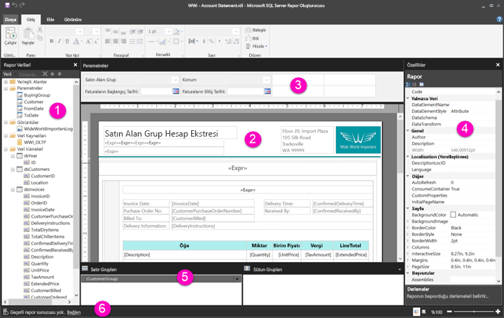

# Sayfalandırılmış raporlar için Rapor Tasarımı Görünümünde dolaşma

Power BI Rapor Oluşturucusu'nun Rapor Tasarımı Görünümü, Power BI hizmetine yayımlayabileceğiniz sayfalandırılmış raporları oluşturmaya yönelik tasarım alanıdır. Tasarım yüzeyi Rapor Oluşturucusu'nun ortasında yer alır ve çevresinde şerit ile bölmeler vardır. Tasarım yüzeyi, rapor öğelerinizi eklediğiniz ve düzenlediğiniz yerdir. Bu makalede, rapor kaynaklarınızı eklemek, seçmek ve düzenlemek, ayrıca rapor öğesi özelliklerini değiştirmek için kullandığınız panolar açıklanır.  

1. [Rapor verileri bölmesi](#1-report-data-pane) 
2. [Rapor tasarım yüzeyi](#2-report-design-surface)  
3. [Parametreler bölmesi](#3-parameters-pane) 
4. [Özellikler bölmesi](#4-properties-pane) 
5. [Gruplandırma bölmesi](#5-grouping-pane) 
6. [Geçerli rapor durum çubuğu](#6-current-report-status-bar)  
  
## 1 Rapor Verileri bölmesi  
 Rapor Verileri bölmesinde, rapor düzeninizi tasarlamadan önce rapor için ihtiyacınız olan rapor verilerini ve rapor kaynaklarını tanımlarsınız. Örneğin, Rapor Verileri bölmesine veri kaynaklarını, veri kümelerini, hesaplanan alanları, rapor parametrelerini ve görüntüleri ekleyebilirsiniz.  
  
 Rapor Verileri bölmesine öğeleri ekledikten sonra, verilerin raporda gösterileceği yeri denetlemek için alanları tasarım yüzeyindeki rapor öğelerine sürükleyin.  
  
> [!TIP]  
>  Bir alanı tablo veya grafik gibi bir veri bölgesine yerleştirmek yerine Rapor Verileri bölmesinden doğrudan rapor tasarım yüzeyine sürüklerseniz, raporu çalıştırdığınızda söz konusu alandaki verilerden yalnızca ilk değeri görürsünüz.  
  
 Ayrıca, yerleşik alanları da Rapor Verileri bölmesinden rapor tasarım yüzeyine sürükleyebilirsiniz. Bu alanlar işlendiğinde rapor adı, rapordaki toplam sayfa sayısı ve geçerli sayfa numarası gibi raporla ilgili bilgiler sağlar.  
  
 Rapor tasarım yüzeyine bir şey eklediğinizde Rapor Verileri bölmesine bazı öğeler otomatik olarak eklenir. Örneğin raporunuza görüntü eklediğinizde, bu görüntü Rapor Verileri bölmesindeki Görüntüler klasörüne eklenir.  
  
> [!NOTE]  
>  Rapor Verileri bölmesine yeni öğe eklemek için **Yeni** düğmesini kullanabilirsiniz. Rapora aynı veri kaynağından veya farklı veri kaynaklarından birden çok veri kümesi ekleyebilirsiniz. Aynı veri kaynağından yeni bir veri kümesi eklemek için, veri kaynağına sağ tıklayın > **Veri Kümesi Ekle**'ye tıklayın.  
  
## 2 Rapor tasarım yüzeyi  
 Rapor Oluşturucusu rapor tasarım yüzeyi, raporlarınızı tasarlarken kullandığınız ana çalışma alanıdır. Raporunuza veri bölgeleri, alt raporlar, metin kutuları, görüntüler, dikdörtgenler ve çizgiler gibi rapor öğelerini yerleştirmek için, bu öğeleri şeritten veya Rapor Bölümü Galerisi'nden tasarım yüzeyine eklersiniz. Ardından, rapor öğelerinize gruplar, ifadeler, parametreler, filtreler, eylemler, görünürlük ve biçimlendirme ekleyebilirsiniz.  
  
 Ayrıca şunları da değiştirebilirsiniz:  
  
-   Tasarım yüzeyinde herhangi bir rapor öğesinin dışındaki beyaz alana sağ tıklayıp **Gövde Özellikleri**'ni seçerek, kenarlık ve dolgu rengi gibi rapor gövdesi özellikleri.  
  
-   Tasarım yüzeyinde üst bilgi veya alt bilgi alanında, herhangi bir rapor öğesinin dışındaki beyaz alana sağ tıklayıp **Üst Bilgi Özellikleri**'ni veya **Alt Bilgi Özellikleri**'ni seçerek, kenarlık ve dolgu rengi gibi üst bilgi ve alt bilgi özellikleri.  
  
-   Tasarım yüzeyinin çevresindeki gri alana tıklayıp **Rapor Özellikleri**'ni seçerek, sayfa yapısı gibi raporun kendi özellikleri.  
  
-   Üzerlerine tıklayıp **Özellikler**'i seçerek, rapor öğelerinin özellikleri.  
  
### Tasarım yüzeyi boyutu ve yazdırma alanı  
Tasarım yüzeyi boyutu, raporu yazdırmak için belirttiğiniz sayfa boyutu yazdırma alanından farklı olabilir. Tasarım yüzeyinin boyutunun değiştirilmesi, raporunuzun yazdırma alanını değiştirmez. Raporunuzun yazdırma alanı için hangi boyutu ayarlarsanız ayarlayın, tam tasarım alanının boyutu değişmez. Daha fazla bilgi için İşleme Davranışları'na bakın. 
  
- Cetveli görüntülemek için, **Görünüm** sekmesinde **Cetvel** onay kutusunu seçin.  
  
## 3 Parametreler bölmesi  
 Rapor parametreleriyle rapor verilerini denetleyebilir, ilgili raporları birbirine bağlayabilir ve rapor sunumunu çeşitlendirebilirsiniz. Parametreler bölmesi, rapor parametreleri için esnek bir düzen sağlar.  
  
 Rapor Parametreleri hakkında daha fazla açıklama okuyun   
  
## 4 Özellikler bölmesi
 Veri bölgeleri, görüntüler, metin kutuları ve rapor gövdesinin kendisi de dahil olmak üzere rapordaki her öğeyle ilişkilendirilmiş özellikler vardır. Örneğin, metin kutusunun BorderColor özelliği metin kutusunun kenarlığının renk değerini ve raporun PageSize özelliği de raporun sayfa boyutunu gösterir.  
  
 Bu özellikleri Özellikler bölmesinde görebilirsiniz. Bölmedeki özellikler, seçtiğiniz rapor öğesine bağlı olarak değişir.  
  
- Özellikler bölmesini görmek için, **Görünüm** sekmesinin **Göster/Gizle** grubunda > **Özellikler**'i seçin.  
  
### Özellik Değerlerini Değiştirme  
 Rapor Oluşturucusu'nda, rapor öğelerinin özelliklerini çeşitli yollarda değiştirebilirsiniz:  
  
-   Şeritteki düğmeleri ve listeleri seçerek.  
  
-   İletişim kutularının içinde ayarları değiştirerek.  
  
-   Özellikler bölmesinin içinde özellik değerlerini değiştirerek.  
  
 En yaygın kullanılan özellikler iletişim kutularında ve şeritte sağlanır.  
  
 Özelliği bağlı olarak, açılan listeden bir özellik değeri ayarlayabilir, değeri yazabilir veya ifade oluşturmak için `<Expression>` öğesini seçebilirsiniz.  
  
### Özellikler Bölmesi Görünümünü Değiştirme  
 Varsayılan olarak, Özellikler bölmesinde görüntülenen özellikler Eylem, Kenarlık, Dolgu, Yazı Tipi ve Genel gibi geniş kategoriler halinde düzenlenmiştir. Her kategoriyle ilişkilendirilmiş bir özellik kümesi vardır. Örneğin, aşağıdaki özellikler Yazı Tipi kategorisinde listelenmiştir: Color, FontFamily, FontSize, FontStyle, FontWeight, LineHeight ve TextDecoration. Bölmede listelenen tüm özellikleri alfabetik olarak sıralamayı tercih edebilirsiniz. Bu sıralama kategorileri kaldırır ve kategorisine bakılmaksızın tüm özellikleri alfabetik olarak sıralar.  
  
 Özellikler bölmesinin üst kısmında üç düğme vardır: **Kategori**, **Alfabetik Yap** ve **Özellik Sayfası**. Özellikler bölmesinin görünümleri arasında geçiş yapmak için Kategori ve Alfabetik düğmelerini seçin. Seçili rapor öğesinin özellikler iletişim kutusunu açmak için **Özellik Sayfaları** düğmesini seçin.  
  
  
## 5 Gruplandırma bölmesi

 Gruplar, rapor verilerinizi görsel bir hiyerarşide düzenlemek ve toplamları hesaplamak için kullanılır. Veri bölgesindeki satır ve sütun gruplarını hem tasarım yüzeyinde hem de Gruplandırma bölmesine görüntüleyebilirsiniz. Gruplandırma bölmesinde iki bölme vardır: Satır Grupları ve Sütun Grupları. Bir veri bölgesi seçtiğinizde, Gruplandırma bölmesinde söz konusu veri bölgesinin tüm grupları hiyerarşik bir liste şeklinde görüntülenir: Alt gruplar kendi üst gruplarının altında girintili olarak gösterilir.  
  
 Rapor Verileri bölmesindeki alanları sürükleyip tasarım yüzeyine veya Gruplandırma bölmesine bırakarak gruplar oluşturabilirsiniz. Gruplandırma bölmesinde üst, bitişik ve alt gruplar ekleyebilir, grup özelliklerini değiştirebilir ve grupları silebilirsiniz.  
  
 Gruplandırma bölmesi varsayılan olarak görüntülenir ama Görünüm sekmesindeki Gruplandırma bölmesi onay kutusunu temizleyerek bu bölmeyi kapatabilirsiniz. Gruplandırma bölmesi Grafik veya Ölçer veri bölgelerinde kullanılamaz.  
  
 Daha fazla bilgi için bkz. Gruplandırma Bölmesi ve Grupları Anlama.  
  
## 6 Geçerli rapor durum çubuğu

Geçerli rapor durum çubuğunda, raporun bağlandığı sunucunun adı veya "Geçerli rapor sunucusu yok" ifadesi gösterilir. Sunucuya bağlanmak için **Bağlan**'ı seçebilirsiniz.

## Sonraki adımlar

[Power BI Premium’da sayfalandırılmış raporlar nelerdir?](paginated-reports-report-builder-power-bi.md) 

  
  
