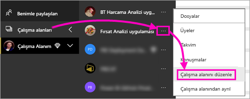
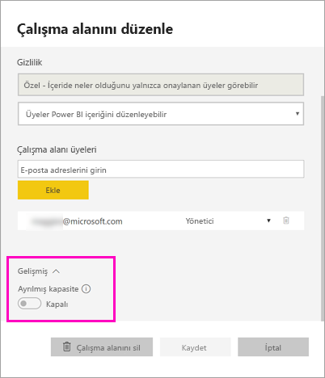
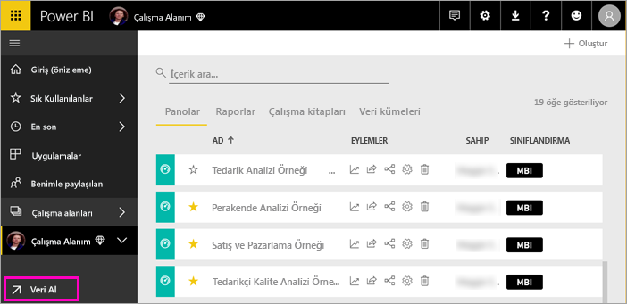
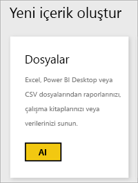
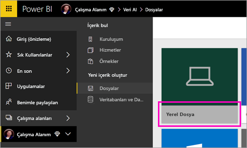
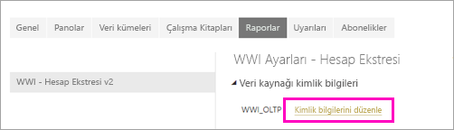
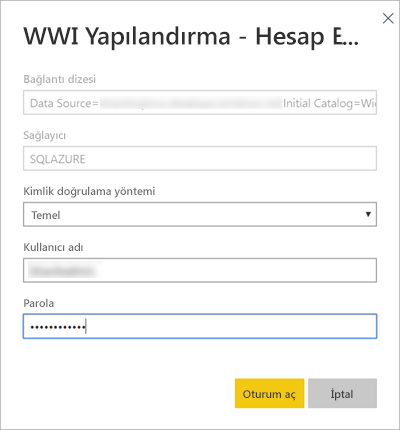
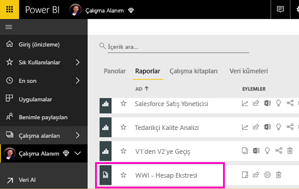
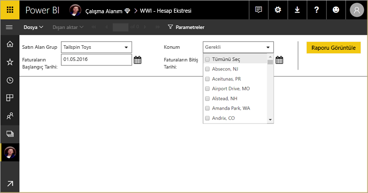

# Power BI hizmetinde sayfalandırılmış rapor yayımlama (Önizleme)

Bu makalede, sayfalandırılmış bir raporu yerel bilgisayarınızdan yükleyerek Power BI hizmetinde yayımlama hakkında bilgi edineceksiniz. Sayfalandırılmış raporları Çalışma Alanım’a veya Premium kapasitede olan başka bir çalışma alanına yükleyebilirsiniz. Çalışma alanı adının yanında  elmas simgesini arayın. 

Rapor veri kaynağınız şirket içindeyse, raporu karşıya yükledikten sonra [bir ağ geçidi oluşturmanız](#create-a-gateway) gerekir.

## Çalışma alanını Premium kapasiteye ekleme

Çalışma alanı adının yanında baklava simgesi  yoksa, çalışma alanını bir Premium kapasiteye eklemeniz gerekir. 

1. **Çalışma Alanları**’nı seçin, çalışma alanı adının yanındaki üç noktayı (**...**) ve sonra **Çalışma alanını düzenle**’yi seçin.

    

1. **Çalışma alanını düzenle** iletişim kutusunda **Gelişmiş**’i genişletin, ardından **Ayrılmış kapasite**’yi **Açık** seçeneğine sürükleyin.

    

   Bunu değiştirmeniz mümkün olmayabilir. Mümkün değilse, çalışma alanınızı bir Premium kapasiteye eklemek üzere size atama haklarını vermesi için Power BI Premium kapasite yöneticinize başvurun.

## Sayfalandırılmış raporu karşıya yükleme

1. Rapor Oluşturucusu'nda sayfalandırılmış raporunuzu oluşturun ve yerel bilgisayarınıza kaydedin.

1. Power BI hizmetini bir tarayıcıda açın ve raporu yayımlamak istediğiniz Premium çalışma alanına göz atın. Adın yanındaki elmas simgesine  dikkat edin. 

1. **Veri Al**’ı seçin.

    

1. **Dosyalar** kutusunda **Al**'ı seçin.

    

1. **Yerel dosya**’yı seçin > sayfalandırılmış rapora göz atın > **Aç**’ı seçin.

    

1. **Devam** > **Kimlik bilgilerini düzenle**’yi seçin.

    

1. Kimlik bilgilerinizi yapılandırın > **Oturum aç**’ı seçin.

    

   Raporunuzu rapor listesinde görürsünüz.

    

1. Power BI hizmetinde açmak için seçin. Parametreleri varsa, raporu görüntüleyebilmeniz için bunları seçmeniz gerekir.
 
    

## Ağ geçidi oluşturma

Diğer tüm Power BI raporlarında olduğu gibi, rapor veri kaynağı şirket içindeyse verilere erişmek için bir ağ geçidi oluşturmanız veya bir ağ geçidine bağlanmanız gerekir.

1. Rapor adının yanındaki **Yönet**’i seçin.

   

1. Ayrıntılı bilgi ve sonraki adımlar için Power BI hizmetinin [Ağ geçidi yükleme](service-gateway-install.md) makalesine bakın.

### Ağ geçidi sınırlamaları

Ağ geçitleri şu anda çok değerli parametreleri desteklememektedir.

## Sonraki adımlar

- [Power BI hizmetinde sayfalandırılmış rapor görüntüleme](paginated-reports-view-power-bi-service.md)
- [Power BI Premium’da sayfalandırılmış raporlar nelerdir? (Önizleme)](paginated-reports-report-builder-power-bi.md)

