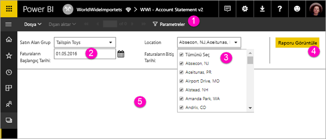

# Power BI hizmetinde sayfalandırılmış raporlar için parametreleri görüntüleme (Önizleme)

Bu makalede, Power BI hizmetinde sayfalandırılmış raporlar için parametrelerle etkileşimde bulunma hakkında bilgi edineceksiniz.  Rapor parametresi, rapor verilerini filtrelemek için bir yol sağlar. Parametreler kullanılabilir değerlerin bir listesini sunar ve bir veya birden çok değer seçebilirsiniz. Bazen parametreler varsayılan bir değere sahip olur, bazı durumlarda ise raporu görebilmek için bir değer seçmeniz gerekir.  

Parametreleri olan bir raporu görüntülediğinizde, rapor görüntüleyici araç çubuğunda her parametre gösterilir, böylece değerleri etkileşimli bir şekilde belirtebilirsiniz. Aşağıdaki çizimde **Satın Alma Grubu**, **Konum**, **Başlangıç Tarihi** ve **Bitiş Tarihi** parametreleri ile bir raporun parametre alanı gösterilmektedir.  

## Power BI hizmetindeki parametreler bölmesi

  
1.  **Parametreler bölmesi** Rapor görüntüleyici araç çubuğunda, "Gerekli" gibi bir istem ya da her parametre için varsayılan bir değer gösterilir.    
  
2.  **Fatura Başlangıç / Bitiş Tarihi parametreleri** İki veri parametresi varsayılan değerlere sahiptir. Tarihi değiştirmek için metin kutusuna bir tarih yazın veya takvimden bir tarih seçin.  
  
3.  **Konum parametresi** Konum parametresi bir değeri, birçok değeri veya tüm değerleri seçmenizi sağlayacak şekilde ayarlanır. 
  
4.  **Raporu Görüntüle** Parametre değerlerini girdikten veya değiştirdikten sonra raporu çalıştırmak için **Raporu Görüntüle**’ye tıklayın. 

5. **Varsayılan değerler** Tüm parametreler varsayılan değerlere sahipse rapor ilk görünümde otomatik olarak çalışır. Bu rapordaki bazı parametreler varsayılan değerlere olmadığı için değerleri seçene kadar raporu görmezsiniz.  

## Sonraki adımlar

[Power BI hizmetinde sayfalandırılmış raporlar için parametreler oluşturma](paginated-reports-parameters.md)
