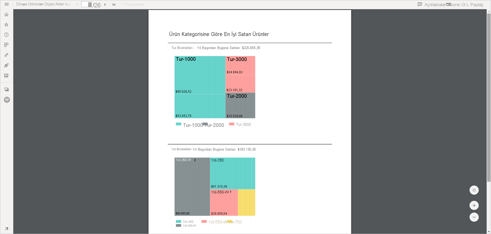
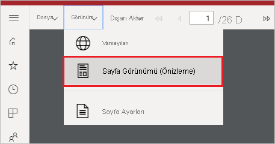
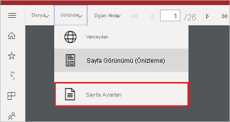
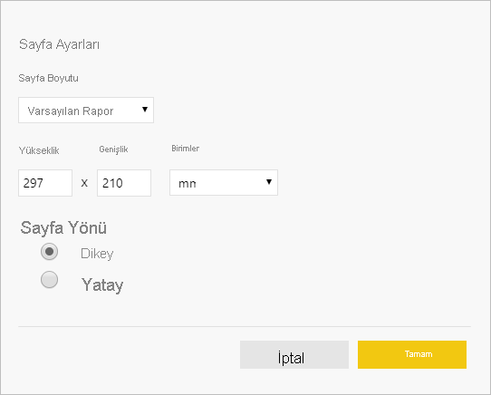

# Power BI hizmetinde sayfalandırılmış raporlar için rapor görünümlerini ayarlama

Power BI hizmetinde sayfalandırılmış raporu işlerken, varsayılan görünüm HTML tabanlı ve etkileşimlidir. PDF gibi sabit sayfa biçimlerine yönelik bir diğer rapor görünümü de yeni Sayfa Görünümü seçeneğidir.

**Varsayılan etkileşimli görünüm**

**Sayfa Görünümü**

Sayfa Görünümünde, işlenen rapor varsayılan görünümde olduğundan farklı görünür. Sayfalandırılmış raporlardaki bazı özellikler ve kavramlar yalnızca sabit sayfalara uygulanır. Görünüm, raporun yazdırılmış veya dışarı aktarılmış haline benzer. Parametre değerleri gibi bazı öğeleri yine değiştirebilirsiniz ama sütun sıralama ve geçişler gibi başka etkileşimli özellikleri yoktur.

Sayfa Görünümü Yakınlaştırma, Uzaklaştırma ve Sayfaya sığdırma gibi tarayıcının PDF Görüntüleyicisinin desteklediği tüm özellikleri destekler.

## Sayfa Görünümüne geçme

Sayfalandırılmış raporu açtığınızda varsayılan olarak etkileşimli görünümde işlenir. Raporun parametreleri varsa, parametreleri seçin ve ardından raporu görüntüleyin.

1. Araç çubuğunda **Görünüm** > **Sayfa Görünümü**’nü seçin.

    

2. Araç çubuğundaki **Görünüm** menüsünde **Sayfa Ayarları**’nı seçerek sayfa görünümünün ayarlarını değiştirebilirsiniz. 

    
    
    **Sayfa Ayarları** iletişim kutusunda, Sayfa Görünümü için **Sayfa Boyutu** ve **Yönlendirme**’yi ayarlama seçenekleri vardır. Siz sayfa ayarlarını uyguladıktan sonra, aynı seçenekler daha sonra sayfayı yazdırdığınızda da geçerli olur.
   
    

3. Etkileşimli görünümüne geri dönmek için **Görünüm** açılan kutusunda **Varsayılan**’ı seçin.

## Tarayıcı desteği

Sayfa Görümünü Google Chrome ve Microsoft Edge tarayıcılarında desteklenir. Tarayıcıda PDF görüntülemenin etkinleştirildiğinden emin olun. Söz konusu tarayıcılarda bu varsayılan ayardır.

Sayfa Görünümü Internet Explorer ve Safari’de desteklenmediğinden bu seçenek devre dışı bırakılmıştır. Ayrıca mobil cihazların tarayıcılarında veya yerel Power BI mobil uygulamalarında da desteklenmez.  

## Sonraki adımlar

- [Power BI hizmetinde sayfalandırılmış rapor görüntüleme](../consumer/paginated-reports-view-power-bi-service.md)
- [Power BI Premium’da sayfalandırılmış raporlar nelerdir?](paginated-reports-report-builder-power-bi.md)
