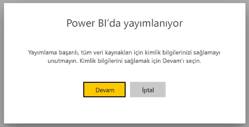
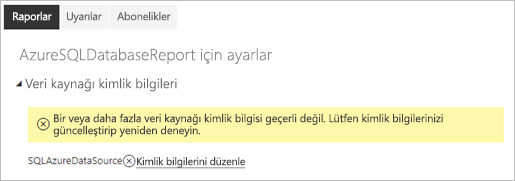
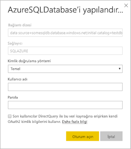

# Power BI sayfalandırılmış raporları için desteklenen veri kaynakları

[!INCLUDE [applies-to](../includes/applies-to.md)] [!INCLUDE [yes-service](../includes/yes-service.md)] [!INCLUDE [yes-paginated](../includes/yes-paginated.md)] [!INCLUDE [yes-premium](../includes/yes-premium.md)] [!INCLUDE [no-desktop](../includes/no-desktop.md)] 

Bu makalede Power BI hizmetindeki sayfalandırılmış raporlar için desteklenen veri kaynakları ve Azure SQL Veritabanı veri kaynaklarına nasıl bağlanılacağı açıklanır. Bazı veri kaynakları yerel olarak desteklenir. Diğerlerine veri ağ geçitleri yoluyla bağlanabilirsiniz.

## Yerel olarak desteklenen veri kaynakları

Sayfalandırılmış raporlar aşağıdaki veri kaynakları listesini yerel olarak destekler:

| Veri Kaynağı | Kimlik Doğrulama | Notlar |
| --- | --- | --- |
| Azure SQL Veritabanı  Azure SQL Veri Ambarı | Temel, çoklu oturum açma (SSO), OAuth2 | Azure SQL Veritabanı ile Kurumsal Ağ Geçidi kullanabilirsiniz. Bununla birlikte söz konusu senaryolarda kimlik doğrulaması için SSO veya oAuth2 kullanamazsınız.   |
| Azure SQL Yönetilen Örneği | Temel | Ortak veya Özel Uç Nokta aracılığıyla (Özel Uç Nokta’nın Kurumsal Ağ Geçidi üzerinden yönlendirilmesi gerekir)  |
| Azure Analysis Services | SSO, OAuth2 | AAS güvenlik duvarının BlackForest bölgesindeki tüm IP aralıklarına izin verecek şekilde devre dışı bırakılması ve yapılandırılması gerekir. Bu yalnızca BlackForest bölgesinde geçerlidir.  Dış kiracılardan SSO desteklenmez. |
| Power BI veri kümesi | SSO | Premium ve Premium olmayan Power BI veri kümeleri. Okuma izni gerektirir. Yalnızca İçeri Aktarma modu ve DirectQuery Power BI veri kümeleri desteklenir. |
| Premium Power BI veri kümesi (XMLA) | SSO | Power BI veri kümeleri, “uygulamanın verilere sahip olması” senaryolarındaki ekli sayfalandırılmış raporlar için veri kaynağı olarak desteklenmez.  Power BI Rapor Oluşturucusu doğru bağlantıyı sağlamak için, veri kaynağınızı ayarlarken **kimlik bilgilerini kullanma** seçeneğinin seçildiğinden emin olun. Çalışma alanında veya uygulama düzeyinde XMLA 'nın güvenlik grubu üyeliği kümesi üzerinden erişin. [Bir çalışma](../collaborate-share/service-new-workspaces.md#roles-in-the-new-workspaces) alanında en az bir katkıda bulunan rolüne sahip kullanıcılar, zengin Power BI veri kümeleri ile sayfalandırılmış raporlar işleyebilir. Diğer kullanıcıların [, temel alınan veri kümelerinde derleme izni](../connect-data/service-datasets-build-permissions.md)olması gerekir.    |
| Veri Gir | YOK | Veriler rapora katıştırılmıştır. |
| Veri deposu | SSO, OAuth2 | Multi-Factor Authentication (MFA) desteklenmediğinden ağ geçidi kullanılamıyor.

Siz raporu Power BI hizmetine yükledikten sonra Azure SQL Veritabanı dışındaki tüm veri kaynakları kullanıma hazırdır. Veri kaynakları uygulanabilir olduğunda varsayılan olarak çoklu oturum açmayı (SSO) kullanır. Azure Analysis Services için kimlik doğrulaması türünü OAuth2 olarak değiştirebilirsiniz. Ancak, belirli bir veri kaynağına ait kimlik doğrulaması türü OAuth2 olarak değiştirildikten sonra, bu veri kaynağı SSO kullanmaya geri döndürülemez.  Ayrıca bu değişiklik, söz konusu kiracıdaki tüm çalışma alanları genelinde bu veri kaynağını kullanan tüm raporlara uygulanır.  Sayfalandırılmış raporlarda satır düzeyinde güvenlik, kullanıcılar kimlik doğrulaması türü olarak SSO’yu seçmedikleri sürece çalışmaz.

Azure SQL Veritabanı veri kaynakları için, [Azure SQL Veritabanı Kimlik Doğrulaması](#azure-sql-database-authentication) bölümünde açıklandığı gibi daha fazla bilgi sağlamanız gerekir.

## Diğer veri kaynakları

Yukarıdaki yerel olarak desteklenen veri kaynaklarına ek olarak, aşağıdaki veri kaynaklarına da [Power BI kurumsal ağ geçidi](../connect-data/service-gateway-onprem.md) yoluyla erişilebilir:

- SQL Server
- SQL Server Analysis Services
- Oracle
- Teradata

Sayfalandırılmış raporlar için şu anda Azure Analysis Services’a bir Power BI kurumsal ağ geçidi aracılığıyla erişilemez.

## Azure SQL Veritabanı kimlik doğrulaması

Azure SQL Veritabanı veri kaynakları için, raporu çalıştırmadan önce kimlik doğrulaması türünü ayarlamalısınız. Bu yalnızca çalışma alanında bir veri kaynağını ilk kez kullanırken geçerlidir. Bu ilk kullanımınızda aşağıdaki iletiyi görürsünüz:

Kimlik bilgilerini sağlamazsanız raporu çalıştırdığınızda hata oluşur. Yeni karşıya yüklediğiniz raporun **Veri kaynağı kimlik bilgileri** sayfasına gitmek için **Devam**'ı seçin:

**Yapılandır** iletişim kutusunu görüntülemek için belirli bir veri kaynağının **Kimlik bilgilerini düzenle** bağlantısını seçin:

Azure SQL Veritabanı veri kaynakları için desteklenen kimlik doğrulaması türleri şunlardır:

- Temel (kullanıcı adı ve parola)
- SSO (çoklu oturum açma)
- OAuth2 (depolanmış Azure Active Directory belirteci)

SSO ve OAuth2'nin doğru çalışması için veri kaynağının bağlantılı olduğu Azure SQL Veritabanı sunucusunda [Azure Active Directory kimlik doğrulaması desteğinin etkinleştirilmiş](/azure/sql-database/sql-database-aad-authentication-configure) olması gerekir. OAuth2 kimlik doğrulaması yöntemi için Azure Active Directory bir belirteç oluşturur ve bunu gelecekteki veri kaynağı erişimleri için depolar. Bunun yerine [SSO kimlik doğrulama yöntemini](../connect-data/service-azure-sql-database-with-direct-connect.md#single-sign-on) kullanmak için, hemen altındaki SSO seçeneğini belirtin: **DirectQuery ile bu veri kaynağına erişirken, son kullanıcılar kendi OAuth2 kimlik bilgilerini kullanır**.
  
## Sonraki adımlar

[Power BI hizmetinde sayfalandırılmış rapor görüntüleme](../consumer/paginated-reports-view-power-bi-service.md)

Başka bir sorunuz mu var? [Power BI Topluluğu'na başvurun](https://community.powerbi.com/)
