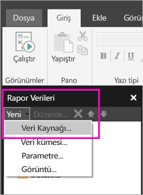

# Power BI hizmetinde sayfalandırılmış raporlar için tümleşik veri kaynağı oluşturma

Bu makalede, Power BI hizmetindeki sayfalandırılmış bir rapor için tümleşik bir veri kaynağı oluşturma ve değiştirme işlemini öğreneceksiniz. Tümleşik bir veri kaynağını tek bir raporda tanımlayabilir ve yalnızca o raporda kullanabilirsiniz. Şu anda, Power BI hizmetinde yayımlanan sayfalandırılmış raporlar için tümleşik veri kümeleri ve tümleşik veri kaynakları gereklidir ve şu veri kaynaklarına bağlanılabilir:

- Azure Analysis Services
- canlı verilere bağlanın ve 
- Azure SQL Veri Ambarı
- SQL Server
- SQL Server Analysis Services
- Oracle 
- Teradata 

Aşağıdaki veri kaynakları için [SQL Server Analysis Services bağlantısı](../admin/service-premium-connect-tools.md) seçeneğini kullanın:

- Power BI Premium veri kümeleri

Sayfalandırılmış raporlar, [Power BI ağ geçidi](../connect-data/service-gateway-onprem.md) üzerinden şirket içi veri kaynaklarına bağlanır. Raporu Power BI hizmetinde yayımladıktan sonra ağ geçidini ayarlayabilirsiniz.

Daha ayrıntılı bilgi için bkz. [Power BI Rapor Oluşturucusu'nda Rapor Verileri](report-builder-data.md).

## Eklenmiş veri kaynağı oluşturma
  
1. Power BI Rapor Oluşturucusu'nu açın.

1. Rapor Verileri bölmesindeki araç çubuğunda **Yeni** > **Veri Kaynağı**’nı seçin. **Veri Kaynağı Özellikleri** iletişim kutusu açılır.

   
  
1. **Ad** metin kutusuna veri kaynağı için bir ad girin ya da varsayılan adı kabul edin.  
  
1. **Raporuma katıştırılmış bağlantı kullan**’ı seçin.  
  
1. **Bağlantı türünü seçin** listesinden bir veri kaynağı türü seçin. 

1. Aşağıdaki yöntemlerden birini kullanarak bir bağlantı dizesi belirtin:  
  
   - Bağlantı dizesini doğrudan **Bağlantı dizesi** metin kutusuna yazın. 
  
   - 2\. adımda seçtiğiniz veri kaynağına ait **Bağlantı Özellikleri** iletişim kutusunu açmak için **Derleme**’yi seçin.  
  
     **Bağlantı Özellikleri** iletişim kutusundaki alanları veri kaynağı türüne uygun şekilde doldurun. Bağlantı özellikleri; veri kaynağı türünü, veri kaynağının adını ve kullanılacak kimlik bilgilerini içerir. Bu iletişim kutusunda değerleri belirttikten sonra, veri kaynağının kullanılabilir olduğunu doğrulamak ve belirttiğiniz kimlik bilgilerinin doğruluğunu onaylamak için **Bağlantıyı Sına**’yı seçin.  
  
1. **Kimlik Bilgileri**’ni seçin.  
  
   Bu veri kaynağı için kullanılacak kimlik bilgilerini belirtin. Veri kaynağının sahibi, desteklenen kimlik bilgilerinin türünü seçer. Daha fazla bilgi için bkz. [Rapor Veri Kaynakları için Kimlik Bilgisi ve Bağlantı Bilgilerini Belirtme](/sql/reporting-services/report-data/specify-credential-and-connection-information-for-report-data-sources).
  
1. **Tamam**’ı seçin.  
  
   Veri kaynağı, Rapor Verileri bölmesinde görünür.

## Sınırlamalar ve Önemli Noktalar

Power BI veri kümelerine bağlanan sayfalandırılmış raporlar, birkaç küçük değişiklikle birlikte Power BI’da paylaşılan veri kümelerindeki kuralları izler.  Kullanıcıların, Power BI veri kümelerini kullanarak sayfalandırılmış raporları düzgün bir şekilde görüntüleyebilmesini ve satır düzeyinde güvenliğin (RLS) etkinleştirilip tüm görüntüleyiciler için zorlanmasını sağlamak için şu kurallara uyduğunuzdan emin olun:

### Klasik uygulamalar ve çalışma alanları

- Veri kümesi olarak aynı çalışma alanında .rdl (aynı sahip): Destekleniyor
- Veri kümesi olarak farklı çalışma alanında .rdl (aynı sahip): Destekleniyor
- Paylaşılan .rdl: Raporu veri kümesi düzeyinde görüntüleyen her kullanıcıya Okuma izni atamanız gerekir
- Paylaşılan uygulama: Raporu veri kümesi düzeyinde görüntüleyen her kullanıcıya Okuma izni atamanız gerekir
- Veri kümesi olarak aynı çalışma alanında .rdl (farklı kullanıcı): Destekleniyor
- Veri kümesi olarak farklı çalışma alanında .rdl (farklı kullanıcı): Raporu veri kümesi düzeyinde görüntüleyen her kullanıcıya Okuma izni atamanız gerekir
- Rol düzeyinde güvenlik: Raporun uygulanması için bunu veri kümesi düzeyinde görüntüleyen her kullanıcıya Okuma izni atamanız gerekir.

### Yeni deneyim uygulamaları ve çalışma alanları

- Veri kümesi olarak aynı çalışma alanında .rdl: Destekleniyor
- Veri kümesi olarak farklı çalışma alanında .rdl (aynı sahip): Destekleniyor
- Paylaşılan .rdl: Raporu veri kümesi düzeyinde görüntüleyen her kullanıcıya Okuma izni atamanız gerekir
- Paylaşılan uygulama: Raporu veri kümesi düzeyinde görüntüleyen her kullanıcıya Okuma izni atamanız gerekir
- Veri kümesi olarak aynı çalışma alanında .rdl (farklı kullanıcı): - Desteklenir
- Veri kümesi olarak farklı çalışma alanında .rdl (farklı kullanıcı): Raporu veri kümesi düzeyinde görüntüleyen her kullanıcıya Okuma izni atamanız gerekir
- Rol düzeyinde güvenlik: Raporun uygulanması için bunu veri kümesi düzeyinde görüntüleyen her kullanıcıya Okuma izni atamanız gerekir

## Sonraki adımlar

- [Sayfalandırılmış rapor için Power BI hizmetinde tümleşik veri kümesi oluşturma](paginated-reports-create-embedded-dataset.md)
- [Power BI Premium’da sayfalandırılmış raporlar nelerdir?](paginated-reports-report-builder-power-bi.md)